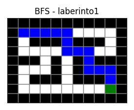
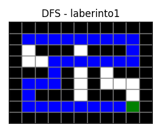
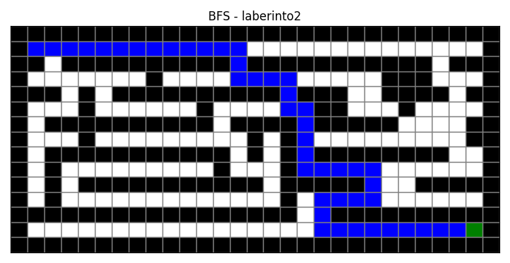
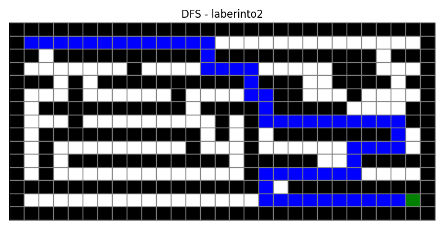
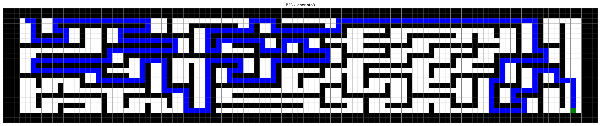
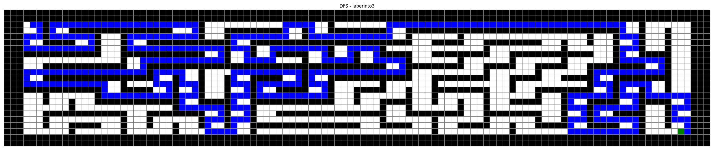
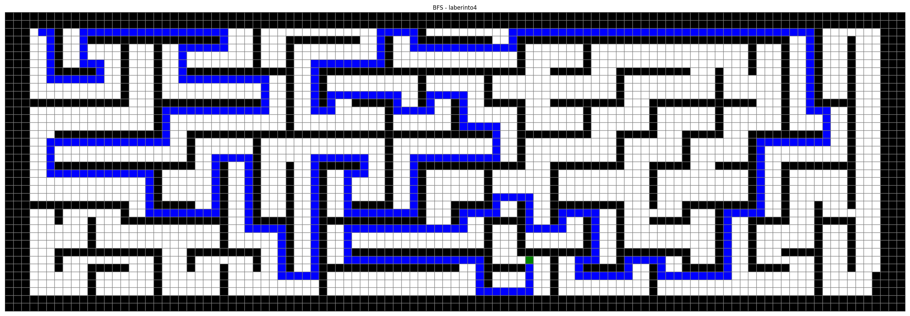
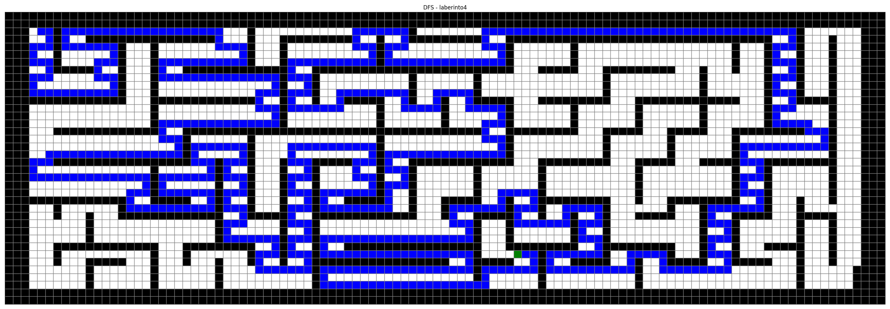

# WorkShop-USFQ
## Taller 2 de inteligencia artificial

- **Nombre del grupo**: GRUPO 3
- **Integrantes del grupo**:
  * Ana Haro
  * Lucy Barreno
  * Darwin Simba
  * Jhon Del Castillo

El objetivo de esta tarea es utilizar cualquier algoritmo de búsqueda para resolver los 3 laberintos propuestos, 
el reto es poder visualizar/representar los resultados, adicionalmente poder comparar al menos 2 algoritmos de búsqueda 
y mirar cómo se comportan para cada laberinto
 

## 1. USO DE ALGORITMOS DE BÚSQUEDA

## Descripción

El objetivo de este taller es aplicar algoritmos de búsqueda en un espacio de estados representado por laberintos. Se implementaron los algoritmos BFS (Breadth First Search) y DFS (Depth First Search) para encontrar una ruta desde el punto inicial (S) hasta la meta (E).

---

## Representación del problema

El laberinto se representa como una matriz donde:

- `#` → pared
- `" "` → camino libre
- `S` → punto inicial
- `E` → punto objetivo

---
## Transformación del laberinto a grafo

Cada celda libre del laberinto se representa como un nodo en un grafo.

Se utilizó una estructura de **lista de adyacencia**, implementada mediante un diccionario de Python:

Solo se consideran movimientos en cuatro direcciones:
- Arriba
- Abajo
- Izquierda
- Derecha

Las paredes (`#`) no forman parte del grafo.

---

## Algoritmos implementados

### 🔹 BFS (Breadth First Search)

- Explora el grafo por niveles
- Garantiza encontrar el camino más corto
- Puede explorar muchos nodos

### 🔹 DFS (Depth First Search)

- Explora en profundidad
- No garantiza el camino más corto
- Puede ser más rápido en algunos casos

## Resultados

### Laberinto 1

#### BFS


#### DFS


---

### Laberinto 2

#### BFS


#### DFS


---

### Laberinto 3

#### BFS


#### DFS


---

### Laberinto 4

#### BFS


#### DFS


---

## Comparación de algoritmos

| Laberinto | Algoritmo | Longitud camino | Nodos explorados | Tiempo |
|----------|----------|----------------|------------------|--------|
| 1 | BFS | 15 | 43 | 0.0001 |
| 1 | DFS | 31 | 31 | 0.00007 |
| 2 | BFS | 45 | 158 | 0.0003 |
| 2 | DFS | 57 | 166 | 0.00027 |
| 3 | BFS | 345 | 1268 | 0.0029 |
| 3 | DFS | 453 | 1048 | 0.0023 |
| 4 | BFS | 473 | 2649 | 0.0056 |
| 4 | DFS | 723 | 1570 | 0.0042 |

---

## Conclusiones

- BFS garantiza encontrar el camino más corto.
- DFS encuentra soluciones más rápidamente en algunos casos, pero no óptimas.
- BFS explora un mayor número de nodos, especialmente en laberintos grandes.
- DFS puede ser más eficiente en tiempo, pero produce caminos más largos.
- A medida que el tamaño del laberinto aumenta, el costo computacional también aumenta.

---

## Ejecución

Para ejecutar el proyecto:

```bash
python -m Taller2.P1.P1