# WorkShop-USFQ
## Inteligencia artificial — Taller 2

- **Nombre del grupo**: Grupo 2
- **Integrantes del grupo**:

    • Fernando Escobar
    • Manuel Pillapa
    • Estefano Galarza
    • Jonathan Guallasamin

Este taller aborda dos problemas de Inteligencia Artificial: búsqueda en laberintos mediante algoritmos clásicos y optimización mediante colonias de hormigas (ACO). Cada problema fue implementado en Python con visualización interactiva y análisis comparativo de algoritmos.

## Índice

1. [División del trabajo](#división-del-trabajo)
2. [P1 — Resolución de Laberintos](#p1--resolución-de-laberintos)
3. [P2 — Ant Colony Optimization (ACO)](#p2--ant-colony-optimization-aco)
4. [Resumen comparativo](#resumen-comparativo)
5. [Requisitos](#requisitos)

---

## División del trabajo

El Taller 2 fue desarrollado de forma colaborativa por todo el equipo. En cada sección hubo un liderazgo encargado de organizar el trabajo, revisar avances, garantizar la calidad y coordinar el aporte de los demás integrantes.

| Sección | Liderazgo | Equipo de trabajo |
|---|---|---|
| **Parte 1 — Resolución de Laberintos** | Fernando Escobar y Manuel Pillapa | Fernando Escobar, Manuel Pillapa, Estefano Galarza y Jonathan Guallasamin |
| **Parte 2 — Ant Colony Optimization (ACO)** | Jonathan Guallasamin | Fernando Escobar, Manuel Pillapa, Estefano Galarza y Jonathan Guallasamin |
| **Ensayo** | Estefano Galarza | Fernando Escobar, Manuel Pillapa, Estefano Galarza y Jonathan Guallasamin |

---

## P1 — Resolución de Laberintos

**Directorio:** `P1/`

### Descripción

Dado un laberinto representado como una cuadrícula de texto, encontrar el camino desde la entrada (`E`) hasta la salida (`S`), evitando las paredes (`#`). Se implementaron y compararon tres algoritmos de búsqueda sobre cuatro laberintos de complejidad creciente.

### Algoritmos implementados

**BFS — Búsqueda en Anchura:**
- Explora nodos nivel por nivel usando una cola FIFO.
- Garantiza el camino más corto en grafos sin pesos.
- Complejidad: O(V + E).

**DFS — Búsqueda en Profundidad:**
- Explora tan profundo como sea posible antes de retroceder (pila LIFO).
- No garantiza el camino más corto.
- Complejidad: O(V + E).

**A\* — Búsqueda Informada:**
- Combina costo acumulado g(n) con heurística h(n) (distancia Manhattan).
- Garantiza el camino más corto y minimiza los nodos explorados.
- Complejidad: O(E · log V) con heurística admisible.

### Archivos

| Archivo | Descripción |
|---|---|
| `P1.py` | Driver principal: carga los cuatro laberintos y ejecuta la comparación de algoritmos |
| `P1_solvers.py` | Implementación de BFS, DFS y A* |
| `P1_MazeLoader.py` | Carga de archivos de laberinto, construcción del grafo y visualización con Matplotlib |
| `P1_util.py` | Funciones auxiliares (colores para visualización) |
| `laberinto1.txt` | Laberinto 9×11 (simple) |
| `laberinto2.txt` | Laberinto 15×29 (complejidad media) |
| `laberinto3.txt` | Laberinto de mayor complejidad |
| `laberinto4.txt` | Laberinto de mayor complejidad |

### Ejecución

```bash
python P1/P1.py
```

### Laberintos de prueba

| Laberinto 1 (9×11) | Laberinto 2 (15×29) |
|:---:|:---:|
| 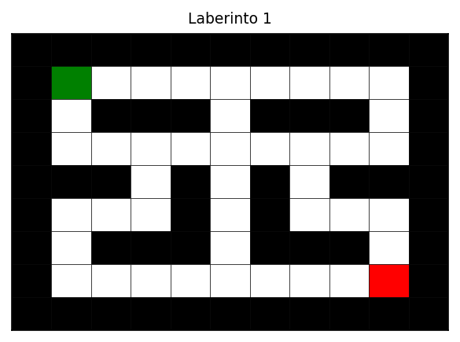 | 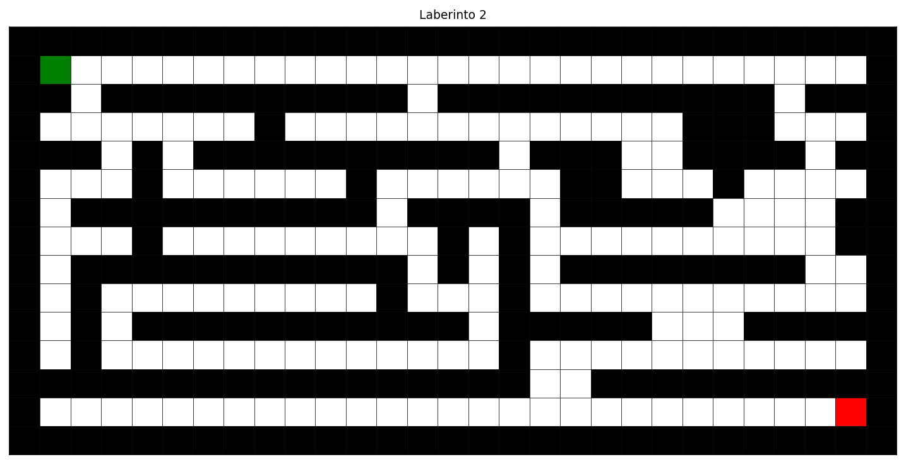 |

| Laberinto 3 | Laberinto 4 |
|:---:|:---:|
| 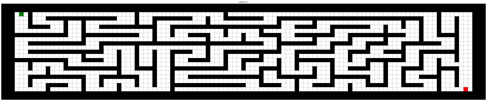 | 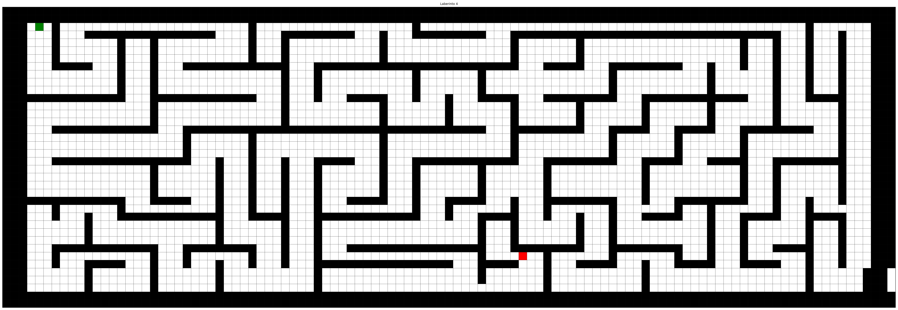 |

### Soluciones por algoritmo

**Laberinto 1**
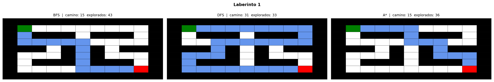

**Laberinto 2**
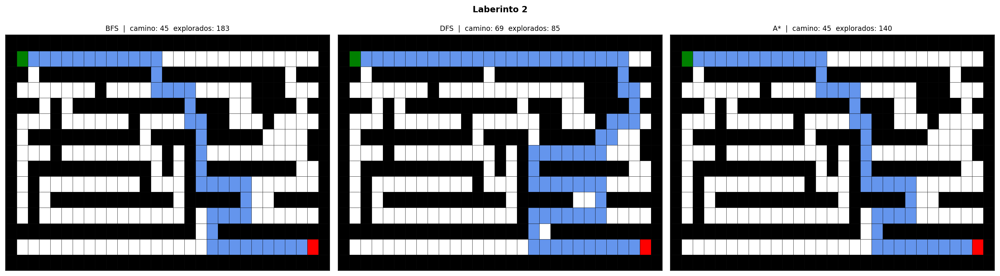

**Laberinto 3**
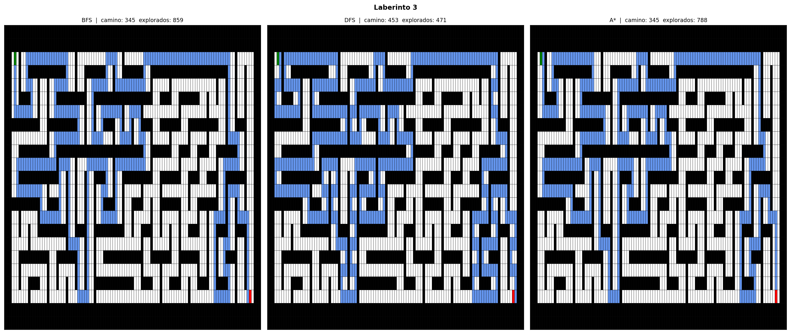

**Laberinto 4**
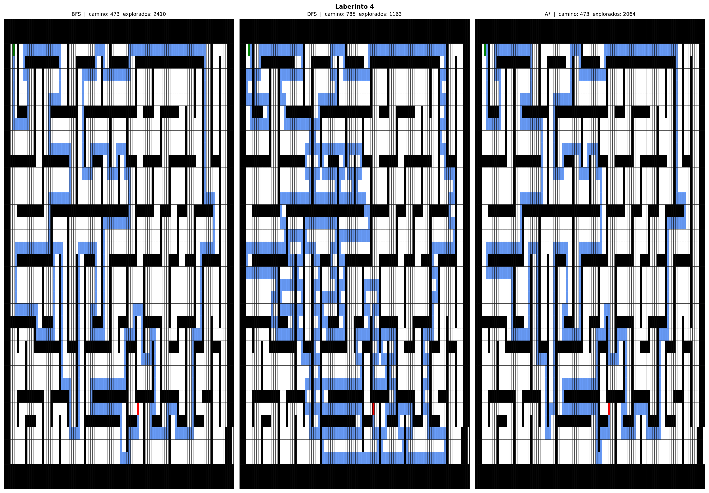

### Métricas comparadas

| Métrica | BFS | DFS | A\* |
|---|---|---|---|
| Longitud del camino | Óptima | Subóptima | Óptima |
| Nodos explorados | Alto | Variable | Bajo |
| Estructura | Cola | Pila | Cola de prioridad |
| Usa heurística | No | No | Sí (Manhattan) |

---

## P2 — Ant Colony Optimization (ACO)

**Directorio:** `P2/`

### Descripción

Implementación del metaheurístico ACO para encontrar caminos óptimos en una cuadrícula con obstáculos. El algoritmo simula el comportamiento de colonias de hormigas: las hormigas depositan feromonas en los caminos recorridos; los caminos más cortos acumulan más feromona y atraen a más hormigas, convergiendo a la solución.

### Algoritmo: Ant Colony Optimization

**Parámetros principales:**

| Parámetro | Descripción | Valor por defecto |
|---|---|---|
| `num_ants` | Número de hormigas por iteración | 10 |
| `evaporation_rate` | Tasa de evaporación de feromona | 0.1 |
| `alpha` | Peso de la feromona en la selección | 0.1 |
| `beta` | Peso de la heurística de distancia | 15 |
| `grid_size` | Dimensiones del entorno | 10×10 |

**Flujo del algoritmo:**
1. Cada hormiga construye una ruta desde el inicio hasta el objetivo seleccionando posiciones de forma probabilística en función de la feromona (α) y la distancia inversa (β).
2. Al completar una ruta válida, la hormiga deposita feromona proporcional a la calidad del camino.
3. Al final de cada iteración, la feromona se evapora según `evaporation_rate`.
4. Se repite durante `num_iterations` iteraciones; se retiene el mejor camino encontrado.

### Casos de estudio

**Caso 1 — Configuración base:** Cuadrícula 10×10 con 3 obstáculos, 10 hormigas, 100 iteraciones. Validación del comportamiento básico del algoritmo.

**Caso 2 — Parámetros ajustados:** 30 hormigas, evaporación 0.3, 200 iteraciones. Mayor presión de exploración para escenarios con obstáculos más complejos.

**Caso 2 Tuneado — Búsqueda aleatoria de hiperparámetros:** 15 pruebas aleatorias para identificar la configuración óptima de ACO sobre el mismo escenario.

### Archivos

| Archivo | Descripción |
|---|---|
| `P2_ACO.py` | Implementación completa de ACO, casos de estudio y visualización |
| `Analisis_P2_ACO.ipynb` | Notebook con análisis detallado, comparación de configuraciones y estudio de sensibilidad de parámetros |

### Ejecución

```bash
# Ejecutar casos de estudio
python P2/P2_ACO.py

# Análisis completo
jupyter notebook P2/Analisis_P2_ACO.ipynb
```

### Visualización

El método `plot()` genera un mapa de calor de feromonas sobre la cuadrícula, marcando obstáculos, inicio, destino y el mejor camino encontrado en cada caso.

### Resultados

**Caso 1 — Configuración base** (3 obstáculos, camino abierto)
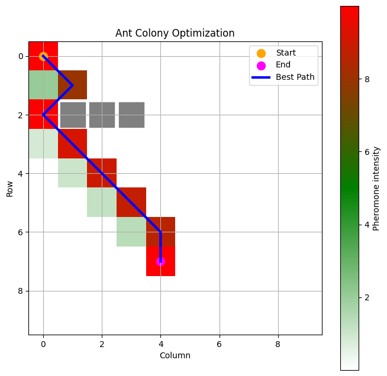

**Caso 2 — Bug detectado** (pared completa: el camino reportado no llega al destino)
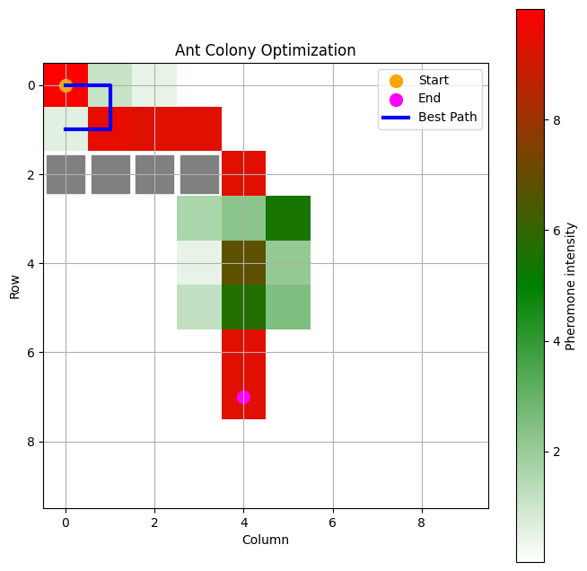

**Caso 2 — Versión corregida** (filtro de validez + parámetros ajustados)
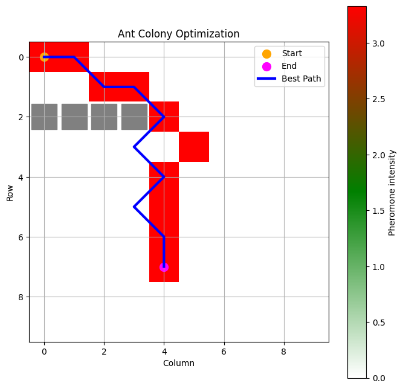

**Sensibilidad de parámetros** (efecto de β y tasa de evaporación sobre la longitud del camino)
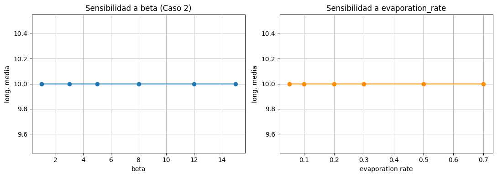

**Random Search — mejor configuración encontrada**
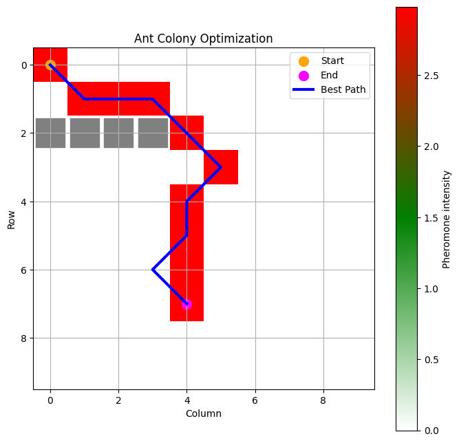

**ACO aplicado a TSP — comparación con Vecino Más Cercano**
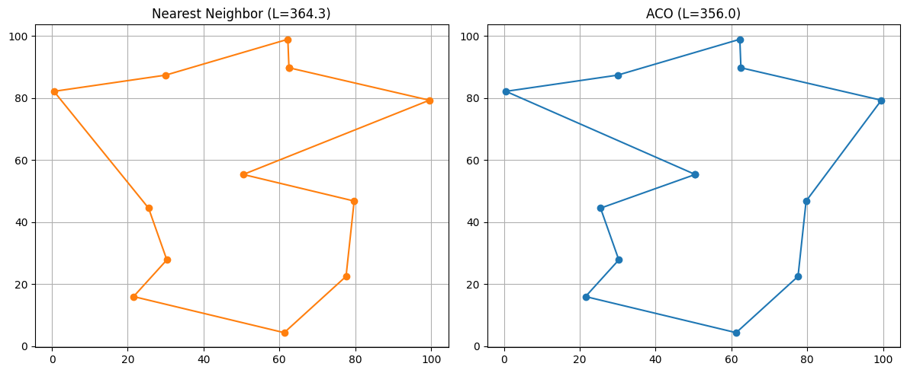

---

## Resumen comparativo

| Proyecto | Problema | Estrategia | Garantía de óptimo | Complejidad |
|---|---|---|---|---|
| **P1 — BFS** | Laberinto | Búsqueda sin información | Sí (camino más corto) | O(V + E) |
| **P1 — DFS** | Laberinto | Búsqueda sin información | No | O(V + E) |
| **P1 — A\*** | Laberinto | Búsqueda informada | Sí (con heurística admisible) | O(E · log V) |
| **P2 — ACO** | Cuadrícula con obstáculos | Metaheurístico (inteligencia de enjambre) | No (óptimo local) | O(iter · hormigas · nodos) |

### Diferencias clave

- **Optimalidad:** BFS y A\* garantizan el camino más corto; DFS y ACO no.
- **Exploración:** ACO es estocástico y converge iterativamente; los algoritmos de P1 son deterministas.
- **Escalabilidad:** A\* es el más eficiente en P1 gracias a la heurística; ACO escala bien en espacios continuos con hiperparámetros ajustados.
- **Aplicabilidad:** Los algoritmos de P1 son exactos y adecuados para espacios discretos pequeños; ACO es más adecuado para problemas de optimización combinatoria de gran escala.

---

## Requisitos

```
Python >= 3.8
matplotlib
jupyter
numpy
```

Instalación de dependencias:

```bash
pip install matplotlib jupyter numpy
```
