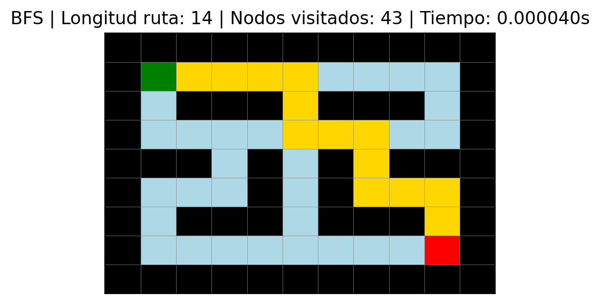
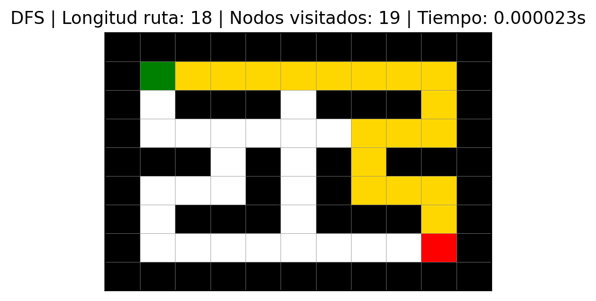
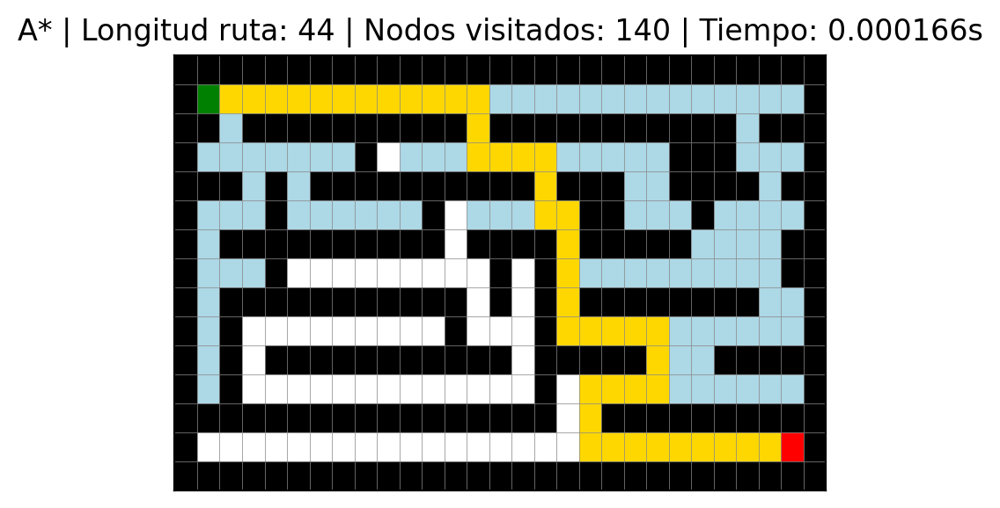
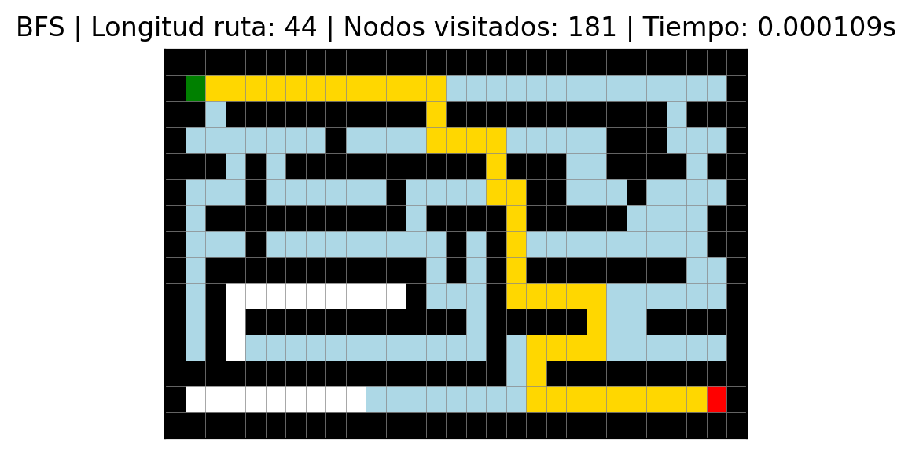
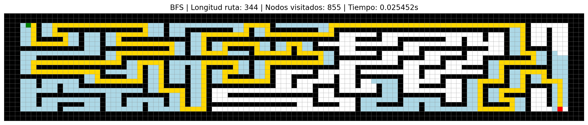
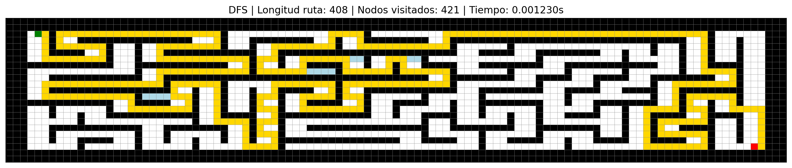
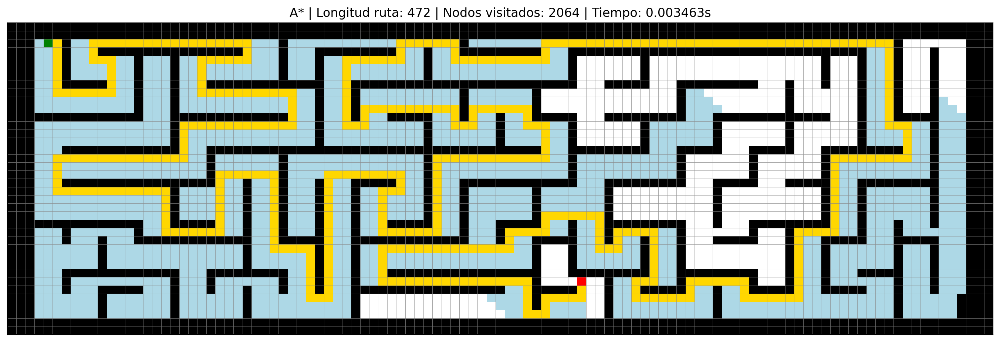
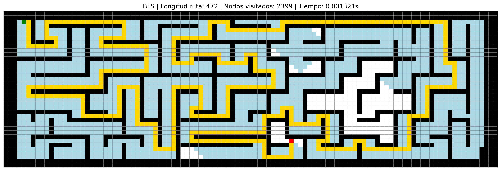
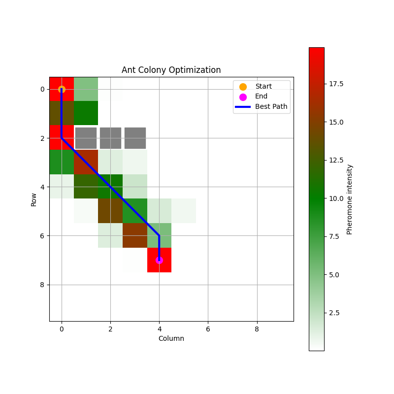
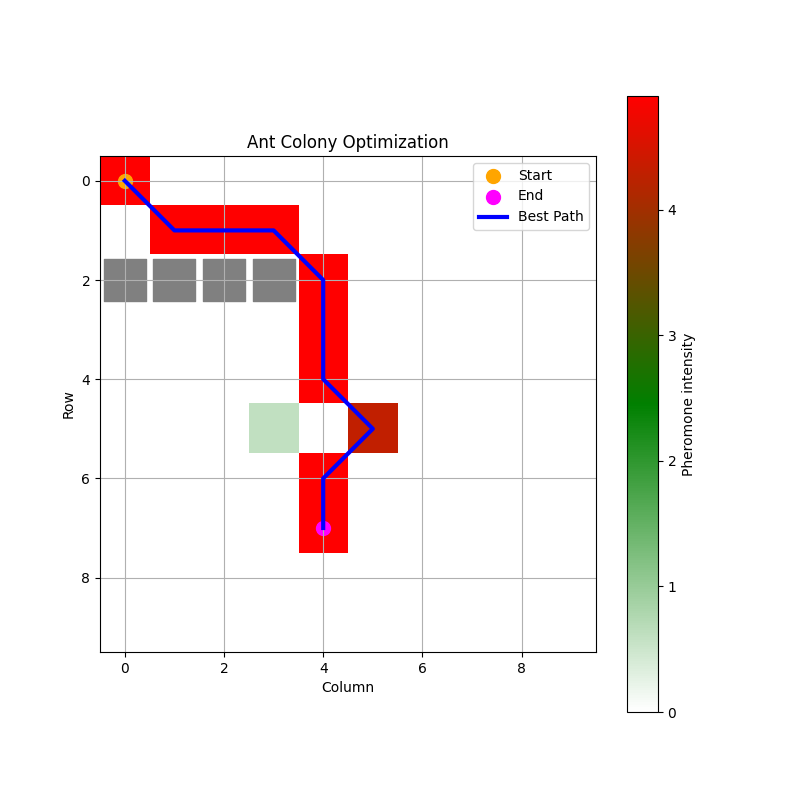

# Taller 2

- [Participación](Participacion_Taller_2_G1.pdf)

## 1. USO DE ALGORITMOS DE BÚSQUEDA

### A. Leer el laberinto y representarlo como un grafo

Los laberintos fueron representados como un grafo no dirigido, donde cada celda transitable corresponde a un nodo identificado por sus coordenadas (fila, columna). Las conexiones entre nodos representan los movimientos válidos en cuatro direcciones: arriba, abajo, izquierda y derecha. Las paredes (#) fueron excluidas del grafo. De esta forma, el problema del laberinto se transforma en un problema de búsqueda de caminos entre el nodo de entrada E y el nodo de salida S.

### B. Aplicar algoritmos de búsqueda
Completar con conclusiones sobre parte B, responder:
¿Se puede establecer alguna métrica para evaluar los algoritmos en este problema?

Para este problema se compararon BFS y DFS para el Laberinto 1 y 3. BFS garantiza encontrar la ruta más corta en laberintos no ponderados, por eso obtiene caminos más cortos en ambos casos. DFS puede encontrar una solución más rápido o visitando menos nodos, pero no garantiza que esa solución sea óptima. Las métricas usadas fueron longitud de la ruta, nodos visitados y tiempo de ejecución.

En los laberintos 2 y 4 se compararon los algoritmos BFS y A* utilizando métricas cuantitativas: longitud de la ruta, cantidad de nodos visitados y tiempo de ejecución. Ambos algoritmos encontraron la ruta más corta (longitud 44 en laberinto 2 y 472 en laberinto 4), pero A* fue más eficiente en la exploración del espacio de búsqueda. 

Para el laberinto 2, BFS visitó 181 nodos en 0.000109 s, mientras que A* solo 140 nodos en 0.000166 s, manteniendo la misma longitud de ruta (44). Para el laberinto 4, BFS visitó 2399 nodos en 0.001321 s y A* solo 2064 nodos en 0.003463 s, ambos con longitud de ruta 472. Esto evidencia que A* explora menos nodos y realiza menos retrocesos (backtracking), optimizando el uso de recursos computacionales, aunque en este caso el tiempo de ejecución fue ligeramente mayor en A* debido al cálculo de la heurística.

En conclusión, A* mantiene la calidad de la solución (ruta óptima) y mejora la eficiencia al reducir la cantidad de nodos explorados y retrocesos, lo que lo hace más adecuado para laberintos grandes o complejos. BFS, aunque rápido, explora más nodos y puede requerir más recursos en escenarios de mayor tamaño.

Soluciones en imágenes para los laberintos:

Representación de colores en las gráficas del laberinto 1 y 3

Amarillo → representa la ruta encontrada por el algoritmo desde la entrada E hasta la salida S.
Azul claro → representa los nodos explorados o visitados por el algoritmo durante la búsqueda, pero que no necesariamente forman parte de la solución final.
Verde → nodo de entrada (E).
Rojo → nodo de salida (S).
Negro → paredes o zonas no transitables del laberinto.
Blanco/gris claro → caminos libres no explorados.

- Para el Laberinto 1 con BFS se obtuvieron los siguientes resultados:

Longitud de ruta: 14
Nodos visitados: 43

- Para el Laberinto 1 con DFS se obtuvieron los siguientes resultados:

Longitud de ruta: 18
Nodos visitados: 19

- Para el Laberinto 3 con BFS se obtuvieron los siguientes resultados:

Longitud de ruta: 344
Nodos visitados: 855

- Para el Laberinto 3 con DFS se obtuvieron los siguientes resultados:

DFS
Longitud de ruta: 408
Nodos visitados: 421

Si se comparan los algoritmos BFS y DFS, se recomienda utilizar BFS para laberintos pequeños o de corta complejidad, ya que este algoritmo explora los nodos por niveles y garantiza encontrar la ruta más corta y óptima. Sin embargo, para lograrlo necesita visitar una mayor cantidad de nodos, lo que incrementa el costo computacional en laberintos grandes.

Por otro lado, en laberintos de mayor tamaño o complejidad, se recomienda el uso de A*, debido a que combina la búsqueda óptima con heurísticas que le permiten dirigirse hacia la meta de forma más eficiente. Esto reduce significativamente la cantidad de nodos explorados y mejora el rendimiento general sin perder la optimalidad de la solución.

#### Laberinto 1:

#### Laberinto 2:

#### Laberinto 3:

#### Laberinto 4:

## 2. OPTIMIZACIÓN DE COLONIAS DE HORMIGAS

### A. Correr la implementación planteada
A través del análisis de esta implementación de Colonia de Hormigas, se observó cómo el algoritmo combina eficientemente dos mecanismos clave: la explotación de rutas prometedoras mediante el depósito de feromonas y la exploración de nuevas posibilidades a través de la evaporación. Los parámetros alpha y beta juegan un papel crucial en el balance entre seguir rastros conocidos versus dirigirse hacia el objetivo final; en este caso, beta tiene un valor mucho mayor (15 versus 0.1), lo que indica que la cercanía al destino es más influyente que el historial de feromonas. Comparando los dos casos de estudio, vimos que la configuración de obstáculos afecta significativamente la convergencia del algoritmo, donde obstáculos que obligan a alejarse un poco de la meta o desviarse mucho del camino más corto sin obstáculos puede provocar errores debido a que los parámetros priorizan reducir la distancia a la meta. Sin embargo, identificamos una limitación importante en la lógica actual: el código selecciona el camino más corto sin verificar si realmente alcanza el destino, lo que podría resultar en soluciones incompletas como se obtuvo en el caso 2. Esta observación nos mostró la importancia de validar correctamente las soluciones en problemas de búsqueda de caminos.

Así mismo, se agregaron comentarios al código indicando lo que hace cada bloque identificado durante el análisis

### B. ¿Qué ocurre con el segundo caso de estudio?
En el segundo caso de estudio, nos enfrentamos a una barrera continua de obstáculos que bloquea gran parte del camino directo del inicio hacia el destino. El problema original residía en que el algoritmo seleccionaba el camino más corto sin verificar si realmente alcanzaba el destino, lo que era especialmente problemático en este escenario donde muchas hormigas quedarían atrapadas sin poder llegar. La solución implementada añade una condición crítica: filtrar únicamente los caminos que terminen en el destino (`path[-1] == self.end`) antes de seleccionar el más corto. Esto asegura que solo se refuercen con feromonas las rutas exitosas.

Además, para superar la dificultad adicional que representa la barrera continua, ajustamos los parámetros del algoritmo: aumentamos el número de hormigas a 30 para explorar más posibilidades en paralelo, redujimos la tasa de evaporación a 0.05 para mantener los rastros de feromona más tiempo (permitiendo que las soluciones se consoliden mejor), incrementamos alpha a 0.5 para confiar más en el historial de feromonas acumuladas, y aumentamos el número de iteraciones a 200 para dar más tiempo al algoritmo para converger. Estos cambios permiten que el algoritmo explore caminos alternativos alrededor de la barrera y refuerce gradualmente la ruta viable, demostrando cómo la sintonización de parámetros es esencial para adaptar el algoritmo a diferentes configuraciones del problema.

### C. Describir los parámetros del modelo
En este modelo, los parámetros controlan directamente cómo se comporta la colonia de hormigas al momento de buscar una ruta. `num_ants` define cuántas hormigas exploran el mapa en cada iteración, por lo que un valor más alto aumenta la exploración, aunque también eleva el costo computacional. `evaporation_rate` indica qué tan rápido desaparece la feromona acumulada; si es muy baja, el algoritmo puede aferrarse demasiado a caminos antiguos, y si es muy alta, pierde memoria de las rutas buenas demasiado rápido. `alpha` determina cuánto peso tiene la feromona en la decisión de movimiento, mientras que `beta` controla la influencia de la heurística, es decir, la cercanía al objetivo (la inversa de la distancia con norma euclideana). Los parámetros permiten balancear la búsqueda entre seguir experiencias previas y acercarse de forma más directa a la meta, al igual que permiten controlar qué tanto puede explorar nuevos caminos o mantenerse en los ya explorados.

### D. ¿Qué es Random Search y Grid Search? ¿Cómo aplicarlos para esta heurística?
Random Search (Búsqueda Aleatoria)
Consiste en muestrear combinaciones de hiperparámetros de forma aleatoria a partir de distribuciones de probabilidad definidas para cada parámetro. No se exploran todas las combinaciones, sino un número fijo de iteraciones. Es útil cuando el espacio de búsqueda es grande o continuo.

Grid Search (Búsqueda en Cuadrícula)
Define un conjunto finito de valores para cada hiperparámetro y evalúa todas las combinaciones posibles (producto cartesiano). Es exhaustivo pero su costo crece exponencialmente con el número de parámetros.

Para el algoritmo ACO del ejercicio, los hiperparámetros a optimizar son: alpha (influencia de feromona), beta (influencia heurística), evaporation_rate (tasa de evaporación) y num_ants (número de hormigas). La métrica de rendimiento es la longitud del mejor camino encontrado (menor es mejor).

Grid Search es el más adecuado por las siguientes razones:

Espacio de búsqueda pequeño: Solo 4 parámetros, con rangos razonablemente estrechos (ej. alpha 0.5–2.0, beta 1–5, evaporation_rate 0.05–0.2, num_ants 5–15). El número total de combinaciones es bajo (ej. 4×4×3×3 = 144).
Evaluación rápida: Cada ejecución del ACO en una grid de 10×10 toma milisegundos; probar 144 combinaciones con 3 repeticiones es totalmente factible.
Garantía de encontrar el óptimo dentro de la cuadrícula: No se deja ninguna combinación prometedora al azar.
Reproducibilidad: Los resultados son deterministas y fáciles de comparar.

Random Search sería preferible si el número de parámetros fuera mayor (>5) o si los rangos fueran continuos muy amplios, pero no es el caso.

Se decidio implementar ambos metodos para probar. En el caso 1 parece que hay una mejor optimizacion en el grid search

Para el caso 2, parece que random search dio un mejor resultado, similar a la resolucion original, parece que recorre menor camino

### E. Pregunta de investigación:
Responder: ¿Será que se puede utilizar este algoritmo para resolver el Travelling Salesman Problema (TSP)? ¿Cuáles serían los pasos de su implementación?

Sí, el algoritmo de colonia de hormigas es uno de los métodos metaheurísticos más populares y efectivos para resolver el Problema del Viajante (TSP). De hecho, fue en el TSP donde se aplicó originalmente el algoritmo ACO (Dorigo et al., 1996), convirtiéndose desde entonces en un problema benchmark clásico para validar nuevas variantes de esta metaheurística.

Las principales ventajas de implementar ACO para TSP son cuatro. Primero, la escalabilidad: funciona bien para problemas de hasta cientos de ciudades. Segundo, la robustez: encuentra buenas soluciones incluso con una inicialización desfavorable de las hormigas. Tercero, es paralelizable: cada hormiga construye su tour de forma independiente. Cuarto, evita óptimos locales gracias a la evaporación de feromonas y la exploración probabilística, lo que permite escapar de soluciones subóptimas.

Por otro lado, ACO presenta dos desventajas importantes para TSP. Puede ser más lento que algoritmos específicos como Lin-Kernighan o branch-and-cut cuando se trabaja con grafos muy grandes (miles de ciudades). Además, requiere un ajuste fino de hiperparámetros (alpha, beta, tasa de evaporación, número de hormigas), siendo sensible a estas configuraciones; una mala elección puede llevar a convergencia prematura o nulo aprendizaje.

En conclusión, el ACO es totalmente aplicable al TSP y su implementación sigue una estructura muy similar a la del problema de grid. Los cambios principales son: (1) los vecinos son todas las ciudades no visitadas (no solo adyacentes), (2) el heurístico es la inversa de la distancia entre ciudades (no la distancia al destino), y (3) el criterio de parada es visitar todas las ciudades (no llegar a un punto final).

## 3. ENSAYO - Modelos de lenguaje y algoritmos de búsqueda: análisis, comparaciones y diferencias

- [Ensayo](Ensayo_G1_T2.pdf)

