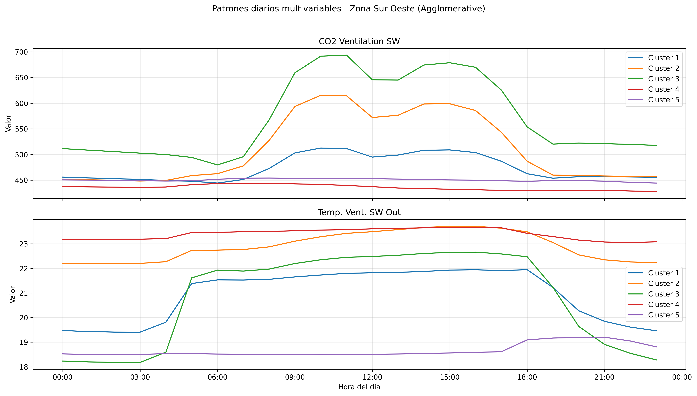

# Taller 3

- [Participación](Participacion_Taller_3_G1.pdf)

## 1. USO DE APRENDIZAJE NO SUPERVISADO

### A. Plotear las variables
Se realizaron overlay diarios de perfiles horarios para las variables registradas (CO2 y temperatura) por sensor/ventilador. El procedimiento gráfico consiste en normalizar las marcas temporales (formato %d.%m.%Y %H:%M), agrupar los datos por día y representar cada día como una curva hora-del-día superpuesta. Esto facilita identificar visualmente picos, caídas abruptas y desviaciones respecto al patrón típico de ocupación.

Observaciones principales:
- CO2: se detectan picos puntuales en ciertos días, con algunos perfiles que alcanzan valores muy elevados (en el análisis se reportan casos por encima de 1300 ppm). Estos picos rompen la forma típica del perfil diario y aparecen claramente resaltados en las figuras de anomalías.
- Temperatura: se observaron caídas bruscas y valores atípicos (p. ej. cercanos a 0 °C y ~7 °C) en algunos días, lo cual no concuerda con el comportamiento normal del sistema de ventilación y sugiere error de sensor, pérdida de datos o condiciones operativas inusuales.

Imágenes de referencia en esta carpeta: las figuras de la subcarpeta `images_P1` muestran la superposición de días normales en gris y los días anómalos en rojo, permitiendo identificar visualmente los eventos atípicos y patrones de comportamiento de los datos.

Recomendaciones iniciales: correlacionar los días detectados con registros operativos (mantenimiento, eventos, ocupación) y revisar calibración/estado de sensores para distinguir entre causas físicas y fallos de adquisición.

### B. Encontrar patrones/clústeres – análisis univariable
Análisis y metodología aplicada:

- Construcción de perfiles diarios: se crea una matriz día × hora pivotando la serie temporal por `time_of_day` (función `build_daily_profiles`). Las columnas se ordenan cronológicamente, se rellenan valores faltantes por interpolación y se descartan días con datos incompletos.
- Escalado: antes de clusterizar, los perfiles diarios se normalizan con `MinMaxScaler` para centrar el análisis en la forma temporal (perfil) en lugar de la magnitud absoluta.
- Selección del número de clusters: se prueba K en el rango 2..min(6, n_días-1) y se selecciona K que maximiza el `silhouette_score` (función `select_cluster_count`).
- Métodos de agrupamiento: se aplican `KMeans` (n_init=10, random_state fijo) y `AgglomerativeClustering` con el K seleccionado.
- Validación entre métodos: se calcula el `Adjusted Rand Index (ARI)` entre las etiquetas de KMeans y Agglomerative para cuantificar la consistencia; el análisis muestra buena concordancia entre ambos métodos en las series estudiadas.

Detección de anomalías univariables (método usado):

- Asignación de centroides: para cada día se toma el centroide del cluster asignado por KMeans.
- Distancia al centroide: se calcula la distancia euclídea entre el perfil diario (escalado) y el centroide asignado.
- Umbral de anomalía: se usa `umbral = media(distancias) + 2·desviación_estándar` (parámetro `threshold_std=2`). Días cuya distancia excede este umbral se marcan como anomalías.

Hallazgos y ejemplos:
- Las anomalías detectadas por este método coinciden con los picos de CO2 y las caídas bruscas de temperatura observadas en los plots. El script imprime una tabla con `day`, `cluster`, `distance` y `is_anomaly`, lo que permite priorizar inspecciones por orden de distancia.

Limitaciones y mejoras sugeridas:
- El escalado puede ocultar anomalías que son puramente de magnitud; considerar complementarlo con un análisis en escala absoluta para detectar aumentos de nivel general.
- El umbral global (media + 2·std) asume una distribución de distancias relativamente simétrica; en conjuntos heterogéneos es preferible usar umbrales por cluster o estadísticos robustos (mediana + MAD).
- Para detectar anomalías que involucren simultáneamente varias variables (CO2 y temperatura), conviene emplear los análisis multivariables desarrollados en la sección D.

Acciones recomendadas: verificar las fechas/días listados como anómalos contra registros de ocupación y mantenimiento; en caso de repetición por sensor, planificar calibración o reemplazo.

### C. Encontrar anomalías – análisis univariable
<!-- Javi -->

<!-- Agregar gráficos y hallazgos -->

### D. Encontrar patrones – análisis multivariable
<!-- Nico -->

<!-- Agregar gráficos y hallazgos -->

### E. Encontrar anomalías – análisis multivariable

Las anomalías multivariables se detectaron identificando perfiles diarios que no pertenecen claramente a los clústeres principales encontrados mediante KMeans y Agglomerative Clustering.

Para cada par de variables (CO2 y temperatura), se comparó la forma completa de los perfiles diarios respecto a los patrones promedio de cada clúster.

En el caso del CO2, se identificaron días con picos excesivos de concentración, variaciones abruptas y perfiles que no seguían la tendencia típica de ocupación del edificio. Algunos perfiles alcanzaron valores superiores a 1300 ppm, alejándose significativamente de los patrones representativos. En las gráficas se visualizan todos los días normales en gris y las anomalías en rojo.

En las variables de temperatura, las anomalías fueron más evidentes, observándose caídas bruscas y valores atípicos cercanos a 0 °C y 7 °C, los cuales no corresponden al comportamiento normal del sistema de ventilación. Estos perfiles podrían estar asociados a errores de sensor, fallos de adquisición de datos o condiciones operacionales inusuales.

Los métodos KMeans y Agglomerative mostraron consistencia en la identificación de los patrones principales, permitiendo detectar perfiles diarios alejados de los centroides o grupos representativos como posibles anomalías.

### F. Conclusiones
<!-- Todos -->

<!-- Agregar hallazgos -->

<!----------------------------------------------------------------------------------->

## 2. INVESTIGACIÓN OPERATIVA: TRAVELLING SALEMAN PROBLEM (TSP)

### A. Analizar el código propuesto
<!-- Jairo + Eve -->

<!-- Agregar gráficos y hallazgos, responder ¿qué tal te parece las soluciones que ha arrojado el modelo sin aplicar
todavía una heurística que ayude al modelo? -->

### B. Analizar el parámetro tee
<!-- Jairo + Eve -->

<!-- Agregar gráficos y hallazgos -->

### C. Aplicar heurística de límites a la función objetivo
<!-- Nico -->

<!-- Agregar gráficos y hallazgos, responder ¿Cuál es la diferencia entre los dos casos? y ¿Sirve esta heurística para cualquier caso? ¿Cuál pudiera ser una razón? -->

### D. Aplicar heurística de vecinos cercanos
<!-- Javi -->

<!-- Agregar gráficos y hallazgos, responder ¿Cuál es la diferencia entre los dos casos? y ¿Sirve esta heurística para cualquier caso? ¿Cuál pudiera ser una razón? -->

### E. Conclusiones
<!-- Todos -->

<!-- Agregar hallazgos -->

<!----------------------------------------------------------------------------------->

## 3. ALGORTIMOS GENÉTICOS

1. Ejecute los dos casos de estudio y explique los resultados de ejecución de cada caso de 
estudio.

•	Caso 1 (evaluación por coincidencias por posición): Se alcanzó el objetivo planteado. Observación: la aptitud (número de caracteres coincidentes) aumenta gradualmente hasta llegar al objetivo. Resultado de la ejecución: objetivo alcanzado en la generación 139 (Aptitud: 11).

•	Caso 2 (evaluación por distancia / minimización): Inicialmente se pudo ver que no alcanzó los objetivos planteados. Se modificó la función de distancia para usar valores absolutos y evitar negativos. Con la implementación correcta y las mejoras, alcanzó el objetivo más rápido. Observación: la aptitud (distancia) disminuye hasta 0. Resultado de la ejecución: objetivo alcanzado en la generación 69 (Aptitud: 0).

2. ¿Cuál sería una posible explicación para que el caso 2 no finalice como lo hace el caso 1?

La raíz del problema fue la función distance() en util.py. Antes devolvía una suma de diferencias con signo (valores negativos), por lo que la evaluación por distancia devolvía aptitudes incorrectas (negativas) y la lógica de selección/minimización quedaba distorsionada. Eso hacía que el algoritmo no favoreciera correctamente las soluciones cercanas al objetivo y no convergiera como se esperaba.

3. Realice una correcta implementación para obtener la distancia/diferencia correcta entre 
dos individuos en el archivo util.py función distance.

Cambié distance() para usar la distancia de Levenshtein sobre las secuencias (listas de códigos de caracteres). Ventajas: mide inserciones/deletes/substitutions (medida de edición) y es una métrica adecuada para similitud entre palabras. Archivo modificado: util.py.

4. ¿Sin alterar el parámetro de mutación mutation_rate, se puede implementar algo para 
mejorar la convergencia y que esta sea más rápida?

Implementé dos mejoras que aceleran la convergencia sin cambiar mutation_rate:

  Selección por torneo para ParentSelectionType.MIN_DISTANCE (favorece padres con menor distancia). Archivo modificado: operation.py.

  Elitismo en la generación NewGenerationType.MIN_DISTANCE: se conserva el mejor individuo y se generan hijos para completar la población (evita perder la mejor solución entre generaciones). Archivo modificado: generalSteps.py.

Efecto observado: con Levenshtein + torneo + elitismo, el Caso 2 pasó de tardar muchas generaciones a alcanzar el objetivo en ~69 generaciones (ejecución de prueba).
