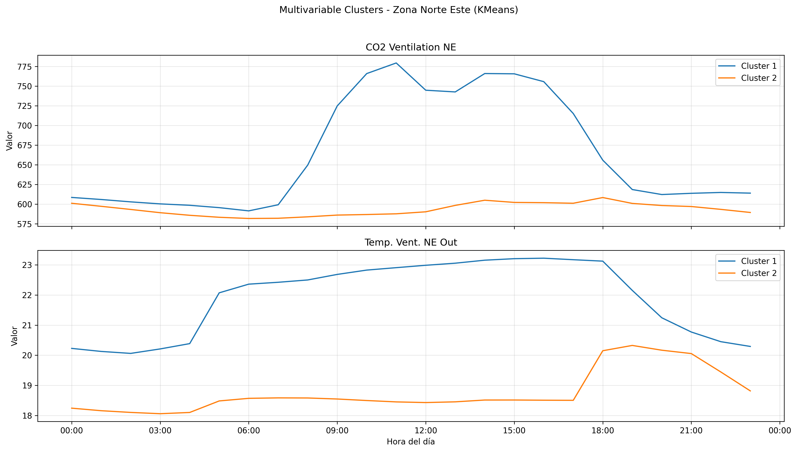
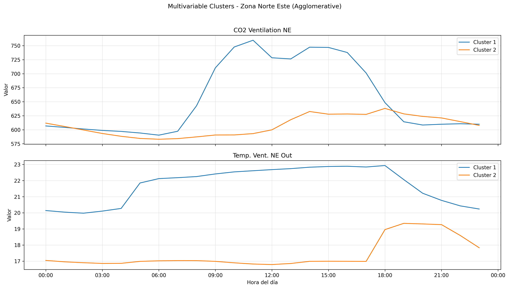
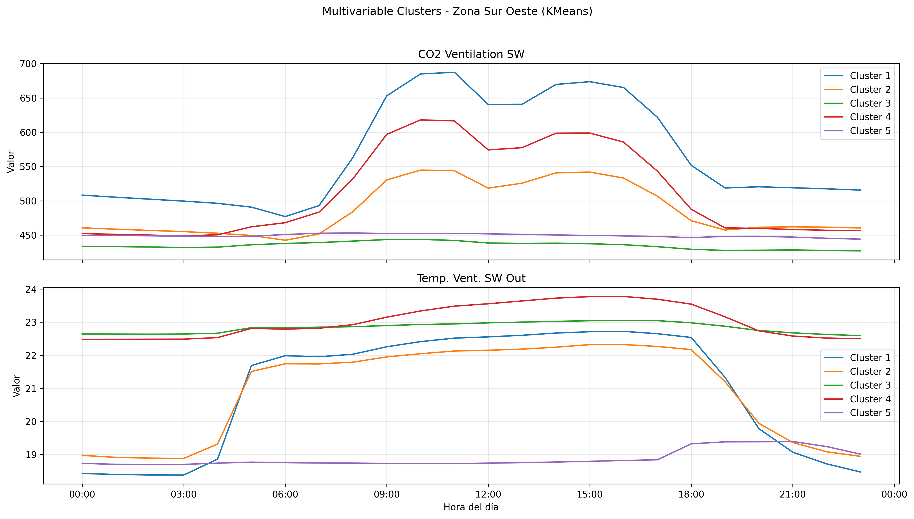
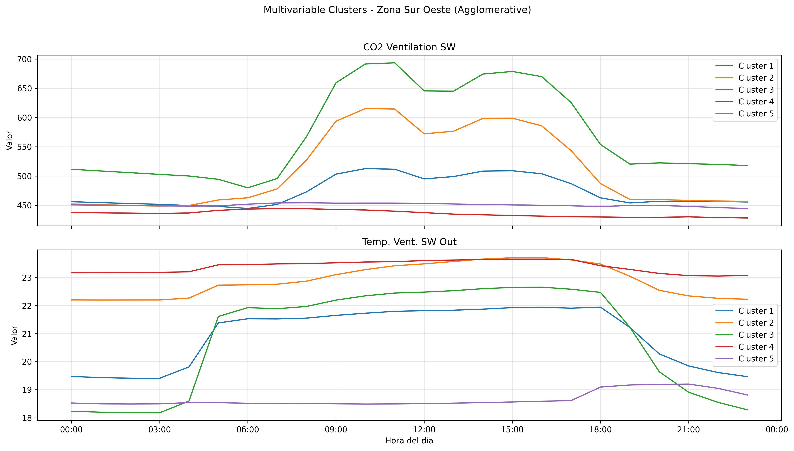
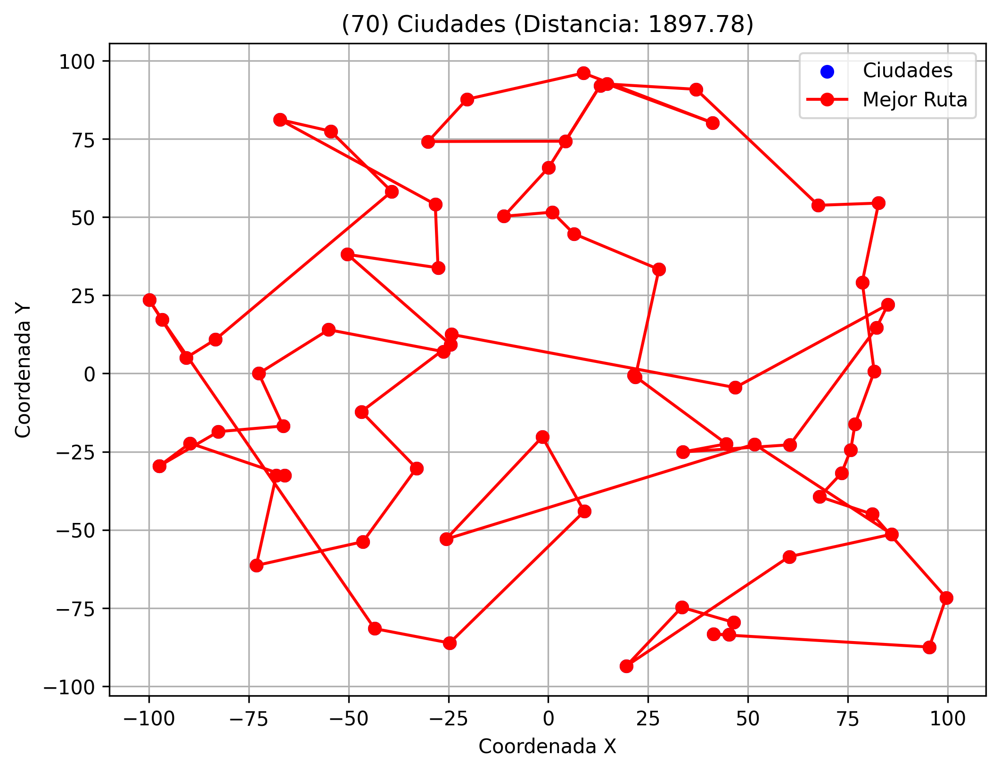
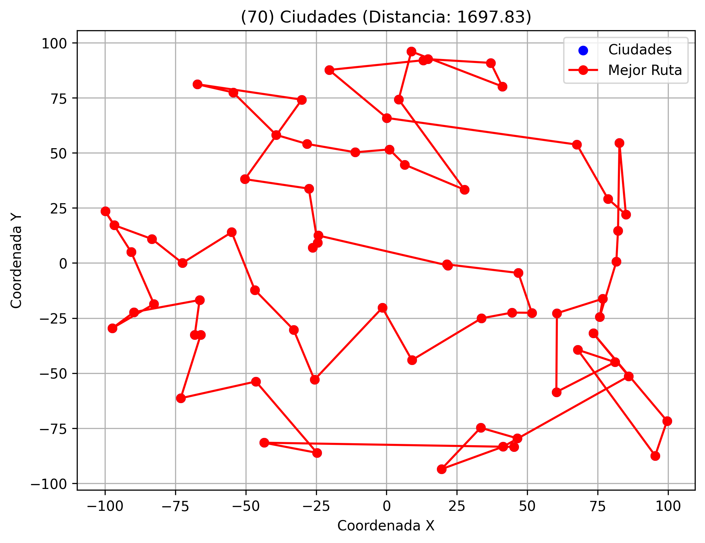

# Taller 3

- [Participación](Participacion_Taller_3_G1.pdf)

## 1. USO DE APRENDIZAJE NO SUPERVISADO

### A. Plotear las variables
<!-- Jairo -->

<!-- Agregar gráficos y hallazgos -->

### B. Encontrar patrones/clústeres – análisis univariable
<!-- Jairo -->

<!-- Agregar gráficos y hallazgos -->

### C. Encontrar anomalías – análisis univariable
<!-- Javi -->

<!-- Agregar gráficos y hallazgos -->

### D. Encontrar patrones – análisis multivariable
<!-- Nico -->

Para el análisis multivariable se estudiaron simultáneamente las variables de CO2 y temperatura de las zonas Norte Este (NE) y Sur Oeste (SW), utilizando dos técnicas de clustering: KMeans y Agglomerative Clustering. El objetivo fue identificar patrones diarios representativos considerando el comportamiento conjunto de ambas variables.

#### Zona Norte Este (NE) — KMeans

#### Zona Norte Este (NE) — Agglomerative

En la zona Norte Este ambos métodos encontraron prácticamente los mismos patrones, lo que evidencia una alta consistencia entre técnicas. Se identificaron principalmente dos clusters:

- Un patrón dominante donde el CO2 aumenta significativamente entre las 08:00 y 18:00, acompañado de temperaturas más altas durante el día. Este comportamiento sugiere mayor ocupación o actividad dentro del edificio.
- Un segundo patrón con niveles de CO2 y temperatura más bajos y estables, posiblemente asociado a días de menor utilización.

Además, se observa una relación positiva entre temperatura y concentración de CO2, ya que ambas variables tienden a incrementarse simultáneamente durante las horas de mayor actividad.

#### Zona Sur Oeste (SW) — KMeans

#### Zona Sur Oeste (SW) — Agglomerative

En la zona Sur Oeste se identificó una mayor variedad de patrones diarios, encontrándose aproximadamente cinco clusters diferenciados. Tanto KMeans como Agglomerative detectaron estructuras muy similares.

El patrón más representativo corresponde a días con:
- incrementos elevados de CO2 durante horas laborales,
- temperaturas medias-altas,
- disminución gradual de ambas variables al finalizar la tarde.

También se observaron clusters con comportamientos más estables y niveles bajos de CO2, lo que podría representar días de menor ocupación o actividad reducida.

En general, el análisis multivariable permitió identificar patrones diarios más completos que el análisis univariable, mostrando cómo evolucionan conjuntamente la temperatura y la concentración de CO2 dentro del sistema de ventilación del edificio.

### E. Encontrar anomalías – análisis multivariable
<!-- Eve -->

<!-- Agregar gráficos y hallazgos -->

### F. Conclusiones
<!-- Todos -->

<!-- Agregar hallazgos -->

<!----------------------------------------------------------------------------------->

## 2. INVESTIGACIÓN OPERATIVA: TRAVELLING SALEMAN PROBLEM (TSP)

### A. Analizar el código propuesto
<!-- Jairo + Eve -->

<!-- Agregar gráficos y hallazgos, responder ¿qué tal te parece las soluciones que ha arrojado el modelo sin aplicar
todavía una heurística que ayude al modelo? -->

### B. Analizar el parámetro tee
<!-- Jairo + Eve -->

<!-- Agregar gráficos y hallazgos -->

### C. Aplicar heurística de límites a la función objetivo
<!-- Nico -->

<!-- Agregar gráficos y hallazgos, responder ¿Cuál es la diferencia entre los dos casos? y ¿Sirve esta heurística para cualquier caso? ¿Cuál pudiera ser una razón? -->

Para este experimento se ejecutó el caso 2 del problema TSP con 70 ciudades comparando dos escenarios:
a) aplicando la heurística `limitar_funcion_objetivo` y
b) sin aplicar heurística.

La heurística implementada agrega restricciones adicionales sobre la función objetivo, estableciendo límites mínimos y máximos estimados para la distancia total del recorrido. Esto busca reducir el espacio de búsqueda del solver y acelerar la convergencia. 

#### Resultado con heurística

* Tiempo de ejecución: **41 segundos**
* Distancia obtenida: **1897.78**
* Estado del solver: **no encontró solución óptima dentro del tiempo límite**
* Heurística aplicada: `limitar_funcion_objetivo`

#### Resultado sin heurística

* Tiempo de ejecución: **41 segundos**
* Distancia obtenida: **1697.83**
* Estado del solver: **no encontró solución óptima dentro del tiempo límite**
* Sin heurísticas aplicadas

En ambos casos el solver alcanzó el límite de tiempo establecido (`tmlim = 40`) sin lograr demostrar optimalidad. Sin embargo, el comportamiento fue diferente.

El caso **sin heurística** obtuvo una mejor solución, alcanzando una distancia total menor (**1697.83**) frente al caso **con heurística** (**1897.78**). Esto indica que la heurística restringió demasiado el espacio de búsqueda y evitó que GLPK explorara rutas potencialmente mejores.

Aunque la intención de la heurística era mejorar la convergencia limitando el rango de valores posibles de la función objetivo, en este caso los límites calculados fueron poco precisos. En el código, dichos límites se estiman utilizando promedios y distancias mínimas globales.  Esto puede provocar que soluciones prometedoras queden fuera del modelo antes de ser evaluadas.

Además, el caso con heurística presentó más restricciones y mayor cantidad de coeficientes no nulos en el modelo, lo que también incrementó la complejidad del problema para el solver.

#### ¿Cuál es la diferencia entre los dos casos?

La principal diferencia es que el caso con heurística agrega restricciones sobre la distancia total esperada del recorrido, intentando guiar al solver hacia soluciones “razonables”. Sin embargo, en esta ejecución la heurística produjo una solución de peor calidad que el modelo sin restricciones adicionales.

El modelo sin heurística tuvo mayor libertad para explorar soluciones y logró encontrar una ruta más corta antes de alcanzar el límite de tiempo.

#### ¿Sirve esta heurística para cualquier caso? ¿Cuál pudiera ser una razón?

No necesariamente. Esta heurística depende de que la estimación de límites sea adecuada para la distribución real de las ciudades. Si los límites son demasiado estrictos o poco representativos, el solver puede descartar soluciones válidas y terminar encontrando rutas peores.

Una posible razón es que el TSP es un problema NP-Hard y pequeñas variaciones en las restricciones pueden afectar significativamente el espacio de búsqueda. Por ello, una heurística mal calibrada puede reducir la exploración útil del solver en lugar de ayudarlo.

### D. Aplicar heurística de vecinos cercanos
<!-- Javi -->

<!-- Agregar gráficos y hallazgos, responder ¿Cuál es la diferencia entre los dos casos? y ¿Sirve esta heurística para cualquier caso? ¿Cuál pudiera ser una razón? -->

### E. Conclusiones
<!-- Todos -->

<!-- Agregar hallazgos -->

<!----------------------------------------------------------------------------------->

## 3. ALGORTIMOS GENÉTICOS

<!-- Pendiente -->