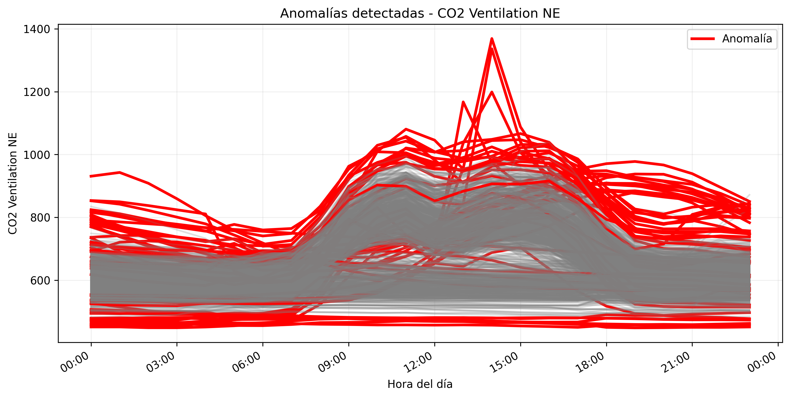
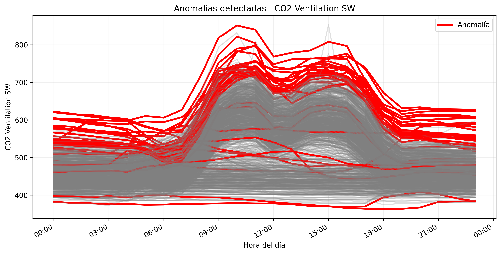
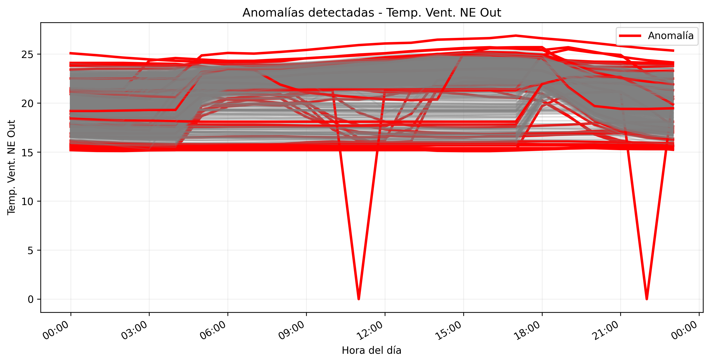
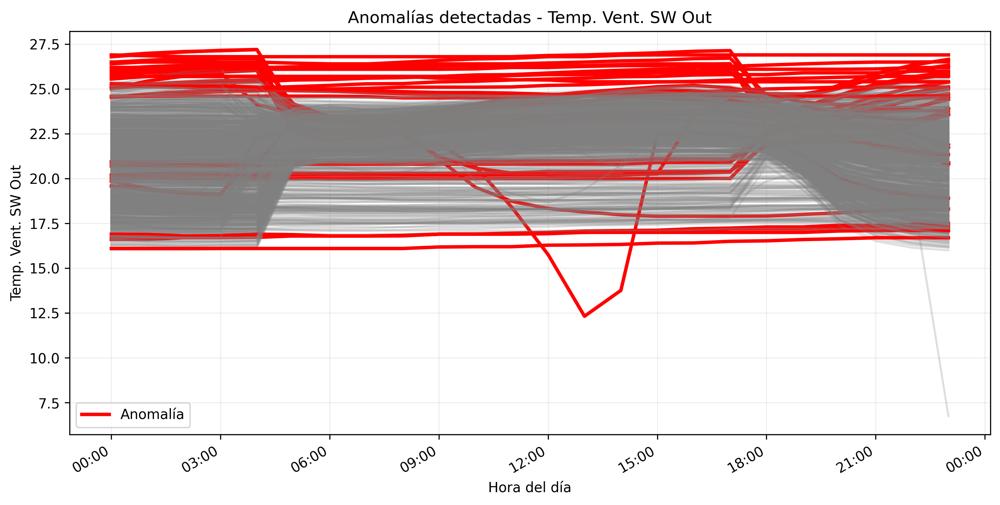

# Taller 3

- [Participación](Participacion_Taller_3_G1.pdf)

## 1. USO DE APRENDIZAJE NO SUPERVISADO

### A. Plotear las variables
<!-- Jairo -->

<!-- Agregar gráficos y hallazgos -->

### B. Encontrar patrones/clústeres – análisis univariable
<!-- Jairo -->

<!-- Agregar gráficos y hallazgos -->

### C. Encontrar anomalías – análisis univariable
<!-- Javi -->

<!-- Agregar gráficos y hallazgos -->

### D. Encontrar patrones – análisis multivariable
<!-- Nico -->

<!-- Agregar gráficos y hallazgos -->

### E. Encontrar anomalías – análisis multivariable

Las anomalías multivariables se detectaron identificando perfiles diarios que no pertenecen claramente a los clústeres principales encontrados mediante KMeans y Agglomerative Clustering.

Para cada par de variables (CO2 y temperatura), se comparó la forma completa de los perfiles diarios respecto a los patrones promedio de cada clúster.

En el caso del CO2, se identificaron días con picos excesivos de concentración, variaciones abruptas y perfiles que no seguían la tendencia típica de ocupación del edificio. Algunos perfiles alcanzaron valores superiores a 1300 ppm, alejándose significativamente de los patrones representativos. En las gráficas se visualizan todos los días normales en gris y las anomalías en rojo.






En las variables de temperatura, las anomalías fueron más evidentes, observándose caídas bruscas y valores atípicos cercanos a 0 °C y 7 °C, los cuales no corresponden al comportamiento normal del sistema de ventilación. Estos perfiles podrían estar asociados a errores de sensor, fallos de adquisición de datos o condiciones operacionales inusuales.





Los métodos KMeans y Agglomerative mostraron consistencia en la identificación de los patrones principales, permitiendo detectar perfiles diarios alejados de los centroides o grupos representativos como posibles anomalías.


### F. Conclusiones
<!-- Todos -->

<!-- Agregar hallazgos -->

<!----------------------------------------------------------------------------------->

## 2. INVESTIGACIÓN OPERATIVA: TRAVELLING SALEMAN PROBLEM (TSP)

### A. Analizar el código propuesto

Las soluciones obtenidas con el modelo sin heurísticas parecen adecuadas y razonablemente eficientes, especialmente para un número pequeño de ciudades. Las rutas generadas muestran recorridos coherentes y relativamente organizados, minimizando trayectorias innecesarias. Sin embargo, conforme aumenta el número de ciudades, el problema se vuelve más complejo y el tiempo de ejecución incrementa considerablemente. Aun así, el modelo logra encontrar soluciones de buena calidad, lo que demuestra la capacidad del enfoque de programación lineal para resolver el problema del TSP en instancias pequeñas y medianas.

#### Resultados comparativos – Caso de estudio 1

En comparación, la heurística del vecino cercano encuentra rutas rápidamente, pero al tomar decisiones locales no siempre obtiene el recorrido global más corto. La heurística de vecino cercano no garantiza una mejor solución que el modelo LP. Como se evidencia, su ventaja principal es el tiempo de ejecución ya que, construye una ruta rápidamente. Sin embargo, al tomar decisiones locales, puede generar rutas con cruces o distancias mayores. Por ello, una solución con heurística puede verse menos ordenada o tener mayor distancia, aunque se obtenga en menor tiempo.

| Nº Ciudades | Método                     | Tiempo de ejecución | Distancia total |
|-------------|----------------------------|---------------------|-----------------|
| 10          | LP sin heurística          | 00:00               | 570.70          |
| 10          | Heurística vecino cercano  | 00:00               | 588.52          |
| 20          | LP sin heurística          | 00:03               | 718.47          |
| 20          | Heurística vecino cercano  | 00:00               | 758.23          |
| 30          | LP sin heurística          | 00:30               | 931.74          |
| 30          | Heurística vecino cercano  | 00:00               | 1036.63         |
| 40          | LP sin heurística          | 00:30               | 1131.79         |
| 40          | Heurística vecino cercano  | 00:00               | 1174.04         |
| 50          | LP sin heurística          | 00:30               | 1125.95         |
| 50          | Heurística vecino cercano  | 00:00               | 1368.73         |


<table>
  <tr>
    <td align="center">
      <b>LP sin heurística</b><br>
      
    </td>
    <td align="center">
      <b>Heurística Vecino Cercano</b><br>
      
    </td>
  </tr>
</table>

<table>
  <tr>
    <td align="center">
      <b>LP sin heurística</b><br>
      
    </td>
    <td align="center">
      <b>Heurística Vecino Cercano</b><br>
      
    </td>
  </tr>
</table>

<table>
  <tr>
    <td align="center">
      <b>LP sin heurística</b><br>
      
    </td>
    <td align="center">
      <b>Heurística Vecino Cercano</b><br>
      
    </td>
  </tr>
</table>

<table>
  <tr>
    <td align="center">
      <b>LP sin heurística</b><br>
      
    </td>
    <td align="center">
      <b>Heurística Vecino Cercano</b><br>
      
    </td>
  </tr>
</table>

<table>
  <tr>
    <td align="center">
      <b>LP sin heurística</b><br>
      
    </td>
    <td align="center">
      <b>Heurística Vecino Cercano</b><br>
      
    </td>
  </tr>
</table>

### B. Analizar el parámetro tee

El parámetro `tee` controla si se muestra o no en consola la salida detallada del solver GLPK durante el proceso de optimización.

Cuando `tee=False`, el solver trabaja en segundo plano y únicamente se muestran los resultados definidos manualmente en el código mediante `print()`. En cambio, al activar:

```python
tee = True
```
el solver imprime información detallada del proceso de resolución del problema TSP como se muestra a continuación:


Entre los mensajes observados se encuentran:

- Inicio de la optimización LP y MIP.
- Número de iteraciones y nodos explorados.
- Mejor solución encontrada hasta el momento.
- Gap porcentual entre la solución actual y el límite inferior.
- Tiempo de ejecución.
- Memoria utilizada.
- Condición de terminación del algoritmo.

En conclusión, el parámetro tee=True es útil para monitorear el comportamiento interno del solver, analizar el rendimiento computacional y comprender el progreso de la optimización en problemas complejos como el TSP.

### C. Aplicar heurística de límites a la función objetivo
<!-- Nico -->

<!-- Agregar gráficos y hallazgos, responder ¿Cuál es la diferencia entre los dos casos? y ¿Sirve esta heurística para cualquier caso? ¿Cuál pudiera ser una razón? -->

### D. Aplicar heurística de vecinos cercanos
<!-- Javi -->

<!-- Agregar gráficos y hallazgos, responder ¿Cuál es la diferencia entre los dos casos? y ¿Sirve esta heurística para cualquier caso? ¿Cuál pudiera ser una razón? -->

### E. Conclusiones
<!-- Todos -->

<!-- Agregar hallazgos -->

<!----------------------------------------------------------------------------------->

## 3. ALGORTIMOS GENÉTICOS

<!-- Pendiente -->