# Taller 3

- [Participación](Participacion_Taller_3_G1.pdf)

## 1. USO DE APRENDIZAJE NO SUPERVISADO

### A. Plotear las variables
Se realizaron overlay diarios de perfiles horarios para las variables registradas (CO2 y temperatura) por sensor/ventilador. El procedimiento gráfico consiste en normalizar las marcas temporales (formato %d.%m.%Y %H:%M), agrupar los datos por día y representar cada día como una curva hora-del-día superpuesta. Esto facilita identificar visualmente picos, caídas abruptas y desviaciones respecto al patrón típico de ocupación.

Observaciones principales:
- CO2: se detectan picos puntuales en ciertos días, con algunos perfiles que alcanzan valores muy elevados (en el análisis se reportan casos por encima de 1300 ppm). Estos picos rompen la forma típica del perfil diario y aparecen claramente resaltados en las figuras de anomalías.
- Temperatura: se observaron caídas bruscas y valores atípicos (p. ej. cercanos a 0 °C y ~7 °C) en algunos días, lo cual no concuerda con el comportamiento normal del sistema de ventilación y sugiere error de sensor, pérdida de datos o condiciones operativas inusuales.

Imágenes de referencia en esta carpeta: las figuras de la subcarpeta `images_P1` muestran la superposición de días normales en gris y los días anómalos en rojo, permitiendo identificar visualmente los eventos atípicos y patrones de comportamiento de los datos.

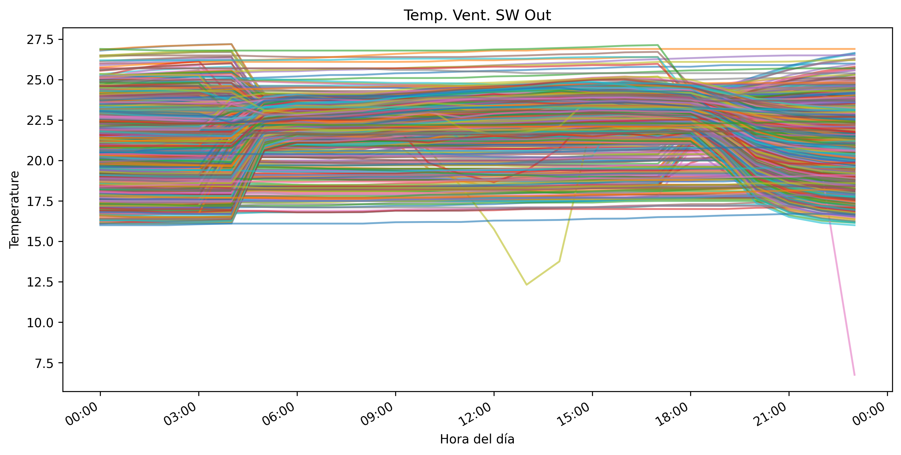

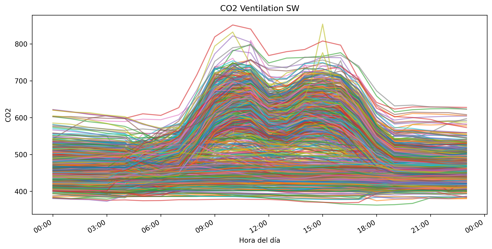

### B. Encontrar patrones/clústeres – análisis univariable
Análisis y metodología aplicada:

- Construcción de perfiles diarios: se crea una matriz día × hora pivotando la serie temporal por `time_of_day` (función `build_daily_profiles`). Las columnas se ordenan cronológicamente, se rellenan valores faltantes por interpolación y se descartan días con datos incompletos.
- Escalado: antes de clusterizar, los perfiles diarios se normalizan con `MinMaxScaler` para centrar el análisis en la forma temporal (perfil) en lugar de la magnitud absoluta.
- Selección del número de clusters: se prueba K en el rango 2..min(6, n_días-1) y se selecciona K que maximiza el `silhouette_score` (función `select_cluster_count`).
- Métodos de agrupamiento: se aplican `KMeans` (n_init=10, random_state fijo) y `AgglomerativeClustering` con el K seleccionado.
- Validación entre métodos: se calcula el `Adjusted Rand Index (ARI)` entre las etiquetas de KMeans y Agglomerative para cuantificar la consistencia; el análisis muestra buena concordancia entre ambos métodos en las series estudiadas.

Detección de anomalías univariables (método usado):

- Asignación de centroides: para cada día se toma el centroide del cluster asignado por KMeans.
- Distancia al centroide: se calcula la distancia euclídea entre el perfil diario (escalado) y el centroide asignado.
- Umbral de anomalía: se usa `umbral = media(distancias) + 2·desviación_estándar` (parámetro `threshold_std=2`). Días cuya distancia excede este umbral se marcan como anomalías.

Hallazgos y ejemplos:
- Las anomalías detectadas por este método coinciden con los picos de CO2 y las caídas bruscas de temperatura observadas en los plots. El script imprime una tabla con `day`, `cluster`, `distance` y `is_anomaly`, lo que permite priorizar inspecciones por orden de distancia.

Limitaciones y mejoras sugeridas:
- El escalado puede ocultar anomalías que son puramente de magnitud; considerar complementarlo con un análisis en escala absoluta para detectar aumentos de nivel general.
- El umbral global (media + 2·std) asume una distribución de distancias relativamente simétrica; en conjuntos heterogéneos es preferible usar umbrales por cluster o estadísticos robustos (mediana + MAD).
- Para detectar anomalías que involucren simultáneamente varias variables (CO2 y temperatura), conviene emplear los análisis multivariables desarrollados en la sección D.

Acciones recomendadas: verificar las fechas/días listados como anómalos contra registros de ocupación y mantenimiento; en caso de repetición por sensor, planificar calibración o reemplazo.

### C. Encontrar anomalías – análisis univariable
<!-- Javi -->

<!-- Agregar gráficos y hallazgos -->

### D. Encontrar patrones – análisis multivariable

Para el análisis multivariable se estudiaron simultáneamente las variables de CO2 y temperatura de las zonas Norte Este (NE) y Sur Oeste (SW), utilizando dos técnicas de clustering: KMeans y Agglomerative Clustering. El objetivo fue identificar patrones diarios representativos considerando el comportamiento conjunto de ambas variables.

#### Zona Norte Este (NE) — KMeans


#### Zona Norte Este (NE) — Agglomerative


En la zona Norte Este ambos métodos encontraron prácticamente los mismos patrones, lo que evidencia una alta consistencia entre técnicas. Se identificaron principalmente dos clusters:

- Un patrón dominante donde el CO2 aumenta significativamente entre las 08:00 y 18:00, acompañado de temperaturas más altas durante el día. Este comportamiento sugiere mayor ocupación o actividad dentro del edificio.
- Un segundo patrón con niveles de CO2 y temperatura más bajos y estables, posiblemente asociado a días de menor utilización.

Además, se observa una relación positiva entre temperatura y concentración de CO2, ya que ambas variables tienden a incrementarse simultáneamente durante las horas de mayor actividad.

#### Zona Sur Oeste (SW) — KMeans


#### Zona Sur Oeste (SW) — Agglomerative


En la zona Sur Oeste se identificó una mayor variedad de patrones diarios, encontrándose aproximadamente cinco clusters diferenciados. Tanto KMeans como Agglomerative detectaron estructuras muy similares.

El patrón más representativo corresponde a días con:
- incrementos elevados de CO2 durante horas laborales,
- temperaturas medias-altas,
- disminución gradual de ambas variables al finalizar la tarde.

También se observaron clusters con comportamientos más estables y niveles bajos de CO2, lo que podría representar días de menor ocupación o actividad reducida.

En general, el análisis multivariable permitió identificar patrones diarios más completos que el análisis univariable, mostrando cómo evolucionan conjuntamente la temperatura y la concentración de CO2 dentro del sistema de ventilación del edificio.

### E. Encontrar anomalías – análisis multivariable

Para el análisis multivariable se consideraron conjuntamente las variables de CO2 y temperatura de cada zona del edificio, formando perfiles diarios combinados. Se aplicó el algoritmo KMeans para identificar patrones representativos y posteriormente se calcularon las distancias de cada día respecto al centroide de su clúster asignado. Los perfiles cuya distancia superó el umbral definido fueron considerados anomalías multivariables.

#### Zona Norte Este (NE)

En la zona Norte Este se identificaron varios perfiles diarios anómalos que presentan comportamientos distintos al patrón general observado en la mayoría de días.

Las anomalías más evidentes se presentan principalmente en la variable de CO2, donde algunos días muestran incrementos abruptos entre las 12:00 y 15:00 horas, alcanzando concentraciones considerablemente mayores al comportamiento promedio. Esto podría sugerir eventos de mayor ocupación, menor ventilación o cambios operativos del sistema de ventilación.

En la variable de temperatura también se detectaron perfiles atípicos, especialmente días con descensos bruscos de temperatura cercanos a valores anormalmente bajos respecto al resto del conjunto. Estos comportamientos podrían estar asociados a errores de medición, fallas del sensor o condiciones operativas inusuales del sistema de ventilación.

En general, la mayoría de anomalías de la zona NE muestran una desviación simultánea en ambas variables, lo que indica que ciertos días presentan un comportamiento integral distinto al patrón multivariable dominante.

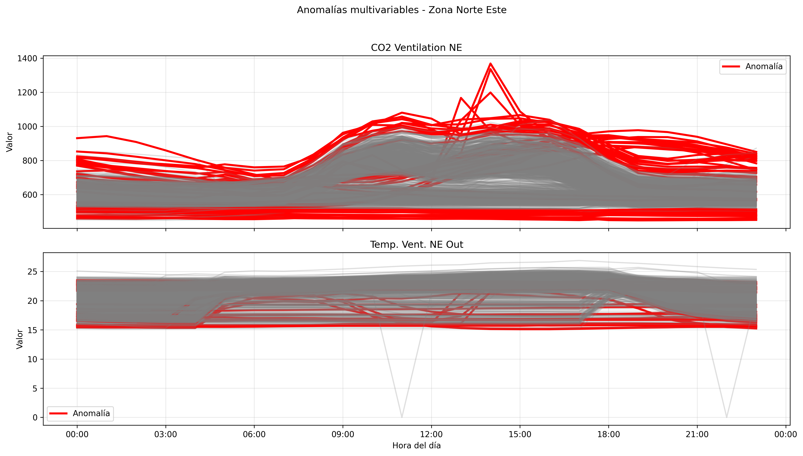

#### Zona Sur Oeste (SW)

En la zona Sur Oeste también se detectaron anomalías multivariables, aunque con menor dispersión que en la zona Norte Este.

Los perfiles anómalos muestran incrementos pronunciados de CO2 durante las horas centrales del día, especialmente entre las 09:00 y 16:00 horas, superando el comportamiento promedio de los demás días.

En temperatura se observan anomalías asociadas a descensos abruptos alrededor del mediodía, así como perfiles con temperaturas más elevadas y constantes respecto al patrón general. Esto podría indicar cambios operativos del sistema de ventilación, diferencias de ocupación o posibles inconsistencias en la adquisición de datos.

A diferencia del análisis univariable, el análisis multivariable permitió identificar días que individualmente podrían parecer normales en una sola variable, pero que presentan un comportamiento atípico cuando se analiza conjuntamente la relación entre CO2 y temperatura.

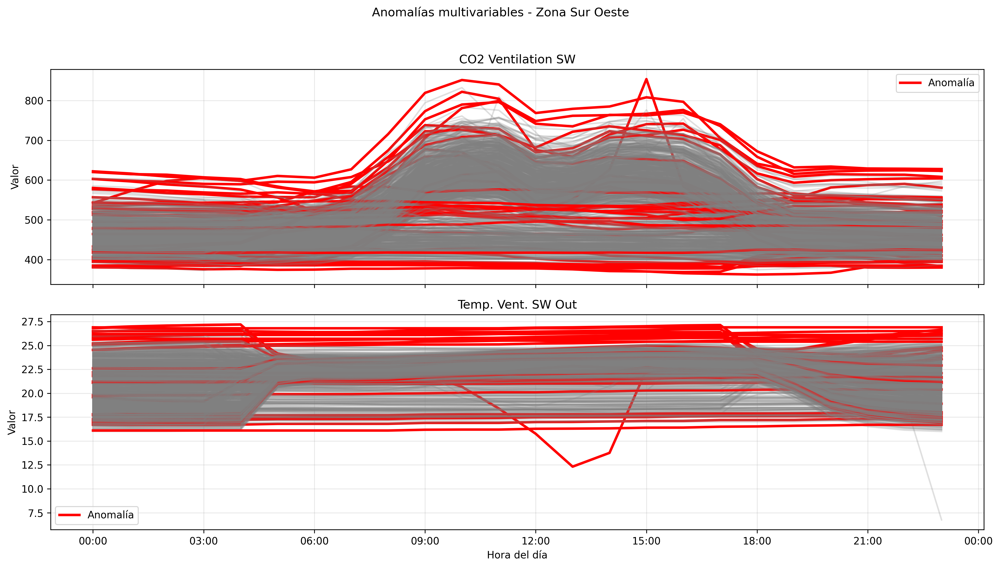

El análisis multivariable permitió identificar patrones diarios representativos y detectar perfiles atípicos considerando simultáneamente las variables de CO2 y temperatura. Las anomalías detectadas evidencian días con comportamientos operativos distintos al patrón habitual del sistema de ventilación, posiblemente relacionados con variaciones de ocupación, cambios de operación del sistema de ventilación o errores de sensores.

Además, se observó que la zona Norte Este presenta una mayor variabilidad y dispersión en los perfiles anómalos respecto a la zona Sur Oeste, lo que sugiere un comportamiento menos estable del sistema en dicha área.

### F. Conclusiones
<!-- Todos -->

<!-- Agregar hallazgos -->

<!----------------------------------------------------------------------------------->

## 2. INVESTIGACIÓN OPERATIVA: TRAVELLING SALEMAN PROBLEM (TSP)

### A. Analizar el código propuesto

Las soluciones obtenidas con el modelo sin heurísticas parecen adecuadas y razonablemente eficientes, especialmente para un número pequeño de ciudades. Las rutas generadas muestran recorridos coherentes y relativamente organizados, minimizando trayectorias innecesarias. Sin embargo, conforme aumenta el número de ciudades, el problema se vuelve más complejo y el tiempo de ejecución incrementa considerablemente. Aun así, el modelo logra encontrar soluciones de buena calidad, lo que demuestra la capacidad del enfoque de programación lineal para resolver el problema del TSP en instancias pequeñas y medianas.

#### Resultados comparativos – Caso de estudio 1

En comparación, la heurística del vecino cercano encuentra rutas rápidamente, pero al tomar decisiones locales no siempre obtiene el recorrido global más corto. La heurística de vecino cercano no garantiza una mejor solución que el modelo LP. Como se evidencia, su ventaja principal es el tiempo de ejecución ya que, construye una ruta rápidamente. Sin embargo, al tomar decisiones locales, puede generar rutas con cruces o distancias mayores. Por ello, una solución con heurística puede verse menos ordenada o tener mayor distancia, aunque se obtenga en menor tiempo.

| Nº Ciudades | Método                     | Tiempo de ejecución | Distancia total |
|-------------|----------------------------|---------------------|-----------------|
| 10          | LP sin heurística          | 00:00               | 570.70          |
| 10          | Heurística vecino cercano  | 00:00               | 588.52          |
| 20          | LP sin heurística          | 00:03               | 718.47          |
| 20          | Heurística vecino cercano  | 00:00               | 758.23          |
| 30          | LP sin heurística          | 00:30               | 931.74          |
| 30          | Heurística vecino cercano  | 00:00               | 1036.63         |
| 40          | LP sin heurística          | 00:30               | 1131.79         |
| 40          | Heurística vecino cercano  | 00:00               | 1174.04         |
| 50          | LP sin heurística          | 00:30               | 1125.95         |
| 50          | Heurística vecino cercano  | 00:00               | 1368.73         |


<table>
  <tr>
    <td align="center">
      <b>LP sin heurística</b><br>
      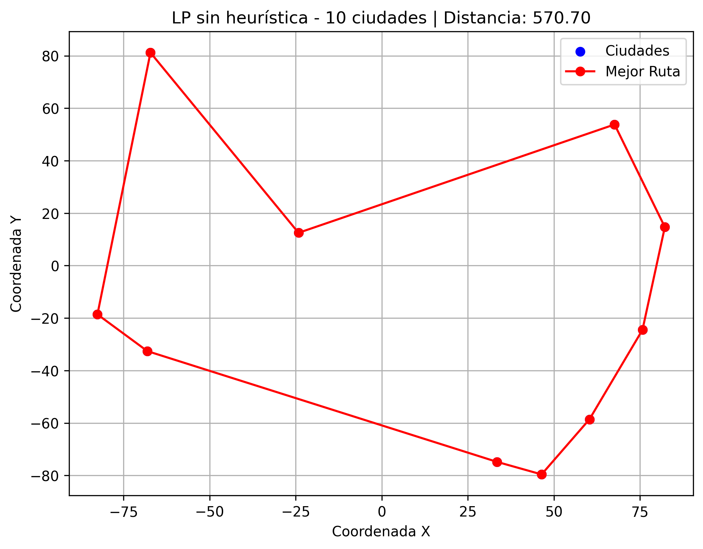
    </td>
    <td align="center">
      <b>Heurística Vecino Cercano</b><br>
      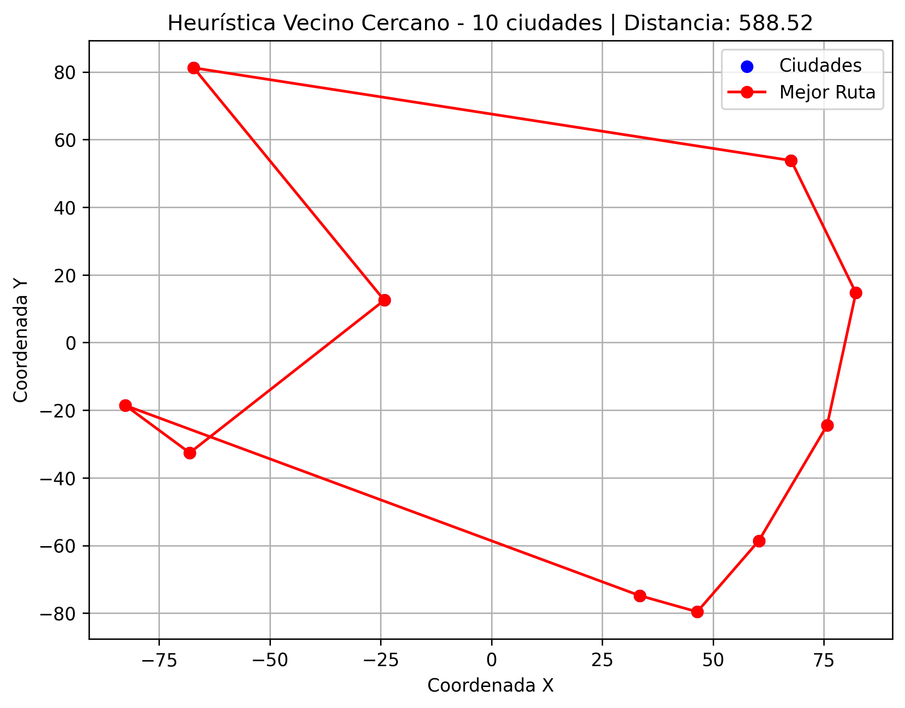
    </td>
  </tr>
</table>

<table>
  <tr>
    <td align="center">
      <b>LP sin heurística</b><br>
      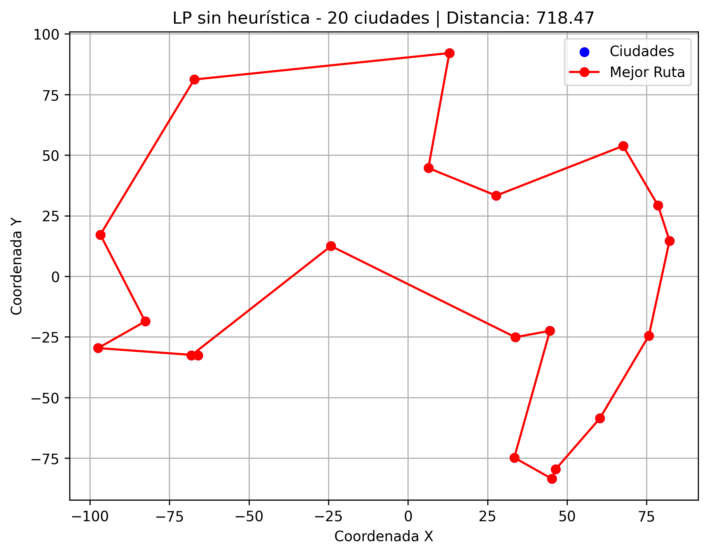
    </td>
    <td align="center">
      <b>Heurística Vecino Cercano</b><br>
      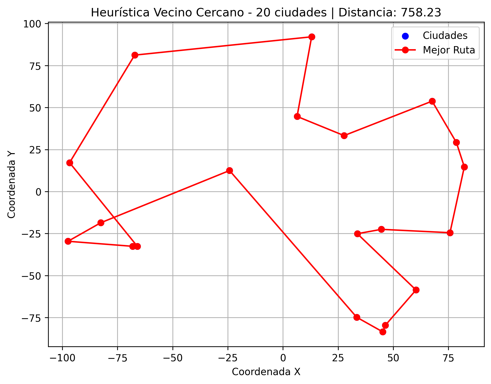
    </td>
  </tr>
</table>

<table>
  <tr>
    <td align="center">
      <b>LP sin heurística</b><br>
      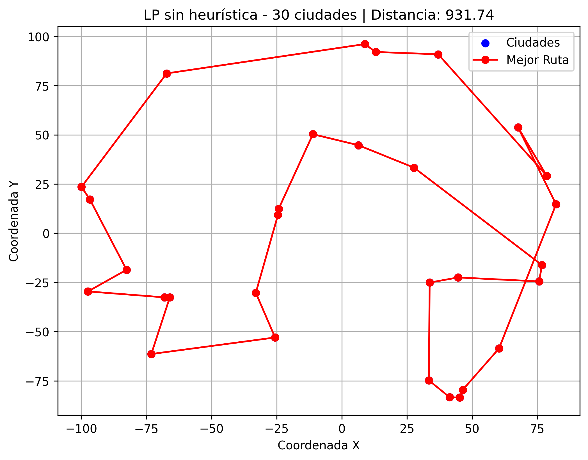
    </td>
    <td align="center">
      <b>Heurística Vecino Cercano</b><br>
      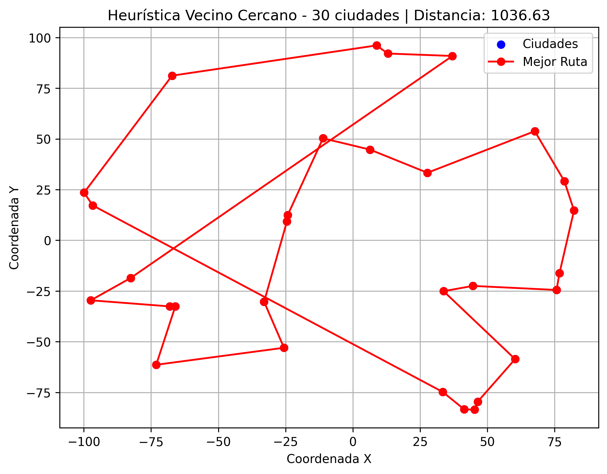
    </td>
  </tr>
</table>

<table>
  <tr>
    <td align="center">
      <b>LP sin heurística</b><br>
      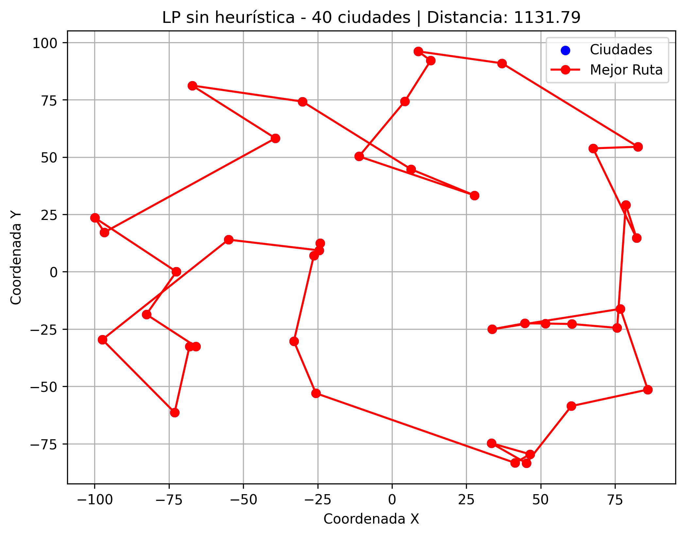
    </td>
    <td align="center">
      <b>Heurística Vecino Cercano</b><br>
      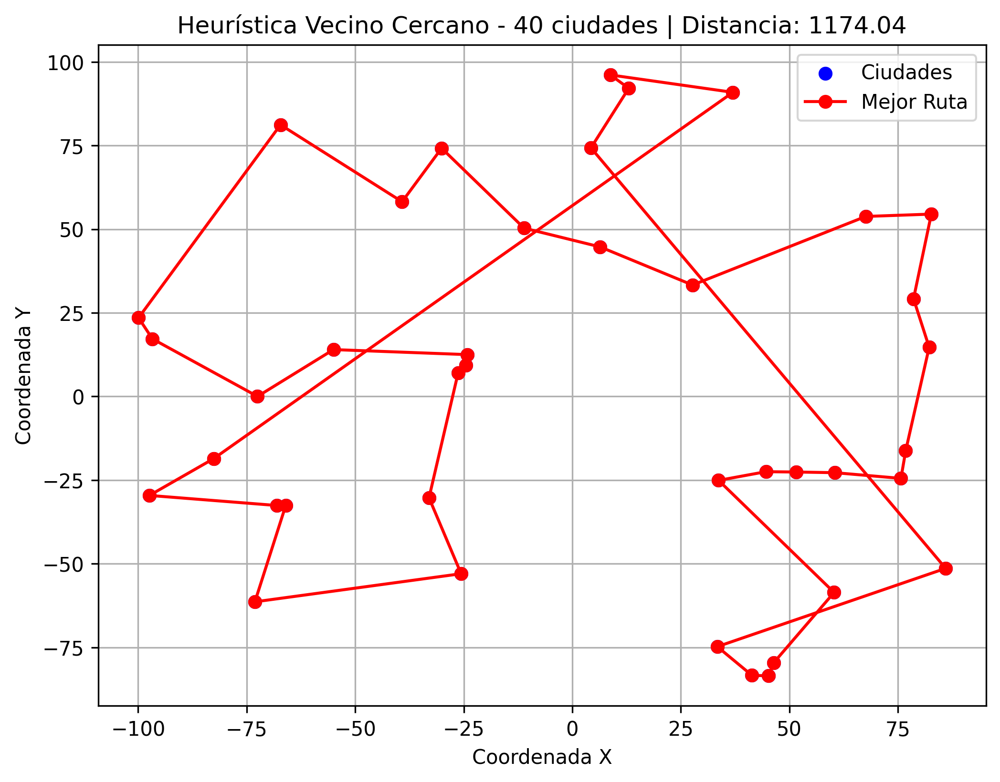
    </td>
  </tr>
</table>

<table>
  <tr>
    <td align="center">
      <b>LP sin heurística</b><br>
      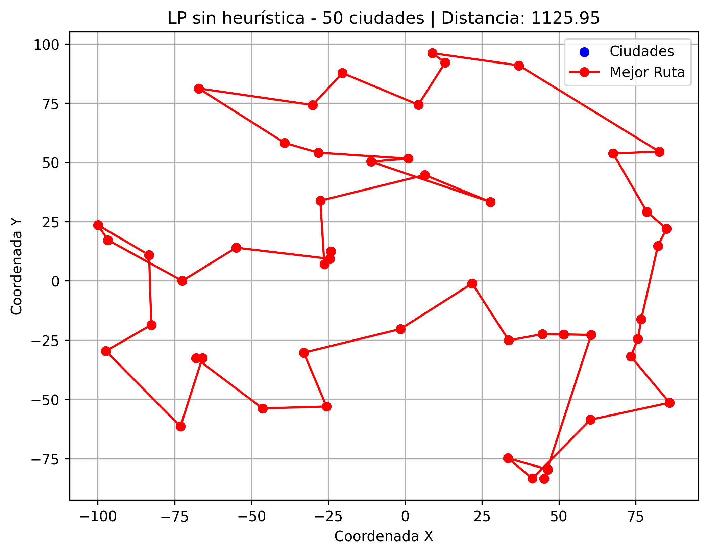
    </td>
    <td align="center">
      <b>Heurística Vecino Cercano</b><br>
      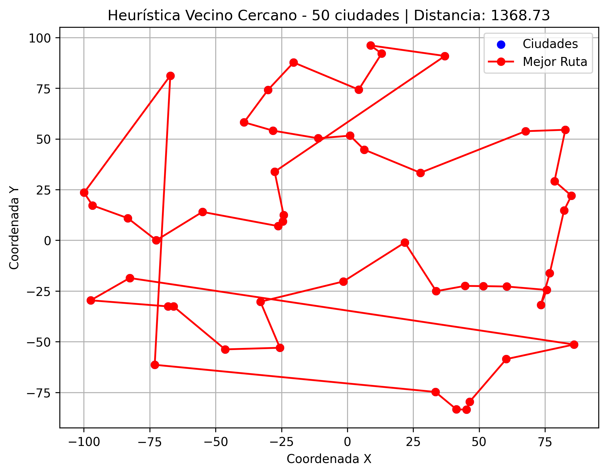
    </td>
  </tr>
</table>

### B. Analizar el parámetro tee

El parámetro `tee` controla si se muestra o no en consola la salida detallada del solver GLPK durante el proceso de optimización.

Cuando `tee=False`, el solver trabaja en segundo plano y únicamente se muestran los resultados definidos manualmente en el código mediante `print()`. En cambio, al activar:

```python
tee = True
```
el solver imprime información detallada del proceso de resolución del problema TSP como se muestra a continuación:

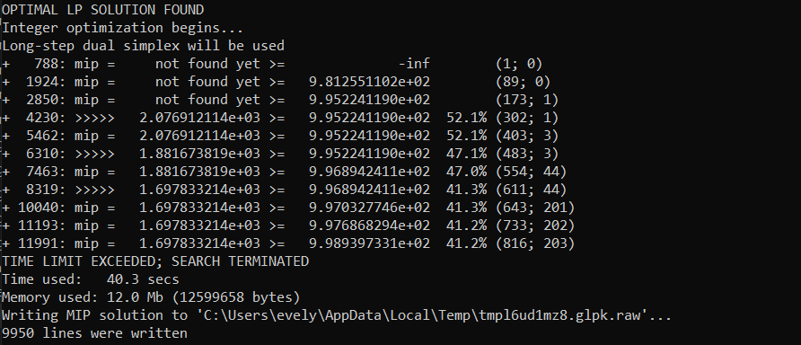

Entre los mensajes observados se encuentran:

- Inicio de la optimización LP y MIP.
- Número de iteraciones y nodos explorados.
- Mejor solución encontrada hasta el momento.
- Gap porcentual entre la solución actual y el límite inferior.
- Tiempo de ejecución.
- Memoria utilizada.
- Condición de terminación del algoritmo.

En conclusión, el parámetro tee=True es útil para monitorear el comportamiento interno del solver, analizar el rendimiento computacional y comprender el progreso de la optimización en problemas complejos como el TSP.

### C. Aplicar heurística de límites a la función objetivo

Para este experimento se ejecutó el caso 2 del problema TSP con 70 ciudades comparando dos escenarios:
a) aplicando la heurística `limitar_funcion_objetivo` y
b) sin aplicar heurística.

La heurística implementada agrega restricciones adicionales sobre la función objetivo, estableciendo límites mínimos y máximos estimados para la distancia total del recorrido. Esto busca reducir el espacio de búsqueda del solver y acelerar la convergencia. 

#### Resultado con heurística


* Tiempo de ejecución: **41 segundos**
* Distancia obtenida: **1897.78**
* Estado del solver: **no encontró solución óptima dentro del tiempo límite**
* Heurística aplicada: `limitar_funcion_objetivo`

#### Resultado sin heurística


* Tiempo de ejecución: **41 segundos**
* Distancia obtenida: **1697.83**
* Estado del solver: **no encontró solución óptima dentro del tiempo límite**
* Sin heurísticas aplicadas

En ambos casos el solver alcanzó el límite de tiempo establecido (`tmlim = 40`) sin lograr demostrar optimalidad. Sin embargo, el comportamiento fue diferente.

El caso **sin heurística** obtuvo una mejor solución, alcanzando una distancia total menor (**1697.83**) frente al caso **con heurística** (**1897.78**). Esto indica que la heurística restringió demasiado el espacio de búsqueda y evitó que GLPK explorara rutas potencialmente mejores.

Aunque la intención de la heurística era mejorar la convergencia limitando el rango de valores posibles de la función objetivo, en este caso los límites calculados fueron poco precisos. En el código, dichos límites se estiman utilizando promedios y distancias mínimas globales.  Esto puede provocar que soluciones prometedoras queden fuera del modelo antes de ser evaluadas.

Además, el caso con heurística presentó más restricciones y mayor cantidad de coeficientes no nulos en el modelo, lo que también incrementó la complejidad del problema para el solver.

#### ¿Cuál es la diferencia entre los dos casos?

La principal diferencia es que el caso con heurística agrega restricciones sobre la distancia total esperada del recorrido, intentando guiar al solver hacia soluciones “razonables”. Sin embargo, en esta ejecución la heurística produjo una solución de peor calidad que el modelo sin restricciones adicionales.

El modelo sin heurística tuvo mayor libertad para explorar soluciones y logró encontrar una ruta más corta antes de alcanzar el límite de tiempo.

#### ¿Sirve esta heurística para cualquier caso? ¿Cuál pudiera ser una razón?

No necesariamente. Esta heurística depende de que la estimación de límites sea adecuada para la distribución real de las ciudades. Si los límites son demasiado estrictos o poco representativos, el solver puede descartar soluciones válidas y terminar encontrando rutas peores.

Una posible razón es que el TSP es un problema NP-Hard y pequeñas variaciones en las restricciones pueden afectar significativamente el espacio de búsqueda. Por ello, una heurística mal calibrada puede reducir la exploración útil del solver en lugar de ayudarlo.


### D. Aplicar heurística de vecinos cercanos
<!-- Javi -->

<!-- Agregar gráficos y hallazgos, responder ¿Cuál es la diferencia entre los dos casos? y ¿Sirve esta heurística para cualquier caso? ¿Cuál pudiera ser una razón? -->

### E. Conclusiones
<!-- Todos -->

<!-- Agregar hallazgos -->

<!----------------------------------------------------------------------------------->

## 3. ALGORTIMOS GENÉTICOS

### 1. Ejecute los dos casos de estudio y explique los resultados de ejecución de cada caso de estudio.

-	Caso 1 (evaluación por coincidencias por posición): Se alcanzó el objetivo planteado. Observación: la aptitud (número de caracteres coincidentes) aumenta gradualmente hasta llegar al objetivo. Resultado de la ejecución: objetivo alcanzado en la generación 982 (Aptitud: 17).

-	Caso 2 (evaluación por distancia / minimización): Inicialmente se pudo ver que no alcanzó los objetivos planteados. Se modificó la función de distancia para usar valores absolutos y evitar negativos. Con la implementación correcta alcanzó el objetivo más rápido. Observación: la aptitud (distancia) disminuye hasta 0. Resultado de la ejecución: objetivo alcanzado en la generación 378 (Aptitud: 0).

### 2. ¿Cuál sería una posible explicación para que el caso 2 no finalice como lo hace el caso 1?

La raíz del problema fue la función `distance()` en util.py. Antes devolvía una suma de diferencias con signo (valores negativos), por lo que la evaluación por distancia devolvía aptitudes incorrectas (negativas) y la lógica de selección/minimización quedaba distorsionada. Eso hacía que el algoritmo no favoreciera correctamente las soluciones cercanas al objetivo y no convergiera como se esperaba.

### 3. Realice una correcta implementación para obtener la distancia/diferencia correcta entre dos individuos en el archivo util.py función distance.

Se modificó para que sume los valores absolutos de las distancias al igual que sume el valor absoluto de la diferencia de longitudes entre ambas listas. De esta manera, el caso 2 converge correctamente y en menos iteraciones.

### 4. ¿Sin alterar el parámetro de mutación mutation_rate, se puede implementar algo para mejorar la convergencia y que esta sea más rápida?

Se implementaron dos mejoras que aceleran la convergencia sin cambiar mutation_rate:

- Selección por torneo para ParentSelectionType, escogiendo `k` individuos y eligiendo como parent al mejor entre ellos. Solo agregando selección por torneo, el resultado mejoró y se alcanzó el objetivo en 225 generaciones.

- Elitismo en la generación: se conserva el mejor individuo y se generan hijos para completar la población (evita perder la mejor solución entre generaciones). Con esta mejora mas el torneo, se alcanzó el objetivo en 215 generaciones.

### 5. Cree un nuevo caso de estudio 3. Altere el parámetro de mutación mutation_rate, ¿ha beneficiado en algo la convergencia? Qué valores son los más adecuados para este parámetro. ¿Qué conclusión se puede obtener de este cambio?

Sí hubo un efecto importante al modificar el parámetro `mutation_rate`. Para analizarlo se implementó un nuevo caso de estudio utilizando un enfoque tipo *grid search*, probando distintos valores de mutación: `0.001`, `0.005`, `0.01`, `0.02`, `0.05` y `0.1`. Además, las pruebas se realizaron utilizando selección por torneo y elitismo (`TOURNAMENT_ELITISM`), manteniendo constante el resto de parámetros del algoritmo. 

Los resultados mostraron que tasas de mutación demasiado bajas reducen significativamente la capacidad de exploración del algoritmo. Por ejemplo, con `mutation_rate = 0.001` el algoritmo no logró alcanzar el objetivo en ninguna de las ejecuciones realizadas.

En cambio, tasas intermedias y moderadamente altas permitieron una convergencia mucho más rápida. El valor `0.05` fue el que obtuvo la convergencia más rápida, alcanzando el objetivo en promedio en aproximadamente 113 generaciones. Por otro lado, `0.01` produjo la mejor aptitud promedio global, lo que indica una búsqueda más estable y precisa.

También se observó que valores excesivamente altos, como `0.1`, aunque todavía permitieron converger, comenzaron a degradar parcialmente el rendimiento. Esto ocurre porque demasiada mutación introduce ruido aleatorio constante y dificulta conservar buenas soluciones entre generaciones.

En conclusión, el parámetro `mutation_rate` tiene un impacto directo sobre el equilibrio entre exploración y explotación dentro del algoritmo genético. Valores muy bajos generan poca diversidad y pueden provocar estancamiento, mientras que valores demasiado altos vuelven la búsqueda demasiado aleatoria. Para este problema, los mejores resultados se obtuvieron con valores entre `0.02` y `0.05`, ya que ofrecieron una convergencia rápida manteniendo buena calidad de solución.

### 6. Cree un nuevo caso de estudio 4. Altere el tamaño de la población, ¿es beneficioso o no aumentar la población?

<!-- Completar -->

### 7. De todo lo aprendido, cree el caso de estudio definitivo (caso de estudio 5) el cual tiene lo mejor de los ítems 4, 5, 6.

<!-- Completar -->