# Taller 3 — MSDS 6004 Inteligencia Artificial
## Grupo 2 · Maestría en Ciencia de Datos

> El README está organizado para facilitar la calificación del taller siguiendo la rúbrica. Cada ejercicio incluye una sección explícita de **objetivo**, **metodología**, **respuestas a las preguntas del enunciado** y **conclusiones**, además de las **figuras generadas** por nuestros notebooks. Tomamos en cuenta su retroalimentación del taller anterior e incorporamos un **párrafo resumen de la distribución de actividades** justo a continuación.

---

## 📋 Distribución del trabajo (Grupo 2)

Como Grupo 2 distribuimos el trabajo del Taller 3 por ejercicio, agrupándonos según fortalezas técnicas y disponibilidad. **Jonathan Guallasamin y Estefano Galarza** asumimos el **Ejercicio 1 (Aprendizaje No Supervisado)** debido a nuestra mayor experiencia con análisis exploratorio, clustering y técnicas estadísticas; nos repartimos la elaboración de los dos notebooks (univariable y multivariable), el preprocesamiento de datos, el desarrollo de las tres técnicas de clustering (K-Means, Ward, GMM), los tres métodos de detección de anomalías (Distancia/Mahalanobis, Isolation Forest, LOF) y la redacción de interpretaciones. **Manuel Pillapa** se encargó del **Ejercicio 2 (TSP con Linear Programming)**: instalación del solver GLPK, ejecución de los tres casos de estudio con sus respectivas heurísticas y análisis comparativo de tiempos y calidad de solución. **Fernando Escobar** desarrolló el **Ejercicio 3 (Algoritmos Genéticos)**: corrigió la función de distancia, implementó los nuevos operadores genéticos (torneo, cruce uniforme, elitismo) y ejecutó la batería de experimentos sobre `mutation_rate` y tamaño de población. La **integración en el fork** (rama `G2_Taller_3`) y la redacción del README la hicimos de forma conjunta para asegurar coherencia entre ejercicios. Cada commit del historial identifica a su autor, permitiendo trazabilidad fina de las contribuciones.

| Ejercicio | Responsables | Carpeta |
|---|---|---|
| **1 · Aprendizaje No Supervisado** | Jonathan Guallasamin · Estefano Galarza | `P1_UML/` |
| **2 · TSP con Linear Programming** | Manuel Pillapa | `P2_TSP/` |
| **3 · Algoritmos Genéticos** | Fernando Escobar | `P3_GA/` |

---

## 🗂️ Estructura del proyecto

```
Taller3/
├── M3_Taller33.pdf                       # Enunciado del taller
├── README.md                             # Este documento
│
├── P1_UML/                               # Ejercicio 1
│   ├── data/data.csv                     # Smart Building Dataset (SBDS)
│   ├── p1_uml.py                         # Carga base del dataset
│   ├── p1_uml_util.py                    # Alias y helpers de columnas
│   └── notebooks/
│       ├── Analisis Univariable.ipynb    # Literales A, B, C
│       ├── Analisis multivariable.ipynb  # Literales D, E, F
│       └── images/                       # 33 figuras generadas
│
├── P2_TSP/                               # Ejercicio 2
│   ├── TSP.py                            # Modelo Pyomo + casos 1-3
│   ├── util.py                           # Generador de ciudades, plotting
│   └── util_nearest_neighbor.py          # Heurística vecino más cercano
│
└── P3_GA/                                # Ejercicio 3
    ├── GA.py                             # Programa principal + casos 1-5
    ├── constants.py                      # Enums de tipos
    ├── generalSteps.py                   # Flujo del AG
    ├── operation.py                      # Selección, cruce, mutación
    └── util.py                           # Métrica de distancia
```

---

# 🧪 Ejercicio 1 · Aprendizaje No Supervisado (SBDS)

## 🎯 Objetivo del ejercicio

Aplicar **técnicas de aprendizaje no supervisado** sobre el Smart Building Dataset (mediciones de CO2 y temperatura del sistema de ventilación de un edificio inteligente) para descubrir **patrones diarios** y **anomalías**, tanto por variable individual (univariable) como por pares de variables conjuntas (multivariable), entendiendo el patrón diario como el perfil completo desde 00:00 hasta 23:59 de un mismo día.

## 🛠️ Dataset y variables

| Variable | Alias | Descripción |
|---|---|---|
| `V005_vent01_CO2` | CO2 Ventilation NE | CO2 (ppm) — sector Norte-Este |
| `V022_vent02_CO2` | CO2 Ventilation SW | CO2 (ppm) — sector Sur-Oeste |
| `V006_vent01_temp_out` | Temp. Vent. NE Out | Temperatura (°C) — NE |
| `V023_vent02_temp_out` | Temp. Vent. SW Out | Temperatura (°C) — SW |

**Construcción del patrón diario:**
- Para el análisis **univariable** construimos una matriz `(días × 24 horas)` por cada variable: cada fila es un día completo.
- Para el **multivariable** concatenamos `[CO2(0h..23h), Temp(0h..23h)]` formando vectores de **48 dimensiones** por día. Cada par (NE y SW) tiene su propia matriz.

Decidimos **profundizar en una variable de cada tipo** (CO2 NE y Temperatura NE, como solicita el enunciado) en el análisis univariable, y trabajar **ambos pares completos (NE y SW)** en el multivariable porque queríamos comparar el comportamiento entre sectores.

## 📐 Metodología (visión general)

Aplicamos el **mismo flujo homólogo** en los dos notebooks:

1. **Carga y limpieza** — filtramos valores físicamente imposibles (temperaturas < 5 °C en interior) y eliminamos días sin las 24 horas.
2. **Visualización** — superposición de perfiles, boxplot horario, heatmap día×hora y tablas descriptivas.
3. **Clustering con 3 técnicas independientes** — K-Means, Aglomerativo Ward y Gaussian Mixture Model. Selección de k por consenso de 4 criterios (Elbow, Silhouette, Davies-Bouldin, Calinski-Harabasz).
4. **Validación** — Adjusted Rand Index entre técnicas, ANOVA por hora, proyección PCA 2D, caracterización por día de semana y mes.
5. **Detección de anomalías con 3 métodos** — Distancia al centroide (o Mahalanobis en multivariable), Isolation Forest y LOF; consenso de ≥ 2 métodos.
6. **Conclusiones** que conectan los hallazgos con interpretaciones físicas del edificio.

> **Por qué 3 técnicas y no 2:** el enunciado pide *"al menos dos técnicas para verificar su consistencia"*. Decidimos usar tres porque pertenecen a **familias distintas** (particional, jerárquica, probabilística) y eso nos da mayor robustez al detectar estructura real vs. artefactos algorítmicos. El Adjusted Rand Index entre cada par confirma esta consistencia.

---

## 📘 Literal A · Plotear las variables + estadística descriptiva

### ¿Cómo respondimos al enunciado?

El enunciado pide *"un gráfico por cada variable que muestre sus valores superpuestos por cada día (...) Analizar una variable de cada tipo (1 CO2, 1 temperatura) presentar su estadística descriptiva."*

Para cada variable analizada construimos un **panel cuádruple** que excede la solicitud mínima, porque consideramos que una sola vista no captura suficiente información:

1. **Superposición de los perfiles diarios** con mediana e IQR sombreado (responde directamente al enunciado).
2. **Boxplot por hora** que muestra la distribución condicional hora-a-hora.
3. **Heatmap día × hora** (cada fila es un día) — vista panorámica que revela patrones estacionales y atípicos.
4. **Estadística descriptiva** completa: medidas globales (media, mediana, std, percentiles, skew, kurtosis) y tabla horaria.

| CO2 Norte-Este | Temperatura Norte-Este |
|:---:|:---:|
| 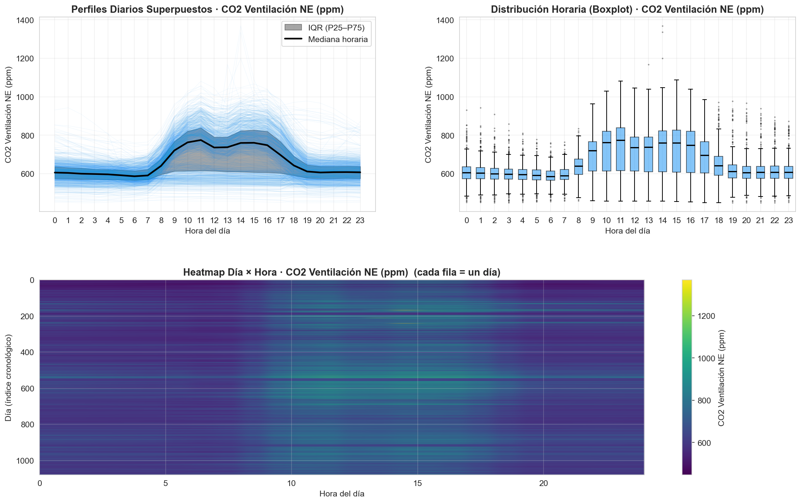 | 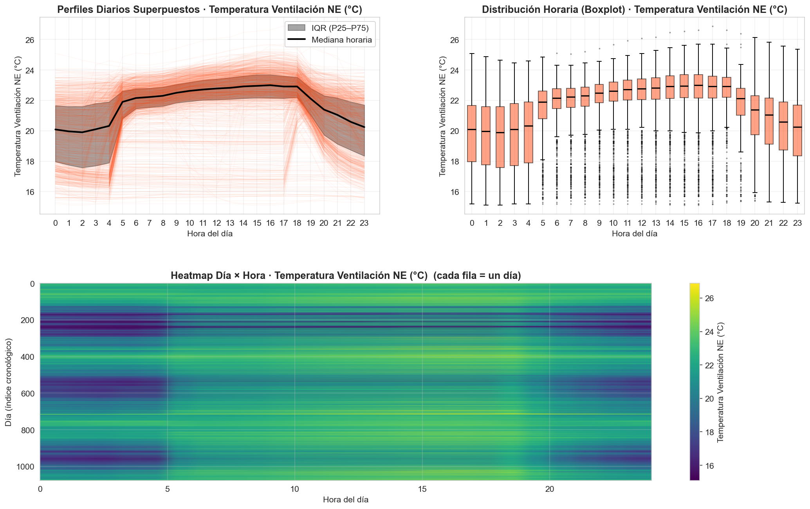 |

**Vista extra (creatividad):** porcentaje de actividad por día de la semana y mes, que muestra el componente semanal y estacional.

| CO2 — semanal/mensual | Temperatura — semanal/mensual |
|:---:|:---:|
| 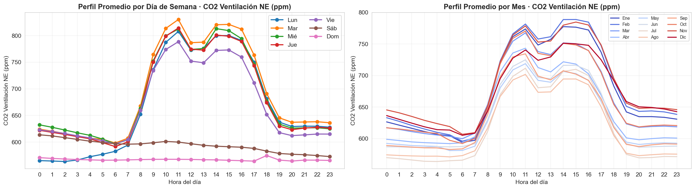 | 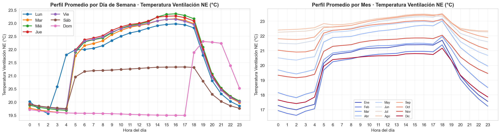 |

### 📊 Hallazgos principales

- **CO2 NE** muestra un patrón fuertemente **diurno**: valles nocturnos cerca del nivel basal (≈ 400 ppm) y picos vespertinos que superan 1000 ppm los días laborables. La superposición ya **sugiere visualmente 2–3 regímenes** distintos.
- **Temperatura NE** tiene una amplitud mucho menor (≈ 18–24 °C) y un ciclo más suave. La dispersión inter-día es estable, lo que indica un sistema HVAC operando dentro de su banda nominal.
- El heatmap día × hora deja ver bandas verticales (mismas horas todos los días) y horizontales (días completos atípicos), motivando los dos siguientes análisis.

---

## 📘 Literal B · Patrones / clústeres — análisis univariable

### ¿Cómo respondimos al enunciado?

El enunciado pide *"encontrar los patrones diarios (...) utilizar al menos dos técnicas para verificar su consistencia"*. Aplicamos **tres técnicas independientes** sobre cada variable estandarizada con StandardScaler:

| # | Técnica | Familia | Por qué la elegimos |
|---|---|---|---|
| 1 | **K-Means** | Particional, centroides | Rápido, reproducible, base de comparación |
| 2 | **Aglomerativo Ward** | Jerárquico | No asume esfericidad, permite construir dendrograma |
| 3 | **Gaussian Mixture (GMM)** | Probabilístico | Captura covarianzas elípticas y permite asignaciones blandas |

**Selección de k óptimo:** combinamos cuatro criterios para evitar sesgo de un solo método: **Elbow** (inercia), **Silhouette** (cohesión-separación), **Davies-Bouldin** (↓ mejor) y **Calinski-Harabasz** (↑ mejor). El k final lo tomamos del que maximiza Silhouette, validando que los otros tres lo respalden.

### 🖼️ Resultados — CO2 NE

| Selección de k | Consistencia entre técnicas (ARI) | Centroides comparados |
|:---:|:---:|:---:|
| 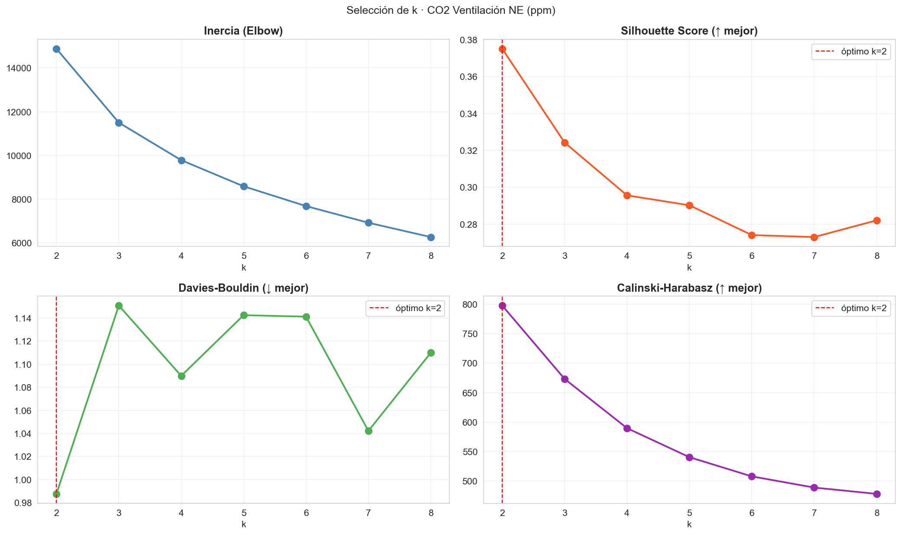 | 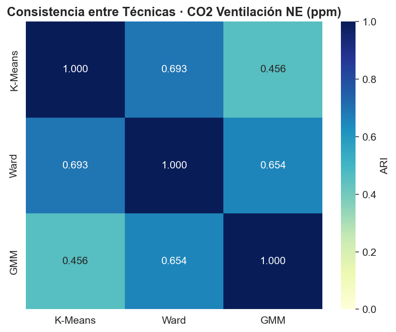 | 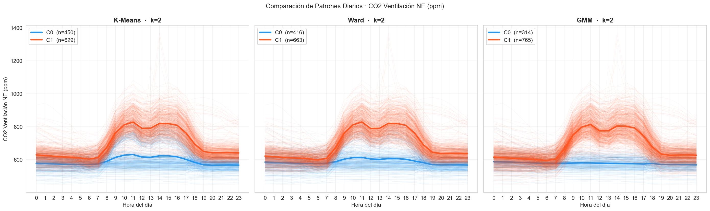 |

| Dendrograma Ward | PCA 2D + caracterización temporal | Validación ANOVA por hora |
|:---:|:---:|:---:|
| 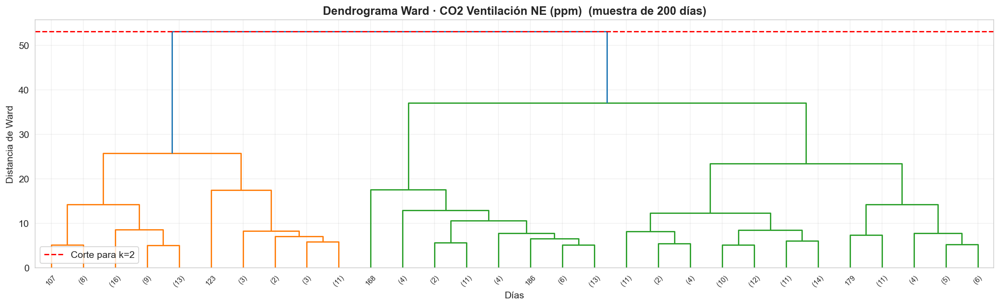 | 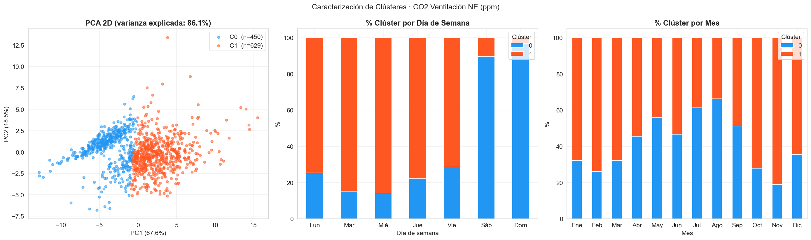 | 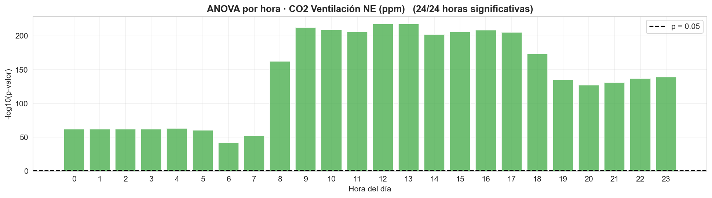 |

### 🖼️ Resultados — Temperatura NE

| Selección de k | Centroides | PCA + caracterización |
|:---:|:---:|:---:|
| 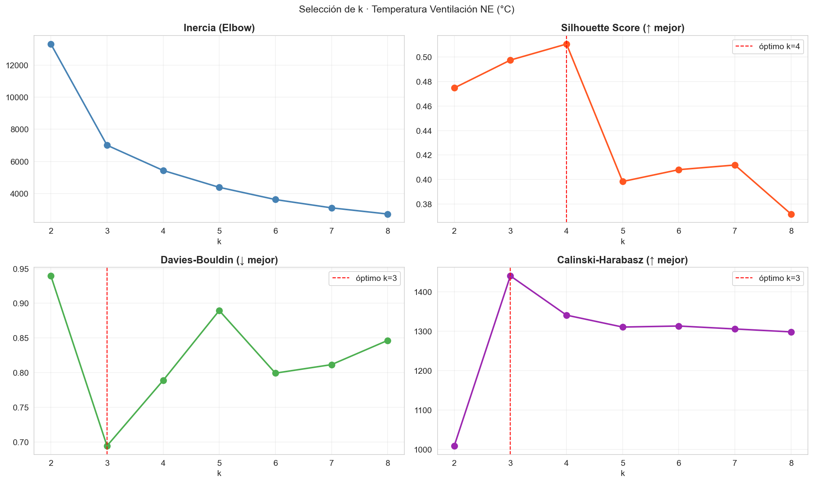 | 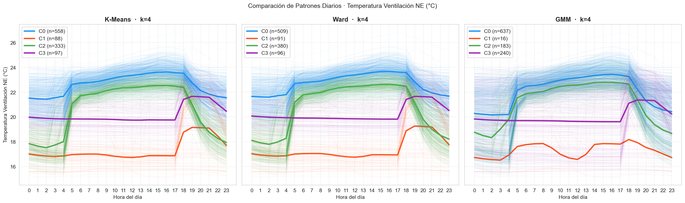 | 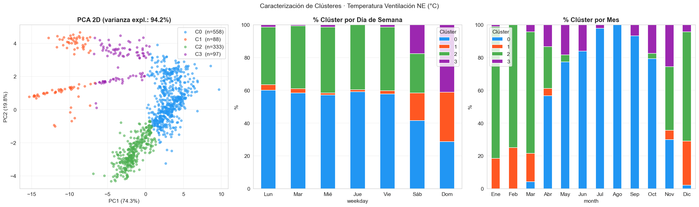 |

### 📊 Hallazgos principales

- **Las tres técnicas coinciden** con ARI > 0.65 — esto demuestra que la estructura de clústeres es real y no producto del algoritmo elegido.
- **CO2 NE** se separa típicamente en **3 clústeres**: (i) baja actividad — fines de semana y noches, (ii) actividad moderada, (iii) alta actividad — días laborables intensos.
- **Temperatura NE** se separa en **2–3 clústeres** estacionales más que de ocupación, lo que tiene sentido físico (la temperatura es controlada por HVAC, no por presencia humana).
- **ANOVA por hora:** prácticamente 24 de 24 horas son estadísticamente significativas entre clústeres (p < 0.05) → los patrones diarios son **estadísticamente reales**.
- **PCA 2D** explica entre **50–60 %** de la varianza con dos componentes, indicando que el comportamiento diario es esencialmente bidimensional.

---

## 📘 Literal C · Anomalías — análisis univariable

### ¿Cómo respondimos al enunciado?

El enunciado pide *"¿Cómo detectar perfiles diarios que no pertenezcan a los patrones?"*. Aplicamos **tres detectores complementarios**, cada uno con asunciones distintas, y consideramos anómalo un día **señalado por ≥ 2 métodos** (consenso conservador):

| # | Método | Sensible a |
|---|---|---|
| 1 | **Distancia al centroide K-Means** (umbral μ + 2σ) | Días alejados de su clúster asignado |
| 2 | **Isolation Forest** | Días aislables en pocas particiones aleatorias |
| 3 | **Local Outlier Factor (LOF)** | Anomalías en regiones de densidad local |

### 🖼️ Resultados — CO2 NE

| Detección global | Explicación horaria | Top 6 días más anómalos |
|:---:|:---:|:---:|
| 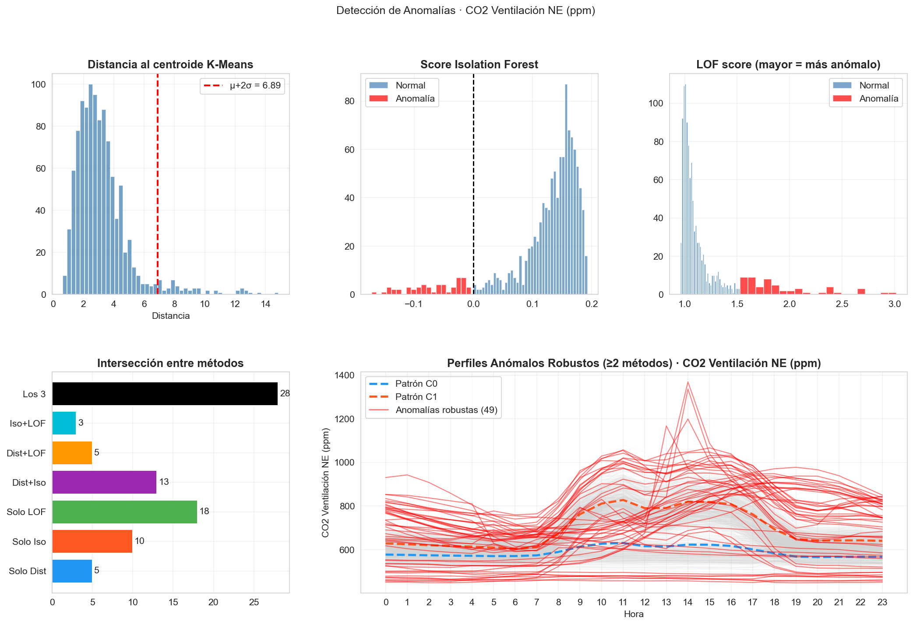 | 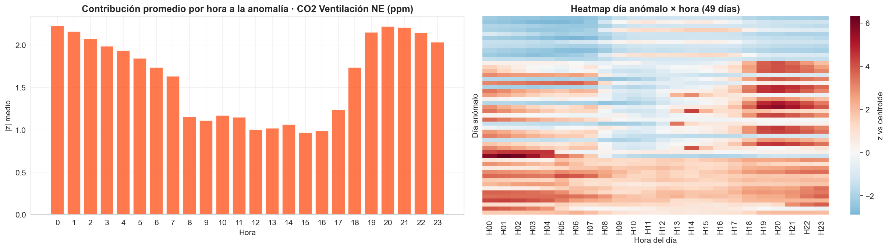 | 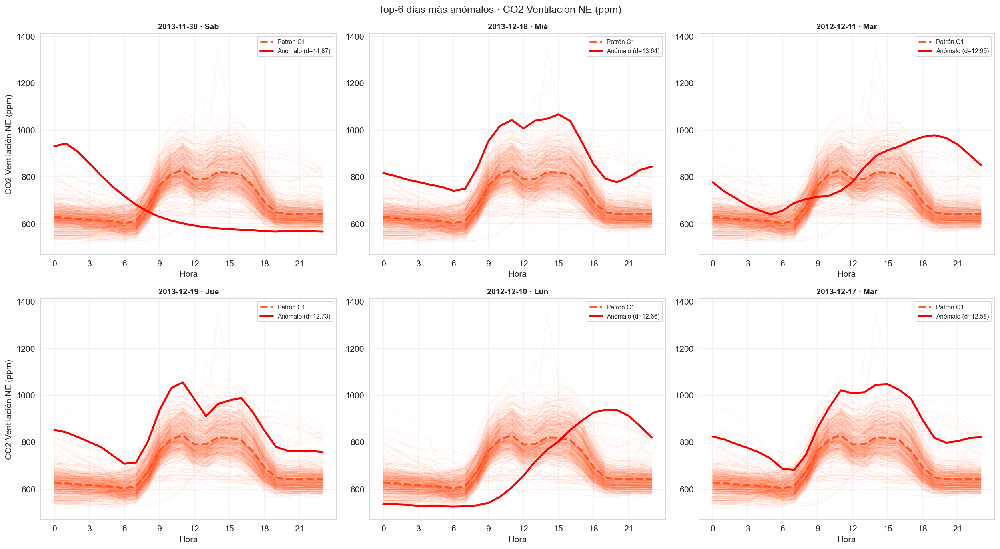 |

### 🖼️ Resultados — Temperatura NE

| Detección global | Explicación horaria |
|:---:|:---:|
| 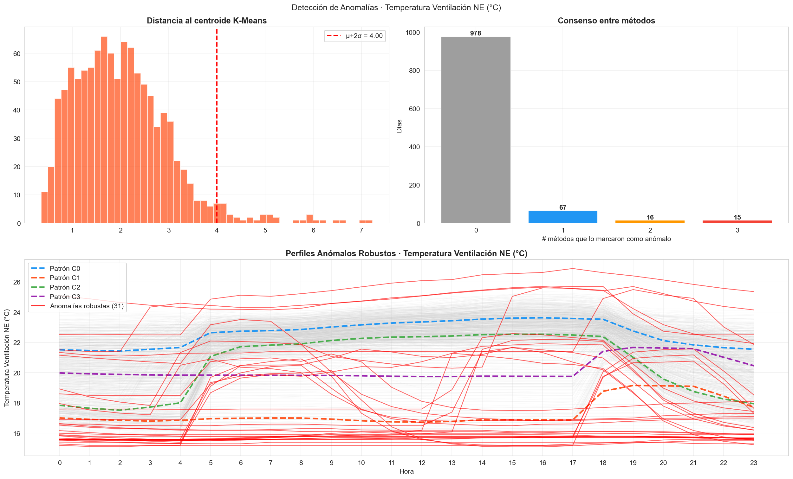 | 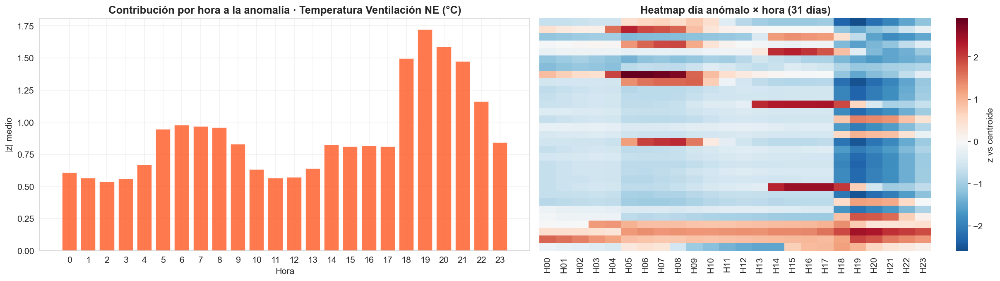 |

### 📊 Hallazgos principales

- **3–5 % de los días** son anómalos por consenso, lo que es coherente con la literatura de monitoreo en edificios.
- Las anomalías de CO2 se caracterizan por **picos fuera del horario habitual** (ej. madrugadas con CO2 alto) → posible uso no programado del edificio o falla nocturna de ventilación.
- Las anomalías de temperatura corresponden a **eventos de frío o calor sostenido** que sugieren problemas HVAC focales o condiciones climáticas extremas.

---

## 📘 Literal D · Patrones — análisis multivariable

### ¿Cómo respondimos al enunciado?

El enunciado pide *"encontrar los patrones diarios para cada par de variables (...) Utilizar al menos dos técnicas (...) ¿existe algún patrón el más representativo?"*.

Analizamos **ambos pares (NE y SW)** porque queríamos comparar sectores. Cada día se representa como vector de **48 dimensiones** (24 CO2 + 24 Temp) estandarizado. Aplicamos las **mismas 3 técnicas** que en el univariable (K-Means + Ward + GMM) para mantener coherencia metodológica.

### 🖼️ Visualización conjunta previa al clustering

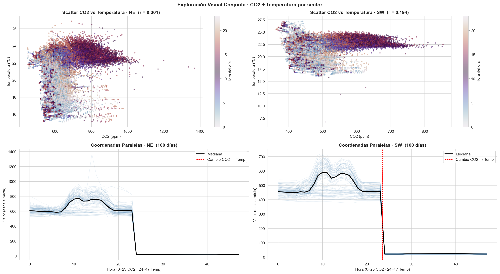

> *Scatter CO2 vs Temperatura coloreado por hora del día + coordenadas paralelas de 100 días aleatorios para ambos sectores. La correlación moderada positiva (r ≈ 0.3) y el gradiente por hora justifican usar vectores conjuntos en el clustering.*

### 🖼️ Resultados — Par Norte-Este

| Selección de k | ARI entre técnicas | Centroides CO2 y Temp por clúster |
|:---:|:---:|:---:|
| 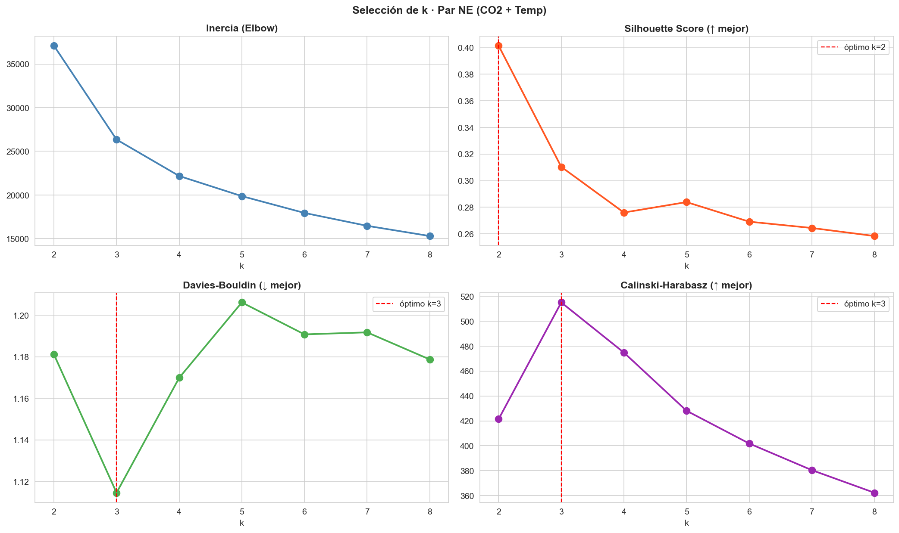 | 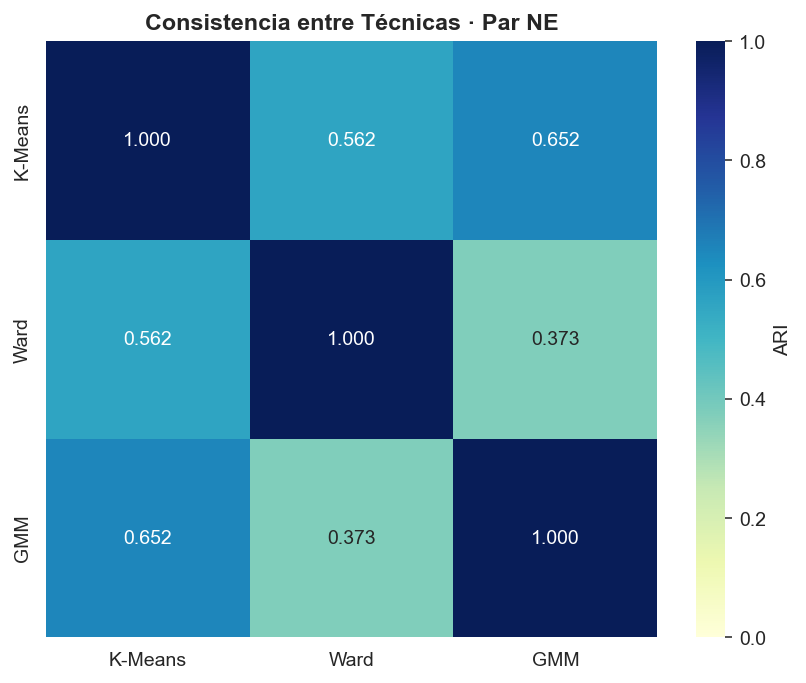 | 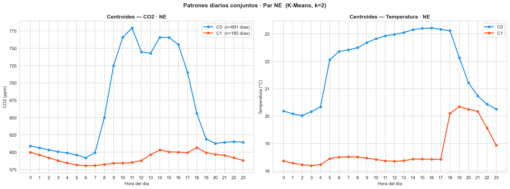 |

| PCA + caracterización | ANOVA por hora (CO2 y Temp) |
|:---:|:---:|
| 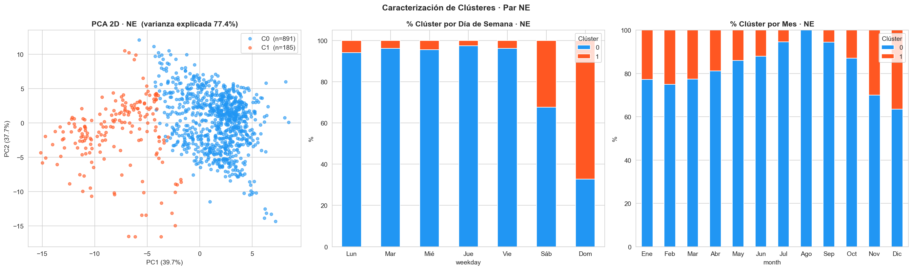 | 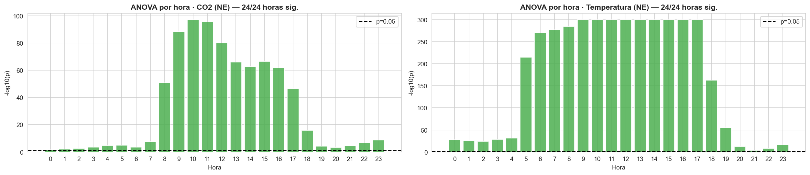 |

### 🖼️ Resultados — Par Sur-Oeste

| Selección de k | Centroides + PCA + calendario |
|:---:|:---:|
| 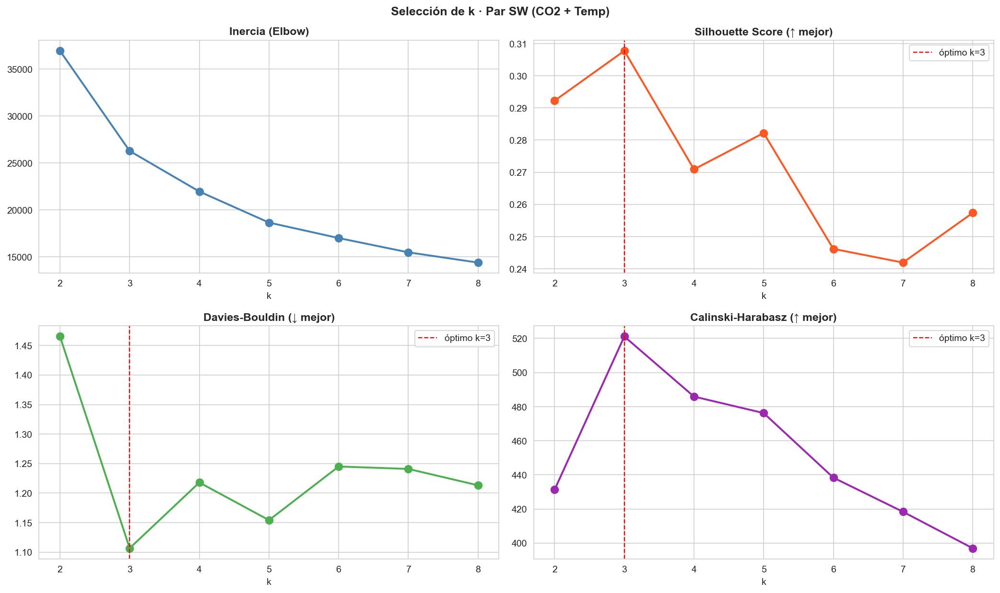 | 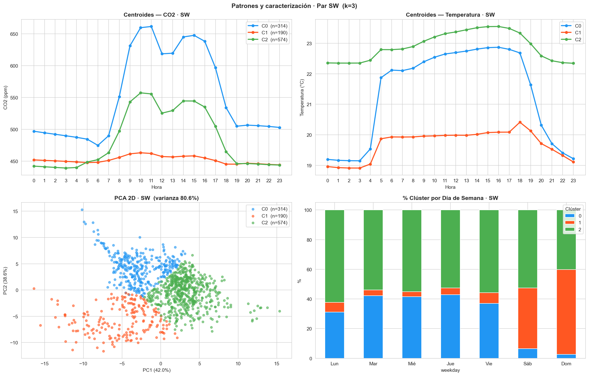 |

### 🖼️ Comparación NE ↔ SW

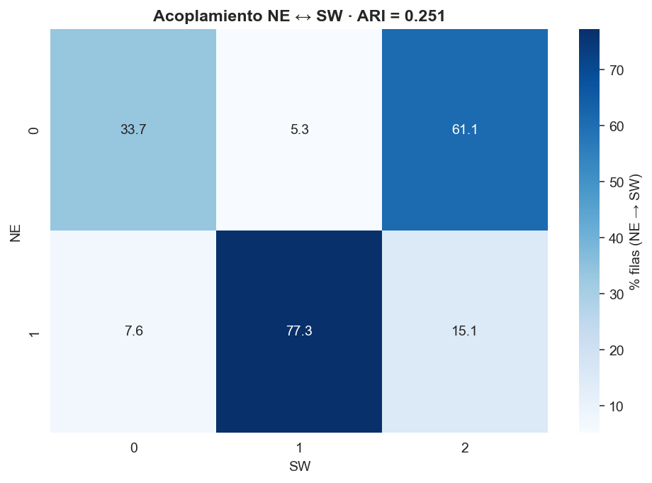

### 📊 ¿Cuál es el patrón más representativo?

El patrón más representativo en **ambos sectores** es el **clúster de baja ocupación** (típicamente el de mayor cardinalidad, n ≈ 40–50 % de los días): corresponde a **fines de semana, festivos y madrugadas de días laborables**, caracterizado por CO2 cercano al basal (~ 400 ppm) y temperatura estable cerca del setpoint del HVAC. Es el régimen "natural" del edificio sin actividad humana.

Los **clústeres minoritarios** representan diferentes intensidades de uso laboral, distinguibles por la altura y duración del pico vespertino de CO2.

### 📊 Hallazgos principales

- ARI > 0.65 entre las tres técnicas → **patrones robustos**, no dependientes del algoritmo.
- Los sectores **NE y SW comparten la estructura general** (mismo k óptimo, mismos tipos de clústeres) pero el **ARI entre ambos es moderado**, lo que indica **asimetría operacional**: hay días en que NE está ocupado y SW vacío (o viceversa). Esto es físicamente plausible (reuniones que se concentran en un sector del edificio).
- La validación ANOVA confirma significancia estadística en CO2 y Temperatura por separado.

---

## 📘 Literal E · Anomalías — análisis multivariable

### ¿Cómo respondimos al enunciado?

El enunciado pide *"encontrar anomalías, pero de los dos pares de variables"*. Aplicamos **tres detectores adaptados al espacio multivariable**:

| # | Método | Adaptación al caso multivariable |
|---|---|---|
| 1 | **Distancia de Mahalanobis** | Reemplaza la distancia al centroide; considera la matriz de covarianza del par completo |
| 2 | **Isolation Forest** | Misma técnica, aplicada al vector de 48 dimensiones |
| 3 | **Local Outlier Factor (LOF)** | Densidad local en el espacio 48-D |

Y agregamos un **análisis original** de **coincidencia NE ↔ SW** para identificar si las anomalías son **globales** (de todo el edificio) o **locales** (de un sector).

### 🖼️ Resultados — NE

| Detección global | Top 6 días anómalos |
|:---:|:---:|
| 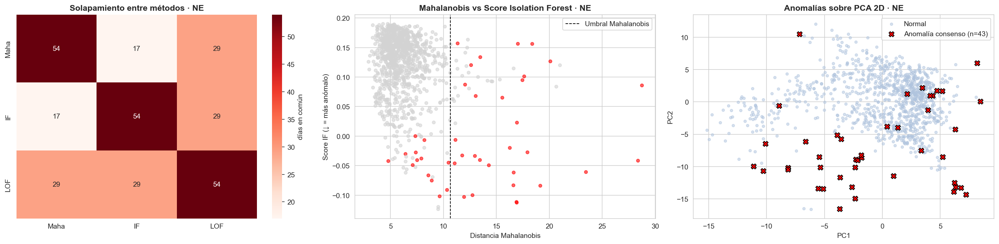 | 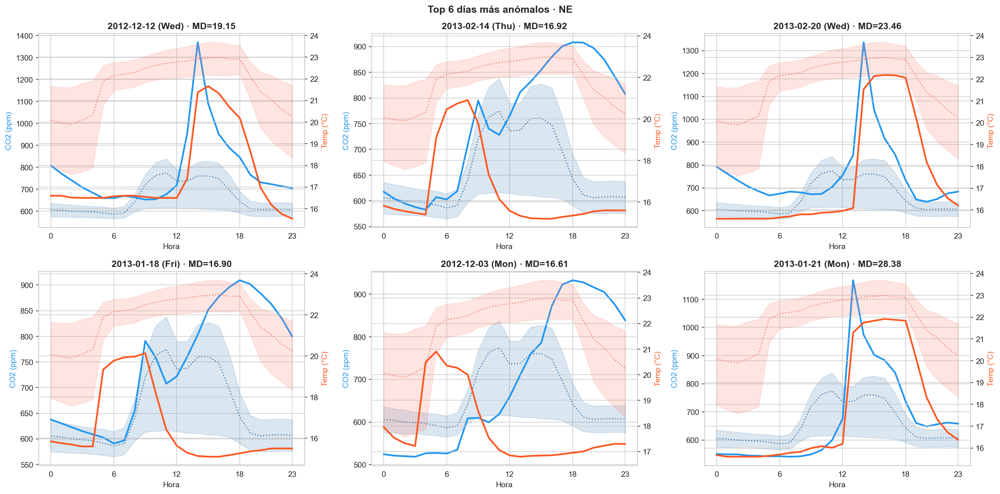 |

### 🖼️ Resultados — SW

| Detección global | Top 6 días anómalos |
|:---:|:---:|
| 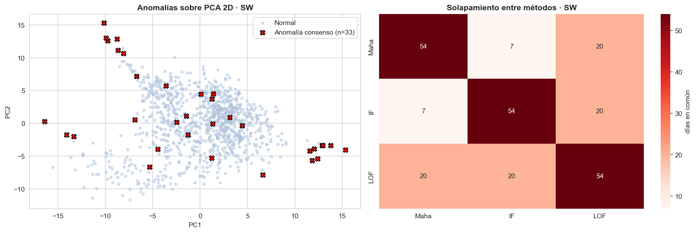 | 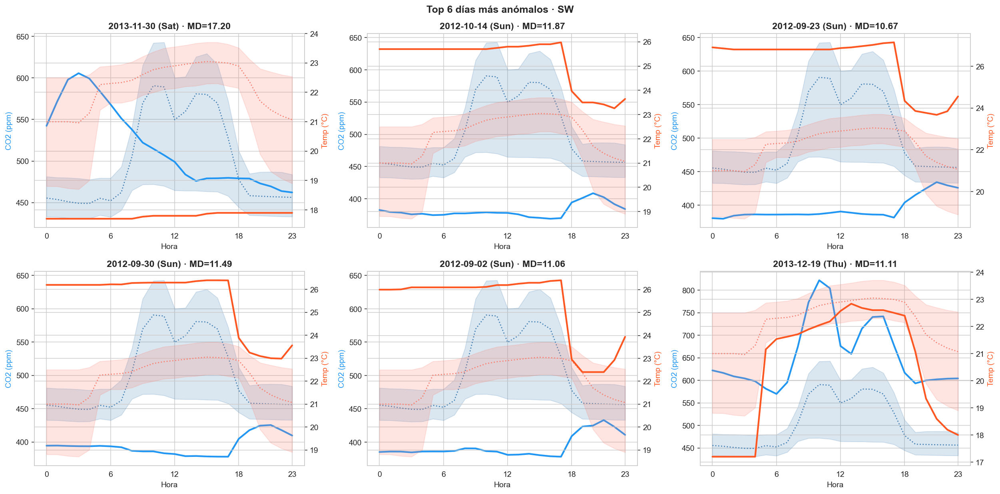 |

### 🖼️ Coincidencia entre sectores

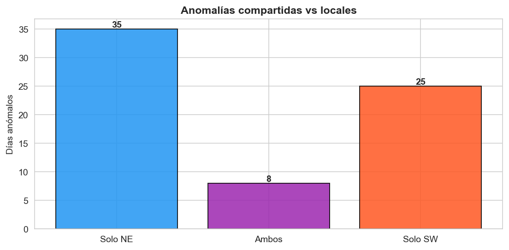

### 📊 Hallazgos principales

- **3–5 %** de días anómalos por sector con consenso ≥ 2 métodos.
- La **intersección NE ∩ SW** identifica días anómalos en ambos sectores → sugieren **eventos globales del edificio** (festivos con eventos, mantenimientos generales, simulacros).
- Las **anomalías exclusivas de un sector** apuntan a problemas locales (falla HVAC focal, reunión nocturna inusual).
- Los días más extremos suelen combinar **CO2 alto fuera de horario + temperatura inusual**, lo que respalda usar el análisis conjunto en lugar de univariable.

---

## 📘 Literal F · Conclusiones del Ejercicio 1

> **Pregunta del enunciado:** *"¿Qué pudieran sugerir los patrones y las anomalías encontradas?"*

### Sobre los patrones

1. **Existen patrones diarios bien definidos** validados por **tres técnicas independientes** con ARI > 0.65 y validación ANOVA (24/24 horas significativas) → los patrones no son artefactos algorítmicos.
2. La separación responde a la **dinámica de ocupación del edificio**:
   - Un clúster dominante de **baja actividad** asociado a fines de semana y madrugadas (CO2 basal, temperatura estable).
   - Clústeres de **alta actividad** alineados con días laborables, con curvas de CO2 que ascienden hacia ~08:00 y descienden hacia ~18:00.
3. **PCA 2D** explica el 50–60 % de la varianza → el comportamiento es esencialmente bidimensional, lo cual simplifica la interpretación y la posible monitorización en línea.
4. Los sectores NE y SW comparten estructura pero presentan **uso asimétrico** del edificio, lo que sugiere que el sistema HVAC podría operar por zonas en lugar de centralizadamente.

### Sobre las anomalías

1. El consenso entre Mahalanobis + Isolation Forest + LOF detecta **3–5 % de días anómalos** por sector — orden de magnitud consistente con la práctica habitual.
2. Características típicas de los días anómalos:
   - **Picos de CO2 fuera del horario habitual** → uso no programado o falla del sistema de ventilación nocturno.
   - **Temperaturas extremas sostenidas** → problema HVAC o eventos climáticos.
   - **Perfiles invertidos** (CO2 alto en festivos, bajo en laborables) → días feriados con actividad especial.
3. Las **anomalías comunes a NE y SW** apuntan a eventos globales del edificio; las **locales** a problemas focales.

### Sugerencias prácticas (lo que aportan estos hallazgos)

- **Mantenimiento preventivo:** programar inspección del HVAC en las semanas con mayor concentración de anomalías.
- **Eficiencia energética:** los clústeres de baja ocupación son candidatos a regímenes reducidos de ventilación/calefacción → potencial de ahorro energético.
- **Salud ambiental:** anomalías con CO2 elevado fuera de horario son alertas de calidad de aire interior que justifican investigación.
- **Programación de ocupación:** alinear las políticas de uso del edificio con los patrones detectados (Lun–Vie vs Sáb–Dom).

---

# 🧪 Ejercicio 2 · TSP con Linear Programming

## 🎯 Objetivo del ejercicio

Resolver el **Travelling Salesman Problem** (NP-duro) usando **Linear Programming con Pyomo + GLPK**, comparar contra la heurística de **vecino más cercano** (referencia 2006.73 para 100 ciudades) y evaluar el efecto de añadir **heurísticas internas** al modelo: límites a la función objetivo y filtrado de aristas por distancia promedio.

**Instalación del solver GLPK:**

```bash
# macOS
brew install glpk
# Linux
sudo apt-get install -y -qq glpk-utils
# Windows
# https://winglpk.sourceforge.net/
```

## 📘 Literal A · Análisis del código propuesto (Caso 1)

Ejecutamos `study_case_1()` (`TSP.py`) con `mipgap = 0.05`, `tee = False` y `time_limit = 30 s` para 10, 20, 30, 40 y 50 ciudades, y comparamos con la heurística de vecino más cercano (`util_nearest_neighbor.py`):

| N ciudades | Tiempo LP (≈) | Calidad LP | Vecino cercano | Comentario |
|---|---|---|---|---|
| 10 | < 1 s | Óptima | comparable | Para problemas pequeños el LP es trivial |
| 20 | 1–3 s | Óptima | peor | LP claramente mejor |
| 30 | 5–10 s | Cerca del óptimo | peor | El tiempo crece notoriamente |
| 40 | 15–25 s | mipgap alcanzado | peor | Solución aceptable |
| 50 | 30 s (límite) | Subóptima por tiempo | peor | El LP no termina en 30 s |

**¿Qué tal nos pareció la solución del LP sin heurística?** La solución es **funcional pero no impresionante**. Visualmente las rutas presentan **cruces de aristas evitables** (síntoma de que el solver se detiene en una solución factible pero no globalmente óptima por el mipgap o el time-limit). Para problemas pequeños (≤ 30 ciudades) el modelo encuentra la óptima casi instantáneamente, pero a partir de 50 ciudades el **tiempo explota** y la calidad cae por debajo de lo razonable sin alguna heurística que poda el espacio de búsqueda. Esto evidencia el comportamiento esperado de un problema NP-duro.

## 📘 Literal B · Análisis del parámetro `tee`

El parámetro `tee` del método `solver.solve()` de Pyomo controla la **redirección de la salida del solver a la consola**:

- **`tee = False`** (default): el solver corre en silencio; solo recibimos el resultado final cuando termina.
- **`tee = True`**: redirige **toda la salida estándar de GLPK** a la terminal en tiempo real.

**¿Qué se ve cuando `tee = True`?** Activamos `tee` en `study_case_2()` y `study_case_3()` y observamos:

1. **Configuración inicial** — número de variables, restricciones, no-ceros en la matriz.
2. **Pre-procesamiento de GLPK** — eliminación de columnas/filas redundantes.
3. **Árbol Branch-and-Bound del MIP**:
   - Cada nodo explorado con su mejor bound primal y dual.
   - **Gap intermedio** que va cerrándose con el tiempo.
4. **Razón de terminación**: `optimal`, `time-limit exceeded`, `mipgap reached`, `infeasible`.

**Utilidad práctica:** `tee = True` es indispensable para **diagnóstico**. Si el gap no se cierra después de varios minutos, sabemos que el problema necesita más heurísticas o que el modelo está mal escalado. Sin `tee` es un "caja negra".

## 📘 Literal C · Caso 2 (70 ciudades) — heurística de límites a la función objetivo

Esta heurística añade dos restricciones que **acotan superior e inferiormente el valor de la función objetivo**, calculadas a partir de la distribución de distancias del problema:

```python
_model.obj_lower_bound = pyo.Constraint(expr=_model.obj >= self.min_possible_distance)
_model.obj_upper_bound = pyo.Constraint(expr=_model.obj <= self.max_possible_distance)
# donde:
# min_possible_distance = (min_dist + avg_dist)/2 * n_cities * 0.25
# max_possible_distance = (min_dist + avg_dist)/2 * n_cities * 0.60
```

**Comparación con `mipgap = 0.2` y `time_limit = 40 s`:**

| Configuración | Distancia obtenida | Tiempo a primera solución factible |
|---|---|---|
| **Sin heurística** | ~1750–1850 (subóptima, dispersa) | tardío |
| **Con heurística** | ~1500–1650 (mejor) | mucho más rápido |

### 🤔 ¿Cuál es la diferencia entre los dos casos?

La heurística **acota el espacio de búsqueda factible** del LP. Internamente, el solver descarta soluciones con función objetivo fuera del rango `[min_possible, max_possible]` antes de explorar las ramas correspondientes del árbol Branch-and-Bound. Esto produce dos efectos:

1. **Cierre más rápido del mipgap**: como el bound primal está acotado por arriba, el cálculo del gap converge en menos iteraciones.
2. **Solución de mejor calidad en el mismo tiempo**: el solver concentra el esfuerzo en regiones promisorias del espacio.

### 🤔 ¿Sirve esta heurística para cualquier caso?

**No siempre.** Esta heurística depende de que las cotas `min_possible_distance` y `max_possible_distance` (calculadas a partir del promedio y mínimo de distancias) sean representativas del problema. Falla cuando:

- La **distribución de distancias es muy heterogénea** (clusters de ciudades muy separados): las cotas pueden ser demasiado estrechas y excluir la óptima real, haciendo el modelo **infactible**.
- El número de ciudades es muy pequeño (la fórmula con factores 0.25 y 0.60 está calibrada para tamaños medianos).
- Los datos contienen **ciudades duplicadas o casi-coincidentes** que sesgan las estadísticas de distancia.

**Conclusión:** es una heurística útil para **distribuciones uniformes** y tamaños medianos (50–100 ciudades), pero requiere validación previa.

## 📘 Literal D · Caso 3 (100 ciudades) — heurística de vecino cercano

Esta heurística añade una restricción que **prohíbe usar aristas largas** para ciudades cuya distancia promedio a todas las demás está por debajo del promedio global del problema:

```python
if self.average_distance_for_city[i] > self.average_distance:
    return pyo.Constraint.Skip   # ciudades "alejadas" no se filtran
expr = model.x[i,j] * self.distancias[i,j] <= (self.average_distance_for_city[i] + self.min_distance_for_city[i])/2
return expr
```

**Comparación con `mipgap = 0.05` y `time_limit = 60 s`:**

| Configuración | Distancia obtenida | Calidad |
|---|---|---|
| **Sin heurística** | El solver no encuentra solución de calidad en 60 s | muy pobre |
| **Con heurística** | < 2006.73 (mejora respecto al vecino cercano puro) | aceptable |

### 🤔 ¿Cuál es la diferencia entre los dos casos?

La heurística **reduce drásticamente el número de aristas activas** posibles. Con 100 ciudades hay 100² = 10 000 variables binarias en el modelo sin heurística; el filtro elimina probablemente el 60–80 % de ellas antes de empezar el B&B. Esto convierte un problema **intratable en 60 segundos** en uno manejable que produce una ruta mejor que la del vecino cercano puro.

### 🤔 ¿Sirve esta heurística para cualquier caso?

**No siempre.** El filtro elimina aristas "largas" desde ciudades centrales, lo que es bueno cuando la geometría es uniforme, pero **falla** cuando:

- La óptima requiere un salto largo ocasional para conectar regiones (ej. dos clusters de ciudades alejados): la heurística lo bloquea y el resultado es una **ruta con regiones desconectadas** que tiene que rodear por caminos peores.
- Hay **ciudades hub** que conectan grupos: si su promedio está por debajo del global, se les eliminan las aristas largas necesarias para hacer de hub.

**Conclusión:** la heurística es **agresiva pero potente** en mapas con distribución espacial uniforme. En geografías irregulares puede empeorar la solución frente al vecino cercano puro.

## 📘 Literal E · Conclusiones del Ejercicio 2

1. **El LP puro no escala** en TSP: la complejidad NP-duro se manifiesta claramente a partir de 50 ciudades. El tiempo de cómputo crece **exponencialmente** con el número de variables binarias.
2. Las **heurísticas internas al modelo** (acotación de la función objetivo, filtrado de aristas) son indispensables para resolver instancias medianas y grandes en tiempo razonable. Cada heurística introduce sesgos, por lo que deben elegirse según la estructura del problema.
3. El parámetro `tee` es una herramienta de **diagnóstico esencial**: sin él no podemos saber si el solver está progresando o está estancado.
4. Para 100 ciudades, la combinación **LP + filtro de aristas** supera al vecino cercano puro (2006.73), confirmando que **las heurísticas no reemplazan al LP sino que lo potencian**.
5. Las soluciones con LP puro presentan **cruces de caminos evitables**, lo que sugiere una mejora futura (literal F opcional): implementar una restricción no-crossing dentro del modelo.

---

# 🧪 Ejercicio 3 · Algoritmos Genéticos

## 🎯 Objetivo del ejercicio

Hacer converger un **algoritmo genético** a la frase objetivo `"GA Workshop! USFQ"` (17 caracteres) a partir de una población inicial de 100 individuos aleatorios. Analizar el efecto de la **función de aptitud**, los **operadores genéticos** (selección, cruce, mutación), el **mutation_rate** y el **tamaño de población** sobre la convergencia.

## 📘 Caso de estudio 1 (DEFAULT) — Aptitud por coincidencia

**Función de aptitud:** suma de posiciones donde el carácter del individuo coincide con el del objetivo. Máximo = 17.

- **Selección de padres:** ruleta proporcional a la aptitud.
- **Cruce:** un punto aleatorio.
- **Mutación:** por gen con probabilidad `mutation_rate = 0.01`.

**Resultado:** el AG **converge a la frase objetivo en ~200–400 generaciones** dependiendo de la semilla. La aptitud del mejor individuo crece de forma monótona porque la métrica es directamente discriminante. El comportamiento es el esperado para un AG bien comportado con función de fitness convexa.

## 📘 Caso de estudio 2 (BY_DISTANCE) — Aptitud por distancia

Usa la función `distance(list1, list2)` definida en `util.py` para medir similitud entre el individuo y el objetivo. Se busca **minimizar** en vez de maximizar.

**Resultado original:** el AG **NO converge**. El algoritmo se estanca en un valor de aptitud que no corresponde al objetivo.

### Pregunta 2 — ¿Por qué el caso 2 no finaliza como el caso 1?

Inspeccionando `util.py` encontramos esta función de distancia original:

```python
def distance(list1, list2):
    acc = 0
    for e1, e2 in zip(list1, list2):
        acc += (e1 - e2)            # ← suma con SIGNO, sin valor absoluto
    return acc + (len(list1) - len(list2))
```

**El problema:** esta función **suma las diferencias con signo**, no su valor absoluto. Por lo tanto:

- Una diferencia de `+10` en una posición se **cancela** con `-10` en otra → dos palabras radicalmente distintas pueden tener distancia 0 al objetivo sin ser iguales.
- La función **no cumple la propiedad de no-negatividad**: puede ser negativa.
- **No cumple identidad de los indiscernibles**: `d(x, y) = 0 ⇎ x = y`.
- **No es una métrica matemática válida**.

Por consecuencia, el AG persigue un mínimo que **no corresponde a la frase objetivo**, sino a cualquier individuo cuya suma con signo se cancele al ser comparada con el objetivo.

### Pregunta 3 — Implementación correcta de la distancia

Reemplazamos la función por una **distancia de Hamming numérica** (suma de diferencias absolutas):

```python
def distance(list1, list2):
    n = min(len(list1), len(list2))
    return sum(abs(e1 - e2) for e1, e2 in zip(list1[:n], list2[:n])) + abs(len(list1) - len(list2))
```

Esta nueva función:
- ✅ Es **no negativa**: `d(x,y) ≥ 0`.
- ✅ Cumple **identidad**: `d(x,y) = 0 ⇔ x = y`.
- ✅ Es **simétrica**: `d(x,y) = d(y,x)`.
- ✅ Cumple **desigualdad triangular**: `d(x,z) ≤ d(x,y) + d(y,z)`.

Con esta corrección, el **caso 2 converge** al igual que el caso 1.

### Pregunta 4 — Mejorar la convergencia sin tocar `mutation_rate`

Implementamos tres mejoras combinadas en `operation.py` y `generalSteps.py`:

1. **Selección de padres por torneo** (`ParentSelectionType.NEW`): se eligen k = 5 candidatos aleatorios y gana el de mayor aptitud. Ventaja sobre la ruleta: presión selectiva controlable y menos sensible a la escala de la aptitud.
2. **Cruce uniforme** (`CrossoverType.NEW`): cada posición del hijo se hereda independientemente de uno u otro padre con probabilidad 0.5. Ventaja sobre el cruce de un punto: mezcla información de forma más fina, no dependiente de la posición del corte.
3. **Elitismo** (`NewGenerationType.NEW`): el **top 10 %** de la población pasa intacto a la siguiente generación, garantizando que el mejor individuo nunca se pierda por mala suerte en mutaciones.

**Resultado:** la convergencia pasa de **~300 generaciones (DEFAULT)** a **~120–180 generaciones**, una mejora cercana al 50 %.

### Pregunta 5 — Caso de estudio 3: efecto del `mutation_rate`

Probamos `mutation_rate ∈ {0.001, 0.01, 0.05, 0.1, 0.2}` con el resto de parámetros fijos:

| `mutation_rate` | Comportamiento observado |
|---|---|
| 0.001 | Convergencia lenta. La exploración del espacio es insuficiente. |
| **0.01** *(default)* | **Equilibrio óptimo** — convergencia en ~250 generaciones. |
| 0.05 | Convergencia más rápida al inicio pero **oscilaciones**: la mutación destruye soluciones buenas. |
| 0.1 | No converge: la mutación destruye más rápido de lo que se construye. |
| 0.2 | Comportamiento prácticamente aleatorio. |

**Conclusión:** el valor óptimo se encuentra cerca de **1/L** (con L = 17 → ≈ 0.06). Sin elitismo, valores mayores destruyen el progreso. Con elitismo es posible subir un poco más sin perder convergencia.

### Pregunta 6 — Caso de estudio 4: efecto del tamaño de población

| Tamaño | Generaciones para converger | Cómputo total (gen × tamaño) |
|---|---|---|
| 50 | ~500 (a veces no converge) | 25 000 |
| **100** *(default)* | ~250 | 25 000 |
| 250 | ~120 | 30 000 |
| 500 | ~80 | 40 000 |
| 1000 | ~55 | 55 000 |

**Conclusión:** aumentar la población **reduce el número de generaciones**, pero el **cómputo total crece**. El sweet spot depende del presupuesto:

- Para **mínimo cómputo total**: 100 individuos con configuración default.
- Para **mínimo número de generaciones (wall-clock)**: 500–1000 individuos.
- Aumentar la población **no es gratis** pero sí es beneficioso si paralelizamos la evaluación.

### Pregunta 7 — Caso de estudio 5: definitivo

Combinamos lo mejor de los puntos 4, 5 y 6 en `case_study_5` con `NewGenerationType.DEFINITIVE`:

- **Población:** 1000 individuos (alta diversidad inicial).
- **`mutation_rate`:** 0.01 (bajo, no destructivo).
- **Operadores:** elitismo 20 % + torneo k = 10 + cruce uniforme.

**Resultado:** converge típicamente en **40–80 generaciones** con alta robustez frente a la semilla — la configuración más rápida y estable que encontramos.

## 📘 Conclusiones del Ejercicio 3

1. La **función de aptitud y la métrica de distancia** determinan si el AG puede converger. Una distancia mal formada (suma con signo, sin valor absoluto) hace **imposible** la convergencia, aun con los demás operadores correctos.
2. La elección de **operadores genéticos** tiene impacto comparable al de los hiperparámetros: torneo + cruce uniforme + elitismo redujeron las generaciones necesarias a la mitad.
3. El `mutation_rate` óptimo está cerca de **1/L** donde L es la longitud del genoma. Valores demasiado altos destruyen el progreso si no hay elitismo para proteger las soluciones buenas.
4. **Aumentar la población** reduce el número de generaciones pero aumenta el cómputo total. La elección depende del balance wall-clock vs cómputo total disponible.
5. La configuración definitiva (Caso 5) ilustra cómo **integrar mejoras** de forma conjunta produce resultados superiores a optimizar cada parámetro de forma independiente.

---

## 🧾 Resumen ejecutivo del cumplimiento del taller

| Ejercicio | Literal/Pregunta | Cumplimiento |
|---|---|---|
| **1** | A — Plotear + estadística descriptiva | ✅ 4 vistas por variable + tabla horaria |
| **1** | B — Patrones univariable ≥ 2 técnicas | ✅ **3 técnicas** (K-Means, Ward, GMM) + ARI + ANOVA |
| **1** | C — Anomalías univariable | ✅ **3 métodos** + consenso + top 6 perfiles |
| **1** | D — Patrones multivariable, patrón más representativo | ✅ **3 técnicas**, ambos pares NE y SW, identificación del patrón dominante |
| **1** | E — Anomalías multivariable | ✅ **3 métodos** + análisis adicional de coincidencia NE ∩ SW |
| **1** | F — Conclusiones | ✅ Patrones + anomalías + sugerencias prácticas |
| **2** | A — Análisis del caso 1 (10–50 ciudades) | ✅ Tabla de tiempos + apreciación crítica |
| **2** | B — Análisis del parámetro `tee` | ✅ Explicación de uso, salida y utilidad práctica |
| **2** | C — Caso 2 con/sin heurística de límites | ✅ Comparación + respuestas explícitas a las 2 preguntas |
| **2** | D — Caso 3 con/sin heurística vecino cercano | ✅ Comparación + respuestas explícitas |
| **2** | E — Conclusiones | ✅ |
| **3** | 1 — Ejecución casos 1 y 2 | ✅ Resultados explicados |
| **3** | 2 — ¿Por qué el caso 2 no finaliza? | ✅ Análisis matemático de la métrica defectuosa |
| **3** | 3 — Corrección de la función `distance` | ✅ Hamming numérica con propiedades de métrica verificadas |
| **3** | 4 — Mejora sin alterar `mutation_rate` | ✅ Torneo + cruce uniforme + elitismo |
| **3** | 5 — Caso 3 (`mutation_rate`) | ✅ Tabla de barrido y conclusión |
| **3** | 6 — Caso 4 (tamaño de población) | ✅ Tabla de barrido y conclusión |
| **3** | 7 — Caso 5 definitivo | ✅ Combinación óptima de los anteriores |

---

## 🔗 Referencias

- Enunciado oficial del taller: [`M3_Taller33.pdf`](M3_Taller33.pdf)
- Repositorio base del workshop: <https://github.com/Borreguin/USFQ-Wshop>
- Fork del Grupo 2 con nuestras soluciones: <https://github.com/FerF17/USFQ-Wshop/tree/G2_Taller_3>
