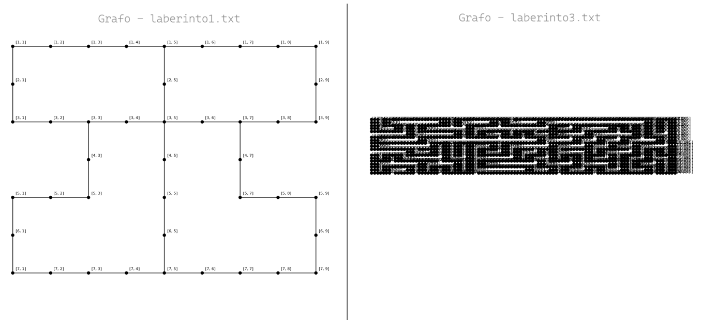
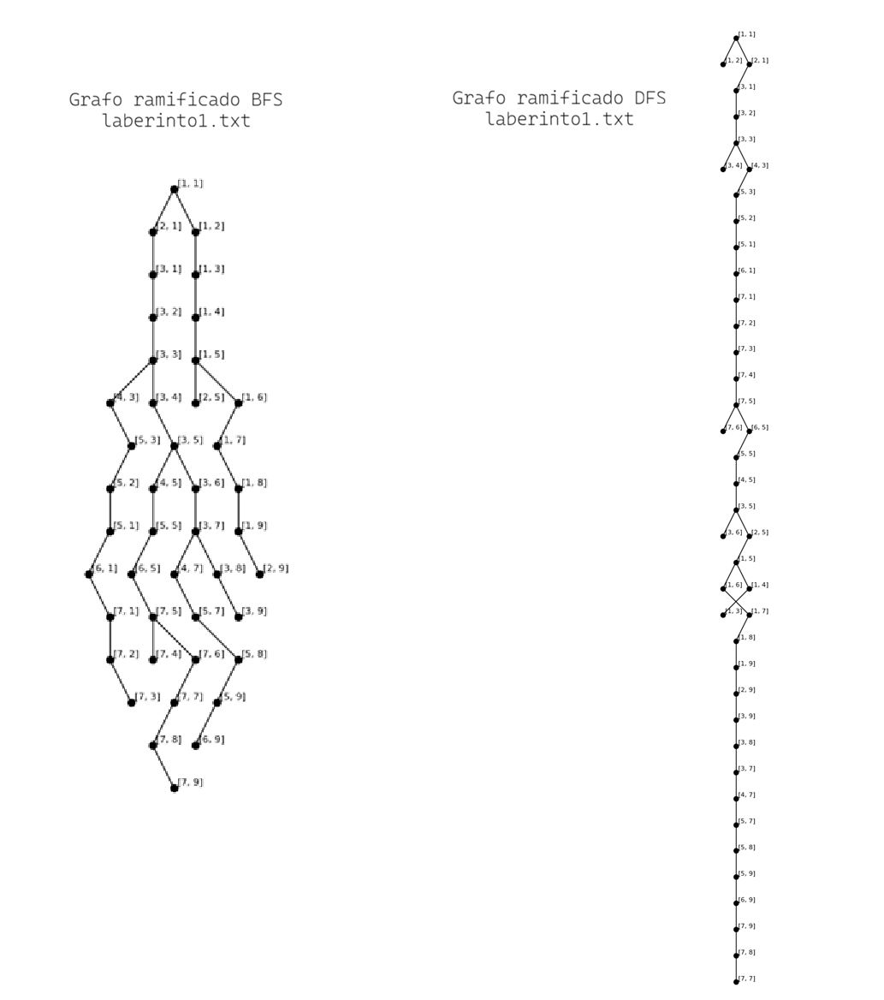
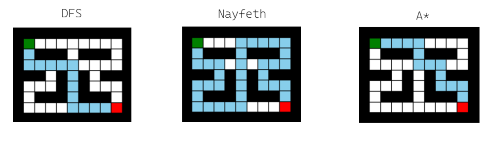
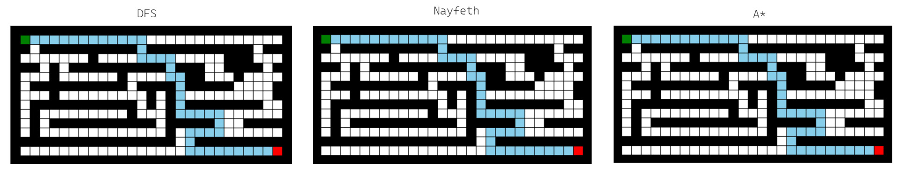
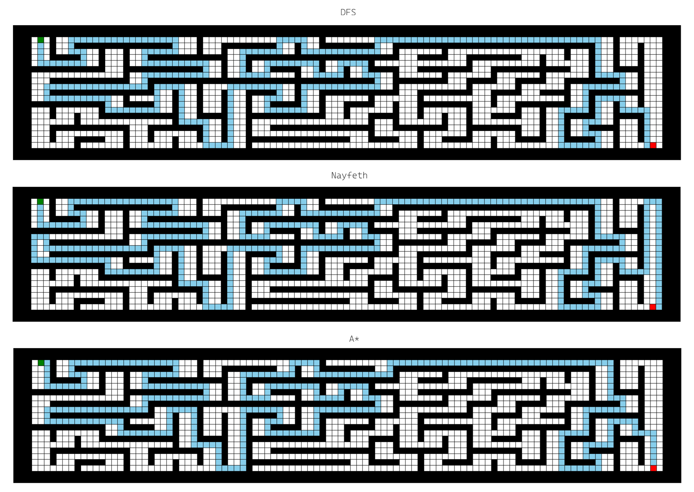
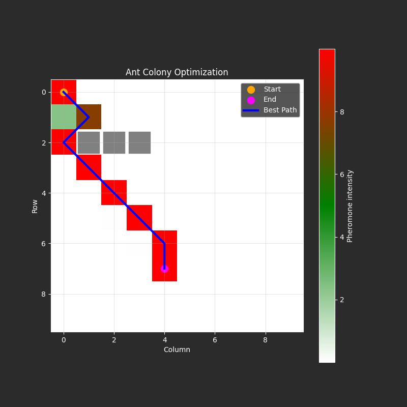
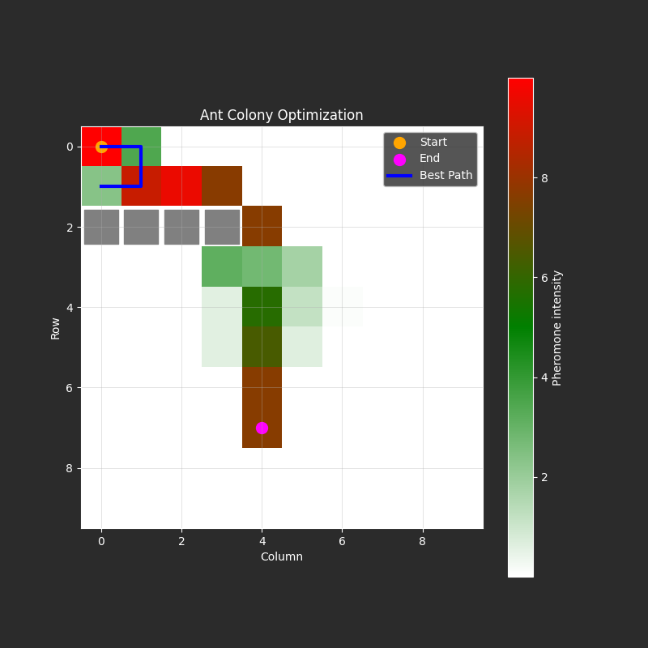
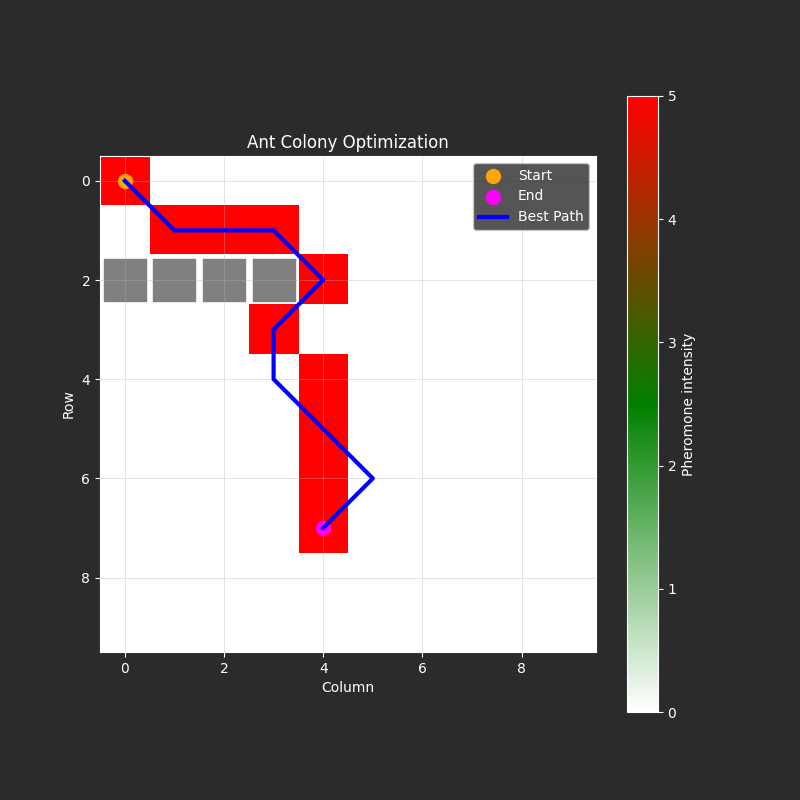
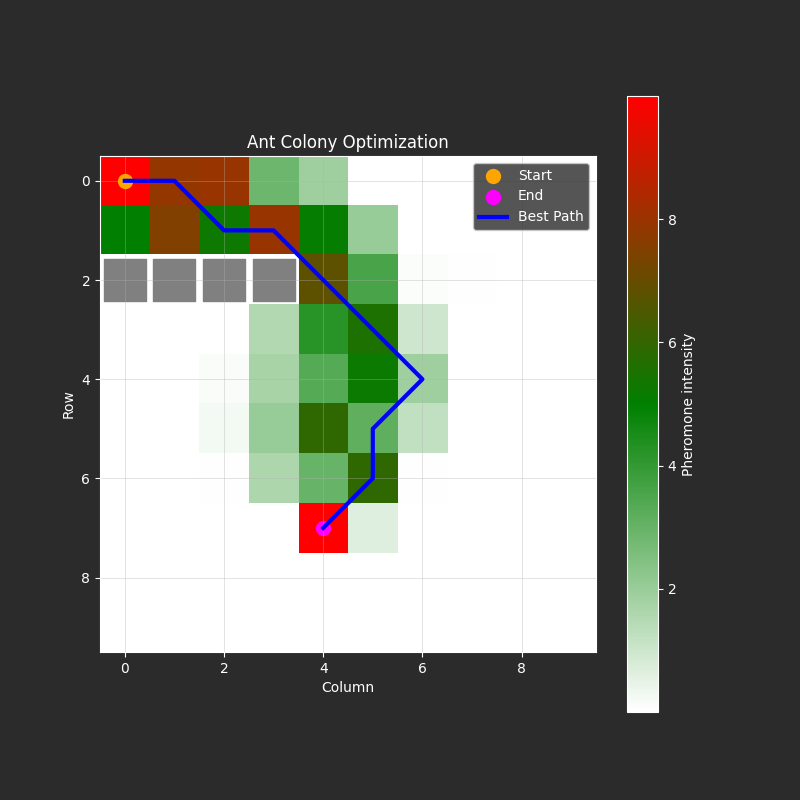

# WorkShop-USFQ
## Taller 2 de inteligencia artificial

- **Nombre del grupo**: Grupo 4
- **Integrantes del grupo**:

    • Anderson Alvarez

    • Maximo Pinta

    • Steeven Quezada

El objetivo de esta tarea es utilizar cualquier algoritmo de búsqueda para resolver los 3 laberintos propuestos, 
el reto es poder visualizar/representar los resultados, adicionalmente poder comparar al menos 2 algoritmos de búsqueda 
y mirar cómo se comportan para cada laberinto
 

### 1) **Uso de Algoritmos de Búsqueda**

#### A) Leer el laberinto y presentarlo como un grafo

En esta sección se realizó la conversión de los laberintos (laberinto1.txt, laberinto2.txt y laberinto3.txt) a una representación basada en grafos. Cada celda transitable del laberinto se modela como un nodo, y las posibles transiciones entre celdas adyacentes se representan como aristas.

Para los laberintos de menor tamaño (laberinto1.txt y laberinto2.txt), la visualización del grafo resulta clara y permite identificar conexiones entre nodos. Sin embargo, en el caso de laberinto3.txt, debido a su mayor tamaño y complejidad, la representación gráfica presenta superposición de nodos, lo que dificulta su interpretación visual.

Adicionalmente, se generó una representación tipo grafo ramificado, similar a la propuesta en la literatura (Tomás et al., s.f.). Para construir este tipo de grafo, fue necesario aplicar previamente algoritmos de búsqueda como BFS (Búsqueda en Amplitud) y DFS (Búsqueda en Profundidad), permitiendo visualizar las relaciones entre los distintos estados.

#### B) Aplicar algoritmos de búsqueda

Se implementaron tres algoritmos de búsqueda para la resolución de los laberintos:

- BFS (Búsqueda en Amplitud): Encuentra la solución más corta en términos de número de pasos.

- A*: Utiliza heurística para optimizar la búsqueda, en teoria deberia reducir el tiempo de exploración.

- DFS: Algoritmo con comportamiento variable dependiendo de la estructura del laberinto (Tomás et al., s.f).

Estos algoritmos fueron aplicados a cada uno de los laberintos, obteniendo las siguientes soluciones:

- laberinto1.txt

- laberinto2.txt

- laberinto3.txt

**Evaluación de algoritmos**

Para evaluar el desempeño de los algoritmos de búsqueda en la resolución de laberintos, se pueden utilizar métricas mencionadas en la literatura previa.

La métrica más utilizada es el tiempo de ejecución, generalmente expresado en milisegundos o segundos, dependiendo de la complejidad del problema (Cruz-Ruiz et al., 2019; Molina Vargas et al., 2008). Esta métrica permite comparar la eficiencia computacional de cada algoritmo.
Adicionalmente, existen otras métricas relevantes (Gabrovsek, 2019):

Número de pasos de la solución: mide la longitud del camino encontrado.
Número de nodos explorados: indica el costo de exploración del algoritmo.
Número de intersecciones visitadas: refleja la complejidad del recorrido.
Número de callejones sin salida explorados: permite evaluar la eficiencia en la toma de decisiones.

Si bien estas métricas, en conjunto, permiten realizar una evaluación más completa del rendimiento de cada algoritmo, en este caso se utilizaron dos, las cuales se muestran en la Tabla.

| Algoritmo | **Laberinto 1**  |  | **Laberinto 2** |  | **Laberinto 3** |  |
|-----------|------------------|--|-----------------|--|-----------------|--|
|           | Tiempo ejecución | Pasos | Tiempo ejecución | Pasos | Tiempo ejecución         | Pasos |
| BFS       | 0,0373 ms        | 14 | 0,1089 ms       | 44 | 0,4018 ms       | 344 |
| DFS       | 0,0357 ms        | 34 | 0,1034 ms       | 44 | 0,6882 ms       | 378 |
| A*        | 0,0859 ms        | 14 | 0,1868 ms       | 44 | 0,9499 ms       | 344 |

Al comparar los algoritmos en los tres laberintos, se observaron los siguientes comportamientos entre eficiencia (tiempo) y calidad (número de pasos).

- En laberinto1, el algoritmo DFS presenta el menor tiempo de ejecución, sin embargo, su solución requiere un mayor número de pasos (34 frente a 14 de BFS y A*). Esto indica que es rápido pero no óptimo. Por otro lado, BFS y A* encuentran la mejor solución (menor número de pasos), aunque con mayor tiempo computacional en el caso de A*.

- En laberinto2, todos los algoritmos encuentran soluciones con el mismo número de pasos (44). En este caso, DFS vuelve a ser el más rápido, seguido de BFS, mientras que A* resulta el más lento, probablemente debido a la heurística.

- En laberinto3, que es el más complejo, se mantiene la tendencia: DFS es el más rápido, pero nuevamente produce una solución con más pasos. BFS y A* encuentran soluciones óptimas (344 pasos), siendo BFS más eficiente en tiempo que A*.

En conclusión, para estos tres casos particulares, BFS ofrece un buen balance entre eficiencia y calidad, A* garantiza soluciones similares a BFS pero con mayor costo computacional, y DFS es más veloz pero sacrifica calidad de solución.

### 2) **Optimización de Colonia de Hormigas (P2)**

#### A) Correr la implementación planteada

Para el problema 2 se implementó la metaheurística de **Optimización de Colonia de Hormigas (ACO)** para búsqueda de rutas en rejilla con obstáculos, usando como base el archivo `P2/P2_ACO.py`.

El método combina:

- **Feromonas** (memoria colectiva de caminos explorados).
- **Heurística** (cercanía al destino).
- **Evaporación** (olvido de rutas poco prometedoras).

En el **Caso de Estudio 1** (obstáculos en `(1,2), (2,2), (3,2)`), el algoritmo encuentra un camino válido y su visualización de feromonas:

#### B) ¿Qué ocurre con el segundo caso de estudio?

En el **Caso de Estudio 2** (barrera en `(0,2), (1,2), (2,2), (3,2)`), se identificó un problema en la versión inicial:

- Se reforzaban caminos cortos aunque no llegaran al destino.
- Con un `beta` alto, el algoritmo tendía a ser demasiado "greedy" y chocaba con la barrera.

Se aplicaron dos mejoras:

1. **Filtrar caminos válidos** (`p[-1] == end`) antes de reforzar feromonas.
2. **Ajustar hiperparámetros** para mejorar exploración/explotación.

Evidencia visual del comportamiento:

#### C) Parámetros del modelo ACO

Los parámetros más relevantes analizados fueron:

- `alpha`: peso de la feromona.
- `beta`: peso de la heurística.
- `evaporation_rate`: ritmo de evaporación.
- `num_ants`: número de hormigas por iteración.
- `iterations`: número de ciclos de búsqueda.

Su ajuste impacta directamente en calidad de ruta, convergencia y costo computacional.

#### D) Random Search vs Grid Search para esta heurística

Se documentó la diferencia entre ambos enfoques y se aplicó **Grid Search** sobre `alpha` y `beta` para este taller, al ser un espacio de búsqueda pequeño y controlado.

Rangos evaluados:

- `alpha`: `[0.1, 0.5, 1.0]`
- `beta`: `[1.0, 5.0, 10.0]`

Con la mejor combinación encontrada se volvió a ejecutar el caso 2:

#### E) Pregunta de investigación: ¿se puede usar ACO para TSP?

Sí. El algoritmo ACO se puede aplicar al **Problema del Viajante (TSP)** modelando ciudades como nodos y distancias como pesos entre aristas. La actualización iterativa de feromonas favorece los recorridos más cortos y permite aproximar soluciones de alta calidad en problemas combinatorios.

**Conclusión P2**

En este problema se evidenció que ACO es sensible al diseño de la función de selección y a los hiperparámetros. Una corrección lógica (validar caminos que llegan al objetivo) junto con una búsqueda de parámetros mejora de forma importante la calidad y robustez de la solución.

**Referencias**

1. Tomás, V., Núñez, F., & Andrade, E. (s.f.). Análisis de algoritmos de búsqueda en espacio de estados. Universidad Autónoma del Estado de Hidalgo. https://www.uaeh.edu.mx/scige/boletin/huejutla/n5/a1.html
2. Cruz-Ruiz, I. O., Lara-Velázquez, P., De-Los-Cobos-Silva, S. G., Rincón-García, E. A., Mora-Gutiérrez, R. A., & Gutiérrez-Andrade, M. A. (2019). Un algoritmo estocástico para resolver laberintos. Revista de Matemática Teoría y Aplicaciones, 26(2), 319–338. https://doi.org/10.15517/rmta.v26i2.38322
3. Molina Vargas, J., Torres Pinzón, C., & Restrepo Patiño, C. (2008). Técnicas de inteligencia artificial para la solución de laberintos de estructura desconocida. Scientia Et Technica, XIV(39), 135–140. https://www.redalyc.org/articulo.oa?id=84920503025
4. Gabrovsek, P. (2019). Analysis of Maze Generating Algorithms. https://ipsitransactions.org/journals/papers/tir/2019jan/p5.pdf