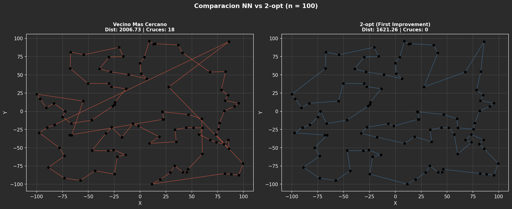
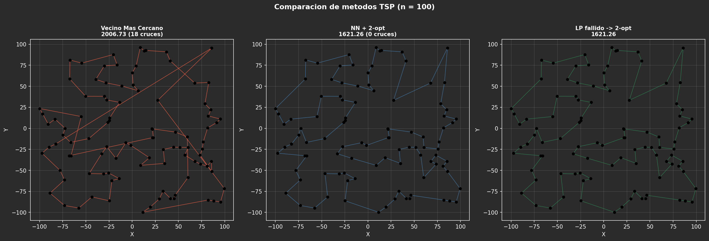
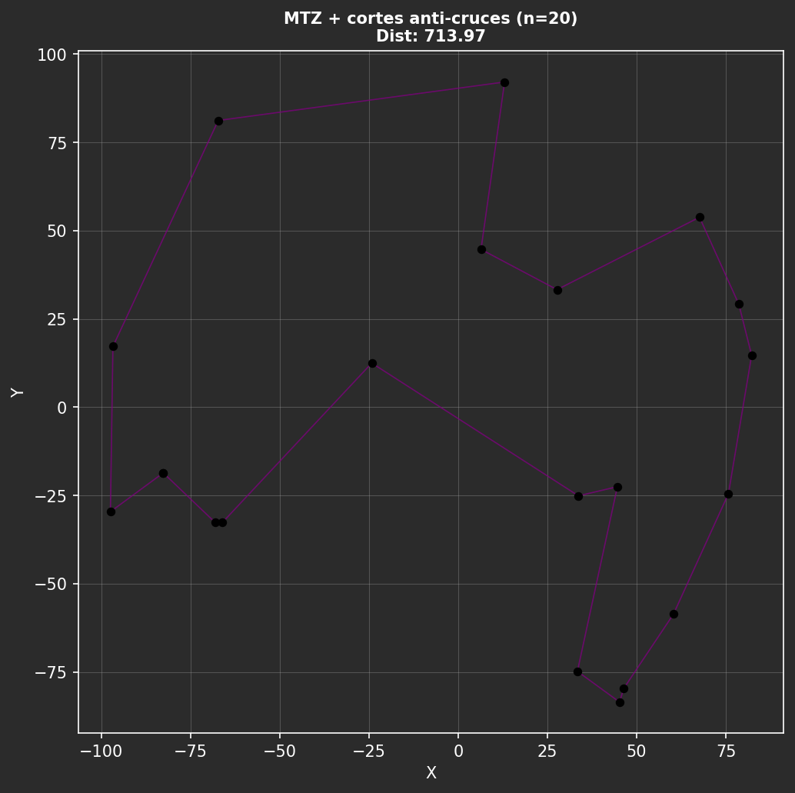
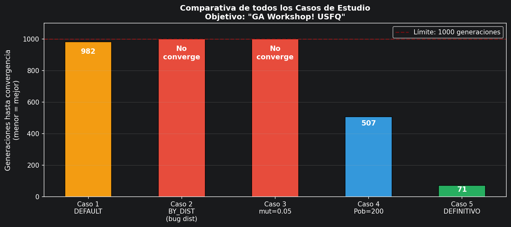

# WorkShop-USFQ
## Taller 3 de inteligencia artificial

- **Nombre del grupo**: Grupo 4
- **Integrantes del grupo**:

  • Anderson Alvarez

  • Maximo Pinta

  • Steeven Quezada

El objetivo de este taller fue resolver tres ejercicios con enfoques distintos de IA:

1. **P1_UML**: análisis de datos con aprendizaje no supervisado (clustering y detección de anomalías).
2. **P2_TSP**: optimización del problema del viajante con Programación Lineal (Pyomo + GLPK) y heurísticas.
3. **P3_GA**: análisis y mejora de un algoritmo genético para generar una frase objetivo.

---

### 1) **Uso de Aprendizaje No Supervisado (P1_UML)**

#### A) Carga de datos y visualización inicial

Se trabajó con el dataset de sensores de ventilación (`P1_UML/data/data.csv`) y se analizaron principalmente dos variables:

- `V005_vent01_CO2` (CO2)
- `V006_vent01_temp_out` (temperatura)

Como exploración inicial se construyeron:

- **gráficos de caja por hora** para revisar mediana, dispersión y valores atípicos;
- **series temporales continuas** para observar patrones diarios y días anómalos.

#### B) Limpieza y preparación del dataset

Antes del clustering se depuraron datos atípicos y se estandarizaron variables para evitar sesgos por escala. Este paso fue clave porque los outliers alteraban la geometría de los grupos y degradaban la detección de patrones.

#### C) Aplicación de algoritmos de clustering

Se compararon dos técnicas:

- **K-Means** (con `k=3` y semilla fija para reproducibilidad).
- **Agrupamiento Jerárquico Aglomerativo** (también con `k=3`).

El valor `k=3` se eligió por interpretabilidad operativa: distinguir franjas de comportamiento asociadas a condiciones de baja ocupación, alta ocupación y operación intermedia/normal.

#### D) Detección de anomalías

Para ambos métodos se usó una regla de distancia al centro del cluster y se marcó como anómalo el **5% superior** (percentil 95):

- En **K-Means**, las anomalías se concentraron sobre todo en bordes de clusters y extremos del espacio.
- En **Jerárquico**, aparecieron más anomalías dispersas (tendencia a sobremarcar), lo que sugiere mayor riesgo de falsos positivos con este criterio.

#### E) Hallazgos de P1

- La limpieza de outliers mejora de forma notable la calidad y estabilidad de los clusters.
- El análisis **multivariable** (CO2 + temperatura) resultó más informativo que el análisis por variable aislada.
- **K-Means** produjo fronteras más limpias para este dataset, mientras que el método jerárquico se adaptó a formas más irregulares pero con mayor sensibilidad en detección de anomalías.

---

### 2) **TSP con Programación Lineal (P2_TSP)**

#### A) Requerimiento de solver (GLPK)

Para resolver el modelo LP/MIP se utilizó **GLPK**:

- Windows: https://winglpk.sourceforge.net/
- Linux: `apt-get install -y -qq glpk-utils`
- Mac: `brew install glpk`

#### B) Caso base (LP sin heurísticas) y comparación con Vecino Más Cercano

Se ejecutó el caso base para `n = 10, 20, 30, 40, 50`, comparando:

- modelo LP (`mipgap=0.05`, `time_limit=30s`), y
- heurística **Nearest Neighbor (NN)**.

Se generaron visualizaciones y comparativas en:

- `images/P2_caso1_tiempo_y_distancia_vs_n.png`
- `images/P2_caso1_ruta_LP_nXX.png`
- `images/P2_caso1_ruta_NN_nXX.png`

#### C) Ajustes con heurísticas en el modelo

Se evaluaron variantes del modelo con heurísticas internas como:

- `limitar_funcion_objetivo`
- `vecino_cercano`

La evidencia de ejecución mostró que, para instancias medianas/grandes con límite de tiempo, estas heurísticas no siempre mejoran el incumbente frente a enfoques híbridos de posprocesamiento.

#### D) Sección F: NN + 2-opt y enfoque anti-cruces

Se implementaron dos estrategias adicionales:

1. **Posprocesamiento 2-opt** sobre la ruta NN (`first` y `best improvement`).
2. **Cutting plane anti-cruces** dentro del modelo (agregando restricciones para evitar cruces de aristas).

Resultados reportados en la corrida (`n=100` para comparación principal):

| Método | Distancia | Tiempo | Cruces | Mejora vs NN |
|--------|-----------|--------|--------|--------------|
| Vecino Más Cercano (NN) | 2006.73 | < 1 ms | 18 | — |
| NN + 2-opt First Improvement | 1621.26 | 41 ms | 0 | 19.21 % |
| NN + 2-opt Best Improvement | **1616.30** | 27 ms | 0 | **19.46 %** |
| LP + heurística `vecino_cercano` | 2043.06 | 60 s | — | -1.81 % |

Evidencia visual:

#### E) Conclusión P2

En este taller, la combinación **heurística NN + 2-opt** ofreció la mejor relación calidad/tiempo para instancias grandes. El modelo LP con GLPK aporta formulación exacta, pero bajo límites de tiempo estrictos no necesariamente supera el desempeño del posprocesamiento heurístico.

---

### 3) **Algoritmos Genéticos (P3_GA)**

#### A) Objetivo

Analizar el comportamiento de un Algoritmo Genético para generar la frase objetivo:

`"GA Workshop! USFQ"` (17 caracteres)

evaluando operadores y parámetros de evolución en cinco casos de estudio.

#### B) Cambios implementados en el ejercicio

1. **Corrección de `distance()` en `util.py`**
   - Se corrigió la suma de diferencias ASCII para usar valor absoluto y evitar distancias negativas no deseadas.
   - Se mantuvo penalización por diferencia de longitud.

2. **Mejoras en operadores (`operation.py`)**
   - Selección por torneo (`ParentSelectionType.NEW`).
   - Cruce uniforme (`CrossoverType.NEW`).

3. **Nuevo tipo de generación (`generalSteps.py`)**
   - `NewGenerationType.NEW` combina torneo + cruce uniforme.

#### C) Casos analizados y resultados

| Caso | Población | `mutation_rate` | Selección | Cruce | Generaciones | Resultado |
|:----:|:---------:|:---------------:|:---------:|:-----:|:------------:|:---------:|
| 1: `DEFAULT` | 100 | 0.01 | Ruleta | Punto único | 982 | ✅ Converge |
| 2: `BY_DISTANCE` | 100 | 0.01 | Min. distancia | Punto único | 1000 | ❌ No converge |
| 3: `mutation_rate = 0.05` | 100 | 0.05 | Ruleta | Punto único | 1000 | ❌ No converge |
| 4: Población 200 | 200 | 0.01 | Ruleta | Punto único | 507 | ✅ Converge |
| 5: Configuración final | 150 | 0.02 | Torneo | Uniforme | 71 | ✅ Converge |

#### D) Hallazgos clave

- Corregir `distance()` evitó presiones selectivas incorrectas en `BY_DISTANCE`.
- El torneo mantuvo mejor presión selectiva que ruleta en escenarios con aptitudes cercanas.
- El cruce uniforme facilitó combinar genes correctos no contiguos.
- En esta experimentación, la combinación del **caso 5** logró la convergencia más rápida.

#### E) Conclusión P3

La estrategia final (población 150, `mutation_rate=0.02`, torneo + cruce uniforme) mejoró notablemente el tiempo de convergencia frente al caso base, mostrando que la calidad de operadores y la calibración de parámetros impactan directamente en la eficiencia del algoritmo genético.

---

### Archivos principales del Taller 3

| Carpeta/Archivo | Descripción |
|-----------------|-------------|
| `P1_UML/p1_uml_notebook.ipynb` | Desarrollo completo de análisis no supervisado y anomalías |
| `P1_UML/p1_uml.py` | Script base de carga y visualización inicial |
| `P2_TSP/P2.ipynb` | Experimentos TSP-LP, comparación con NN y sección F |
| `P2_TSP/TSP.py` | Modelo TSP en Pyomo + heurísticas complementarias |
| `P3_GA/Algoritmos_Geneticos_SQ.ipynb` | Análisis de los 5 casos de estudio del algoritmo genético |
| `P3_GA/GA.py` | Clase principal y configuración de casos |
| `P3_GA/generalSteps.py` | Flujo evolutivo: población, evaluación y nueva generación |
| `P3_GA/operation.py` | Operadores de selección, cruce y mutación |
| `P3_GA/util.py` | Funciones auxiliares (incluye `distance()` corregida) |