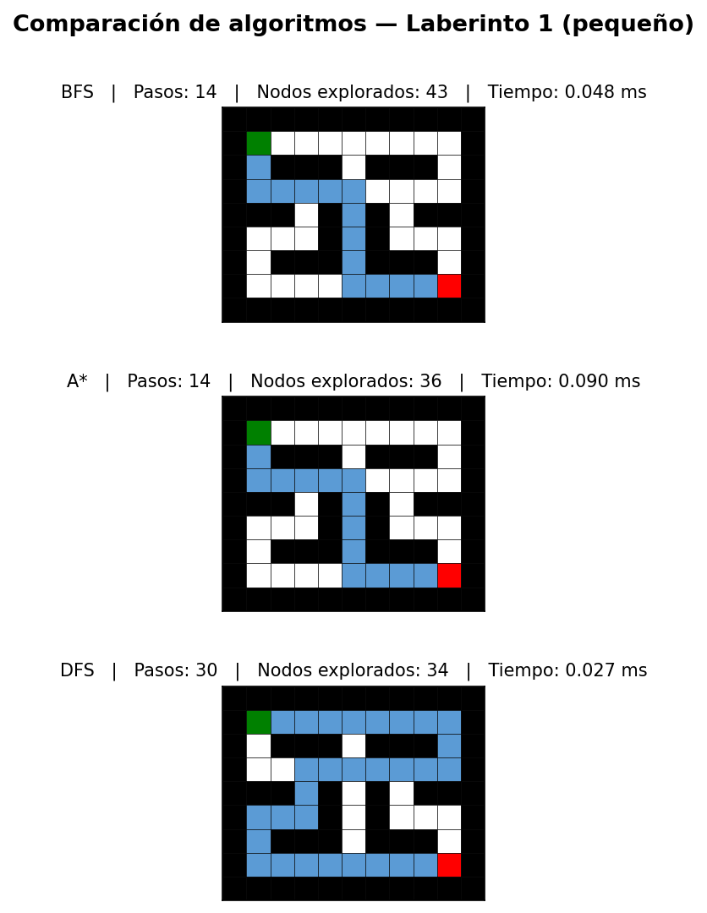
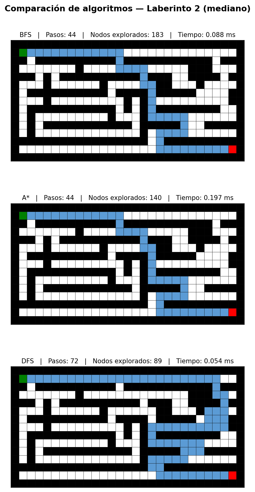
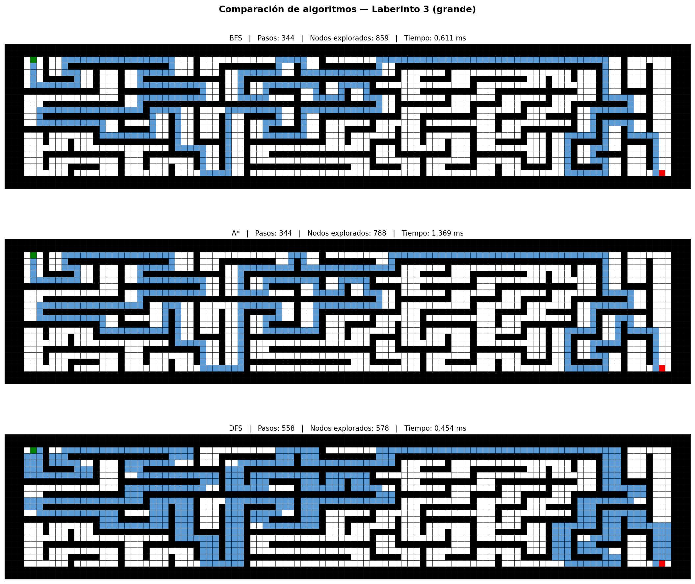
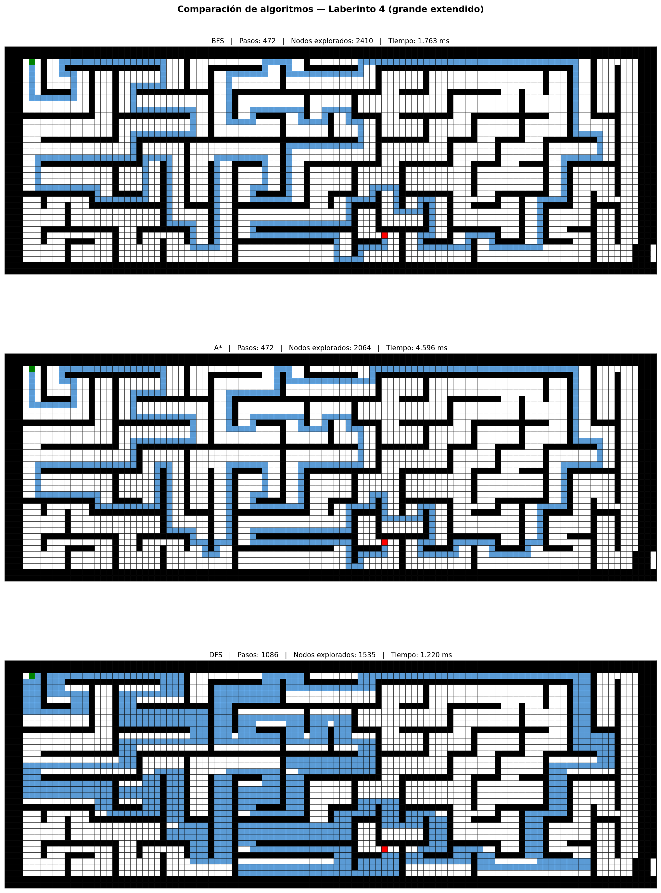

# WorkShop-USFQ
## Taller 2 — Uso de Algoritmos de Búsqueda

- **Nombre del grupo**: Grupo 6
- **Integrantes del grupo**:
  * Estudiante 1
  * Estudiante 2

---

## Descripción

El objetivo es utilizar algoritmos de búsqueda para resolver los laberintos propuestos,
visualizar los resultados y comparar el comportamiento de al menos 2 algoritmos.

> **Nota:** El repositorio original menciona 3 laberintos, sin embargo se encontraron 4 archivos
> (`laberinto1.txt` … `laberinto4.txt`). Se resuelven los **4 laberintos**.

---

## A. Representación del laberinto como grafo

El laberinto se carga desde un archivo `.txt` donde cada celda puede ser:

| Símbolo | Significado |
|---------|-------------|
| `#`     | Pared (no transitable) |
| ` `     | Pasillo libre |
| `E`     | Entrada — nodo inicio |
| `S`     | Salida — nodo destino |

Cada celda transitable (`' '`, `E`, `S`) se convierte en un **nodo** del grafo.
Dos nodos son **vecinos** (arista peso 1) si son adyacentes horizontal o verticalmente y ambos son transitables.
El grafo se representa como un diccionario de adyacencia: `{(fila, col): [(fila', col'), ...]}`

---

## B. Algoritmos de búsqueda

Se implementaron 3 algoritmos en `P1/P1_solvers.py`:

### BFS — Breadth-First Search
Explora por niveles (anchura). Garantiza el **camino más corto** en grafos no ponderados.
- Estructura: Cola (FIFO) — Completitud: Sí — Optimalidad: Sí

### A* (A-estrella)
Búsqueda informada con heurística de **distancia Manhattan** al destino: `f(n) = g(n) + h(n)`.
- Estructura: Cola de prioridad (min-heap) — Completitud: Sí — Optimalidad: Sí

### DFS — Depth-First Search
Explora en profundidad. **No garantiza** el camino más corto.
- Estructura: Pila (LIFO) — Completitud: Sí — Optimalidad: No

---

## Métricas de evaluación

| Métrica | Descripción |
|---------|-------------|
| **Pasos** | Longitud del camino encontrado (celdas − 1) |
| **Nodos explorados** | Cuántos nodos se procesaron antes de encontrar la solución |
| **Tiempo (ms)** | Tiempo de ejecución del algoritmo |

---

## Resultados

### Laberinto 1 — Pequeño (9×11, 43 nodos)



| Algoritmo | Pasos | Nodos explorados | Tiempo (ms) |
|-----------|------:|----------------:|------------:|
| BFS       |    14 |              43 |       0.114 |
| A\*       |    14 |              36 |       0.128 |
| DFS       |    30 |              34 |       0.045 |

---

### Laberinto 2 — Mediano (15×29, 201 nodos)



| Algoritmo | Pasos | Nodos explorados | Tiempo (ms) |
|-----------|------:|----------------:|------------:|
| BFS       |    44 |             183 |       0.096 |
| A\*       |    44 |             140 |       0.181 |
| DFS       |    72 |              89 |       0.051 |

---

### Laberinto 3 — Grande (23×109, 1270 nodos)



| Algoritmo | Pasos | Nodos explorados | Tiempo (ms) |
|-----------|------:|----------------:|------------:|
| BFS       |   344 |             859 |       0.855 |
| A\*       |   344 |             788 |       2.223 |
| DFS       |   558 |             578 |       0.842 |

---

### Laberinto 4 — Grande Extendido (38×109, 2651 nodos)



| Algoritmo | Pasos | Nodos explorados | Tiempo (ms) |
|-----------|------:|----------------:|------------:|
| BFS       |   472 |            2410 |       1.750 |
| A\*       |   472 |            2064 |       4.521 |
| DFS       |  1086 |            1535 |       1.634 |

---

## Análisis comparativo

**BFS vs A\*:**
- Ambos encuentran siempre el **camino óptimo** (mismo número de pasos).
- A\* explora menos nodos gracias a la heurística Manhattan: ~16% menos en laberinto 2, ~8% menos en laberintos 3 y 4.
- La ventaja de A\* crece con el tamaño del laberinto.

**BFS/A\* vs DFS:**
- DFS encuentra solución con menos nodos explorados, pero el camino es **subóptimo**:
  - Laberinto 1: 30 pasos vs 14 (BFS/A\*) — 114% más largo
  - Laberinto 3: 558 pasos vs 344 — 62% más largo
  - Laberinto 4: 1086 pasos vs 472 — 130% más largo
- DFS es útil cuando se necesita *alguna* solución rápida, no la óptima.

**Conclusión:** A\* es el mejor balance entre calidad de solución y eficiencia.
Para laberintos grandes donde el camino óptimo importa, A\* supera a BFS reduciendo los nodos explorados mediante la guía heurística.

---

## Estructura del proyecto

```
Taller2/
├── P1/
│   ├── P1.py              # Punto de entrada — ejecutar para resolver todos los laberintos
│   ├── P1_MazeLoader.py   # Carga, grafo y visualización
│   ├── P1_solvers.py      # Algoritmos BFS, A* y DFS
│   ├── P1_util.py         # Colores de celda
│   ├── laberinto1.txt
│   ├── laberinto2.txt
│   ├── laberinto3.txt
│   └── laberinto4.txt
└── images/
    ├── laberinto1_comparacion.png
    ├── laberinto2_comparacion.png
    ├── laberinto3_comparacion.png
    └── laberinto4_comparacion.png
```

## Cómo ejecutar

```bash
cd _Soluciones/Grupo6/Taller2/P1
python P1.py
```